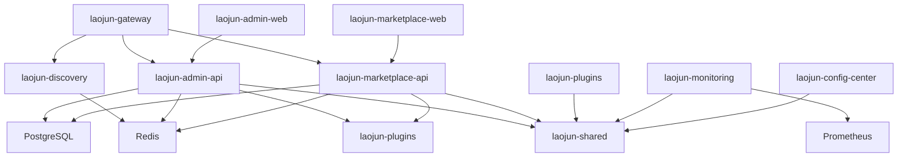
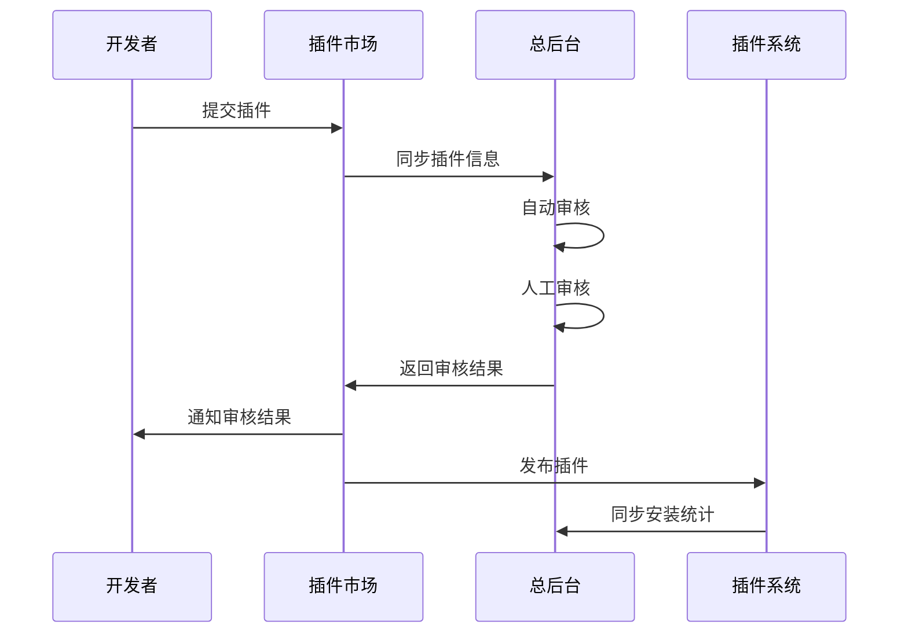

# 太上老君(Laojun) Go企业级分模块架构分析报告

## 📋 目录

1. [项目概述](#项目概述)
2. [目录结构深度解析](#目录结构深度解析)
3. [技术架构分析](#技术架构分析)
4. [模块依赖关系](#模块依赖关系)
5. [插件市场与总后台衔接方案](#插件市场与总后台衔接方案)
6. [性能优化建议](#性能优化建议)
7. [架构改进建议](#架构改进建议)

## 🎯 项目概述

太上老君(Laojun)是一个基于Go语言的企业级微服务架构项目，采用分模块设计，包含插件市场、管理后台、服务发现、网关、监控等多个核心模块。项目遵循DDD(领域驱动设计)和Clean Architecture原则，具有高可扩展性和可维护性。

### 核心特性
- 🏗️ 微服务架构设计
- 🔌 插件化系统
- 🛡️ 完整的权限管理
- 📊 实时监控和指标收集
- 🚀 高性能网关
- 📦 容器化部署

## 🏗️ 目录结构深度解析

### 1. laojun-admin-api (管理后台API)

**功能定位**: 提供系统管理、用户管理、插件审核等后台管理功能的API服务

**技术架构**:
- **框架**: Gin Web Framework
- **数据库**: PostgreSQL + GORM
- **缓存**: Redis
- **认证**: JWT + RBAC权限模型
- **监控**: Prometheus + 系统指标收集

**核心组件**:
```
laojun-admin-api/
├── cmd/                    # 应用入口
├── internal/
│   ├── handlers/          # HTTP处理器
│   ├── services/          # 业务逻辑层
│   ├── models/            # 数据模型
│   ├── middleware/        # 中间件
│   └── config/            # 配置管理
├── configs/               # 配置文件
└── docs/                  # API文档
```

**关键算法实现**:
- RBAC权限验证算法
- 插件审核工作流引擎
- 系统资源监控算法

**性能优化点**:
- Redis缓存用户权限信息
- 数据库连接池优化
- 分页查询优化

### 2. laojun-marketplace-api (插件市场API)

**功能定位**: 插件市场的核心API服务，提供插件展示、搜索、购买、评价等功能

**技术架构**:
- **框架**: Gin Web Framework
- **数据库**: PostgreSQL + GORM
- **搜索**: 全文搜索 + 分类筛选
- **支付**: 集成支付网关
- **文件存储**: 对象存储服务

**核心组件**:
```go
// 插件服务核心接口
type PluginService interface {
    GetPlugins(params PluginSearchParams) ([]Plugin, PaginationMeta, error)
    GetPlugin(id uuid.UUID) (*Plugin, error)
    CreatePlugin(plugin *Plugin) error
    UpdatePlugin(id uuid.UUID, plugin *Plugin) error
    PurchasePlugin(userID, pluginID uuid.UUID) error
}
```

**数据流设计**:
```
用户请求 → API网关 → 插件市场API → 业务服务层 → 数据访问层 → PostgreSQL
                                    ↓
                               Redis缓存层
```

**关键算法实现**:
- 插件搜索排序算法(相关性 + 评分 + 下载量)
- 推荐算法(协同过滤)
- 评分计算算法

### 3. laojun-plugins (插件系统)

**功能定位**: 插件开发框架和运行时环境，提供插件生命周期管理

**技术架构**:
- **插件加载**: 动态加载机制
- **沙箱环境**: 安全隔离
- **生命周期**: 注册→加载→运行→卸载
- **通信机制**: 事件总线 + RPC

**核心组件**:
```go
// 插件注册中心
type PluginRegistry interface {
    Register(plugin Plugin) error
    Unregister(pluginID string) error
    GetPlugin(pluginID string) (Plugin, error)
    ListPlugins() []Plugin
}

// 插件生命周期管理
type PluginManager interface {
    Load(pluginPath string) error
    Start(pluginID string) error
    Stop(pluginID string) error
    Unload(pluginID string) error
}
```

**安全机制**:
- 代码签名验证
- 权限沙箱隔离
- 资源使用限制
- 恶意代码检测

### 4. laojun-gateway (API网关)

**功能定位**: 统一API入口，提供路由、负载均衡、限流、认证等功能

**技术架构**:
- **路由**: 基于路径和Header的智能路由
- **负载均衡**: 轮询、加权轮询、最少连接
- **限流**: 令牌桶算法
- **熔断**: Circuit Breaker模式
- **服务发现**: Consul集成

**核心组件**:
```go
// 网关核心接口
type Gateway interface {
    Route(request *http.Request) (*http.Response, error)
    AddRoute(route Route) error
    RemoveRoute(routeID string) error
    UpdateRoute(routeID string, route Route) error
}

// 中间件链
type MiddlewareChain []Middleware
```

**性能优化点**:
- 连接池复用
- 响应缓存
- 压缩传输
- 异步日志记录

### 5. laojun-discovery (服务发现)

**功能定位**: 微服务注册与发现，提供服务健康检查和负载均衡

**技术架构**:
- **注册中心**: 基于Redis的分布式注册中心
- **健康检查**: HTTP/TCP健康检查
- **负载均衡**: 多种负载均衡算法
- **故障转移**: 自动故障检测和转移

**核心组件**:
```go
// 服务注册接口
type ServiceRegistry interface {
    Register(service ServiceInfo) error
    Deregister(serviceID string) error
    Discover(serviceName string) ([]ServiceInfo, error)
    Watch(serviceName string) (<-chan []ServiceInfo, error)
}
```

### 6. laojun-monitoring (监控系统)

**功能定位**: 系统监控、指标收集、告警通知

**技术架构**:
- **指标收集**: Prometheus + 自定义指标
- **系统监控**: CPU、内存、磁盘、网络
- **应用监控**: QPS、延迟、错误率
- **告警**: 基于规则的告警系统

**核心指标**:
- 系统资源使用率
- API响应时间和QPS
- 数据库连接池状态
- 缓存命中率

### 7. laojun-config-center (配置中心)

**功能定位**: 集中化配置管理，支持动态配置更新

**技术架构**:
- **配置存储**: 分层配置存储
- **动态更新**: WebSocket推送
- **版本管理**: 配置版本控制
- **权限控制**: 细粒度权限管理

### 8. laojun-shared (共享库)

**功能定位**: 提供通用组件和工具库

**核心模块**:
- **认证**: JWT处理、权限验证
- **数据库**: 连接管理、事务处理
- **缓存**: Redis操作封装
- **日志**: 结构化日志
- **工具**: 代码生成、静态检查

## 🔧 技术架构分析

### 分层架构设计

```
┌─────────────────────────────────────────────────────────────┐
│                    表示层 (Presentation Layer)                │
├─────────────────────────────────────────────────────────────┤
│  API Gateway │ Admin Web │ Marketplace Web │ Mobile App     │
└─────────────────────────────────────────────────────────────┘
                                │
┌─────────────────────────────────────────────────────────────┐
│                    应用层 (Application Layer)                 │
├─────────────────────────────────────────────────────────────┤
│  Admin API │ Marketplace API │ Plugin API │ Config API      │
└─────────────────────────────────────────────────────────────┘
                                │
┌─────────────────────────────────────────────────────────────┐
│                    业务层 (Business Layer)                    │
├─────────────────────────────────────────────────────────────┤
│  User Service │ Plugin Service │ Review Service │ Auth Service│
└─────────────────────────────────────────────────────────────┘
                                │
┌─────────────────────────────────────────────────────────────┐
│                    数据层 (Data Layer)                        │
├─────────────────────────────────────────────────────────────┤
│  PostgreSQL │ Redis │ Object Storage │ Message Queue        │
└─────────────────────────────────────────────────────────────┘
```

### 技术栈组成

**后端技术栈**:
- **语言**: Go 1.21
- **Web框架**: Gin
- **ORM**: GORM
- **数据库**: PostgreSQL
- **缓存**: Redis
- **消息队列**: Redis Streams
- **服务发现**: Consul
- **监控**: Prometheus + Grafana
- **日志**: Zap + Lumberjack

**前端技术栈**:
- **框架**: React + TypeScript
- **状态管理**: Zustand
- **UI组件**: Ant Design
- **构建工具**: Vite
- **路由**: React Router

**基础设施**:
- **容器化**: Docker + Docker Compose
- **编排**: Kubernetes
- **CI/CD**: GitHub Actions
- **监控**: Prometheus + Grafana
- **日志**: ELK Stack

## 🔗 模块依赖关系

### 依赖关系图



### 数据流向分析

**用户请求流程**:
1. 用户请求 → API网关
2. API网关 → 服务发现 → 目标服务
3. 目标服务 → 业务逻辑处理
4. 业务逻辑 → 数据访问层
5. 数据访问层 → 数据库/缓存
6. 响应原路返回

**插件安装流程**:
1. 用户选择插件 → 插件市场API
2. 插件市场API → 插件服务
3. 插件服务 → 插件注册中心
4. 插件注册中心 → 插件管理器
5. 插件管理器 → 加载并启动插件

## 🔌 插件市场与总后台衔接方案

### 整体架构设计



### 核心接口设计

#### 1. 插件注册机制

**元数据格式**:
```json
{
  "plugin_id": "com.example.plugin",
  "name": "示例插件",
  "version": "1.0.0",
  "description": "插件描述",
  "author": "开发者",
  "category": "工具类",
  "permissions": ["read", "write"],
  "dependencies": ["core@1.0.0"],
  "manifest": {
    "entry": "main.js",
    "config": "config.json",
    "assets": ["icon.png"]
  },
  "signature": "数字签名"
}
```

**注册流程API**:
```http
POST /api/v1/plugins/register
Content-Type: application/json

{
  "metadata": {...},
  "package_url": "https://storage.example.com/plugin.zip",
  "checksum": "sha256:..."
}
```

#### 2. 权限控制方案

**RBAC模型设计**:
```go
type Permission struct {
    ID       string `json:"id"`
    Resource string `json:"resource"` // plugins, users, reviews
    Action   string `json:"action"`   // create, read, update, delete
    Scope    string `json:"scope"`    // own, all, department
}

type Role struct {
    ID          string       `json:"id"`
    Name        string       `json:"name"`
    Permissions []Permission `json:"permissions"`
}

type User struct {
    ID    string `json:"id"`
    Roles []Role `json:"roles"`
}
```

**权限验证中间件**:
```go
func RequirePermission(resource, action string) gin.HandlerFunc {
    return func(c *gin.Context) {
        user := getCurrentUser(c)
        if !hasPermission(user, resource, action) {
            c.JSON(403, gin.H{"error": "权限不足"})
            c.Abort()
            return
        }
        c.Next()
    }
}
```

#### 3. 通信协议选择

**协议对比分析**:

| 协议 | 优势 | 劣势 | 适用场景 |
|------|------|------|----------|
| REST | 简单易用、广泛支持 | 性能一般、无状态 | CRUD操作、公开API |
| gRPC | 高性能、类型安全 | 复杂度高、调试困难 | 内部服务通信 |
| WebSocket | 实时通信、双向 | 连接管理复杂 | 实时通知、状态同步 |

**推荐方案**: REST + WebSocket混合模式
- REST用于标准CRUD操作
- WebSocket用于实时状态同步和通知

#### 4. 数据同步策略

**增量同步机制**:
```go
type SyncEvent struct {
    ID        string    `json:"id"`
    Type      string    `json:"type"`      // create, update, delete
    Resource  string    `json:"resource"`  // plugin, user, review
    Data      any       `json:"data"`
    Timestamp time.Time `json:"timestamp"`
    Version   int64     `json:"version"`
}

func (s *SyncService) SyncChanges(lastVersion int64) ([]SyncEvent, error) {
    return s.db.GetEventsSince(lastVersion)
}
```

**全量同步场景**:
- 系统初始化
- 数据不一致修复
- 定期数据校验

### API规范设计

#### 版本控制策略
- URL版本控制: `/api/v1/`, `/api/v2/`
- 向后兼容性保证
- 废弃API的渐进式迁移

#### 错误码设计
```go
const (
    // 通用错误码 (1000-1999)
    ErrCodeSuccess         = 0
    ErrCodeInternalError   = 1000
    ErrCodeInvalidParam    = 1001
    ErrCodeUnauthorized    = 1002
    ErrCodeForbidden       = 1003
    
    // 插件相关错误码 (2000-2999)
    ErrCodePluginNotFound  = 2000
    ErrCodePluginExists    = 2001
    ErrCodePluginInvalid   = 2002
    
    // 审核相关错误码 (3000-3999)
    ErrCodeReviewPending   = 3000
    ErrCodeReviewRejected  = 3001
)
```

#### 响应格式标准
```json
{
  "code": 0,
  "message": "success",
  "data": {...},
  "timestamp": "2024-01-01T00:00:00Z",
  "request_id": "uuid"
}
```

## 📊 性能优化建议

### 数据库优化
1. **索引优化**: 为常用查询字段添加复合索引
2. **分页优化**: 使用游标分页替代OFFSET分页
3. **连接池**: 合理配置数据库连接池大小
4. **读写分离**: 读操作使用只读副本

### 缓存策略
1. **多级缓存**: 本地缓存 + Redis缓存
2. **缓存预热**: 系统启动时预加载热点数据
3. **缓存更新**: 使用发布订阅模式同步缓存
4. **缓存穿透**: 布隆过滤器防止缓存穿透

### 服务优化
1. **连接复用**: HTTP连接池复用
2. **异步处理**: 耗时操作异步化
3. **批量操作**: 减少网络往返次数
4. **压缩传输**: 启用gzip压缩

## 🚀 架构改进建议

### 可扩展性改进
1. **微服务拆分**: 按业务域进一步拆分服务
2. **事件驱动**: 引入事件总线解耦服务
3. **CQRS**: 读写分离架构
4. **分布式缓存**: Redis集群部署

### 可靠性改进
1. **熔断器**: 实现服务熔断机制
2. **重试机制**: 指数退避重试
3. **限流**: 多维度限流策略
4. **监控告警**: 完善监控指标和告警规则

### 安全性改进
1. **API安全**: OAuth2.0 + JWT
2. **数据加密**: 敏感数据加密存储
3. **审计日志**: 完整的操作审计
4. **安全扫描**: 自动化安全漏洞扫描

---

**报告生成时间**: 2024年12月28日  
**版本**: v1.0  
**作者**: 架构分析团队