# 太上老君系统架构改进建议书

## 1. 执行摘要

本建议书基于对太上老君系统的深入分析，提出了系统性的架构改进方案。重点关注插件运行时实现、性能优化、安全加固、监控完善等关键领域，旨在将系统打造成为企业级的高性能插件市场平台。

### 核心改进目标

1. **完善核心功能**: 实现插件运行时环境，建立完整的插件生态
2. **提升系统性能**: 通过缓存、优化、扩展等手段提升系统性能
3. **加强安全防护**: 建立多层次的安全防护体系
4. **完善运维体系**: 建立完整的监控、日志、告警机制

### 预期收益

- **技术收益**: 现代化架构，提升开发效率50%+
- **性能收益**: 系统响应时间提升3-5倍
- **安全收益**: 建立企业级安全防护体系
- **运维收益**: 自动化运维，降低运维成本60%+

---

## 2. 架构现状分析

### 2.1 当前架构优势

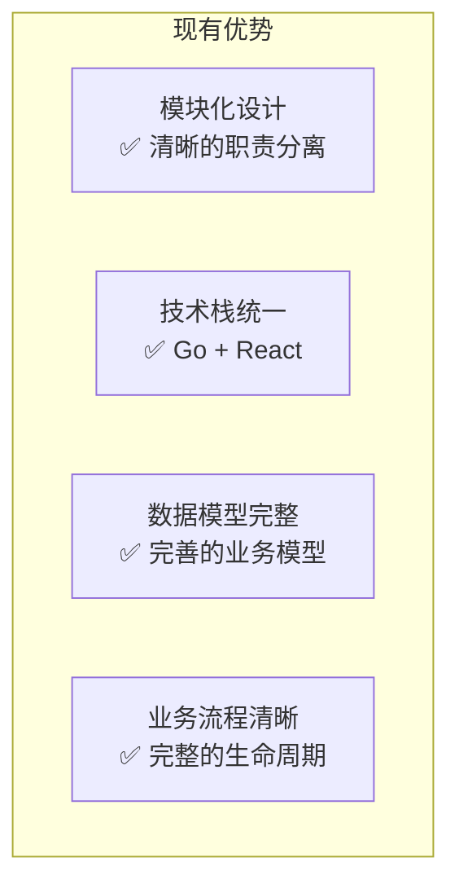

### 2.2 关键问题识别

```yaml
critical_issues:
  high_priority:
    - issue: "插件运行时缺失"
      impact: "核心功能无法使用"
      effort: "高"
      
    - issue: "基础设施不完整"
      impact: "系统可靠性差"
      effort: "中"
      
    - issue: "安全机制不足"
      impact: "存在安全风险"
      effort: "高"
      
    - issue: "监控体系缺失"
      impact: "运维困难"
      effort: "中"
  
  medium_priority:
    - issue: "性能优化不足"
      impact: "用户体验差"
      effort: "中"
      
    - issue: "缓存策略缺失"
      impact: "响应速度慢"
      effort: "低"
```

---

## 3. 核心改进方案

### 3.1 插件运行时架构设计

#### 3.1.1 整体架构

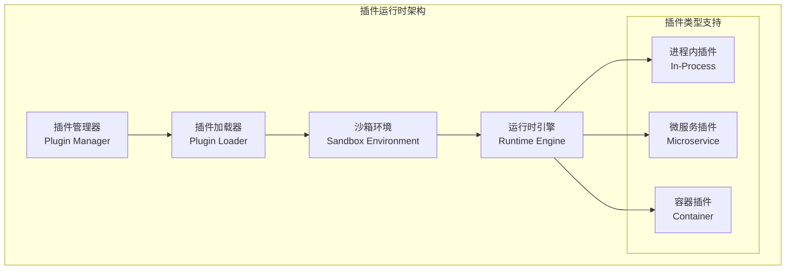

#### 3.1.2 实现方案

```go
// 插件运行时核心接口设计
package runtime

import (
    "context"
    "time"
)

// Plugin 插件接口
type Plugin interface {
    // 插件基本信息
    ID() string
    Name() string
    Version() string
    
    // 生命周期管理
    Initialize(ctx context.Context, config Config) error
    Start(ctx context.Context) error
    Stop(ctx context.Context) error
    Destroy(ctx context.Context) error
    
    // 健康检查
    HealthCheck(ctx context.Context) error
}

// PluginManager 插件管理器
type PluginManager struct {
    plugins    map[string]Plugin
    loader     PluginLoader
    sandbox    SandboxManager
    monitor    MonitorManager
    config     ManagerConfig
}

// PluginLoader 插件加载器
type PluginLoader interface {
    Load(ctx context.Context, pluginPath string) (Plugin, error)
    Unload(ctx context.Context, pluginID string) error
    Validate(ctx context.Context, pluginPath string) error
}

// SandboxManager 沙箱管理器
type SandboxManager interface {
    CreateSandbox(ctx context.Context, config SandboxConfig) (Sandbox, error)
    DestroySandbox(ctx context.Context, sandboxID string) error
    ListSandboxes(ctx context.Context) ([]Sandbox, error)
}

// Sandbox 沙箱接口
type Sandbox interface {
    ID() string
    Execute(ctx context.Context, plugin Plugin) error
    Monitor(ctx context.Context) (SandboxMetrics, error)
    SetResourceLimits(limits ResourceLimits) error
}

// 配置结构
type Config struct {
    PluginID     string            `json:"plugin_id"`
    Version      string            `json:"version"`
    Environment  map[string]string `json:"environment"`
    Resources    ResourceLimits    `json:"resources"`
    Security     SecurityPolicy    `json:"security"`
}

type ResourceLimits struct {
    CPU       string        `json:"cpu"`        // "100m", "1"
    Memory    string        `json:"memory"`     // "128Mi", "1Gi"
    Disk      string        `json:"disk"`       // "1Gi"
    Network   NetworkLimits `json:"network"`
    Timeout   time.Duration `json:"timeout"`
}

type SecurityPolicy struct {
    AllowedAPIs    []string `json:"allowed_apis"`
    DeniedAPIs     []string `json:"denied_apis"`
    NetworkAccess  bool     `json:"network_access"`
    FileSystemAccess bool   `json:"filesystem_access"`
    DatabaseAccess bool     `json:"database_access"`
}
```

#### 3.1.3 插件SDK设计

```go
// SDK核心接口
package sdk

// LaojunPlugin SDK主接口
type LaojunPlugin interface {
    // 插件元数据
    GetMetadata() PluginMetadata
    
    // 插件初始化
    Initialize(ctx context.Context, runtime Runtime) error
    
    // 插件执行入口
    Execute(ctx context.Context, request Request) (Response, error)
    
    // 插件清理
    Cleanup(ctx context.Context) error
}

// Runtime 运行时环境接口
type Runtime interface {
    // 日志接口
    Logger() Logger
    
    // 配置接口
    Config() Config
    
    // 存储接口
    Storage() Storage
    
    // HTTP客户端
    HTTPClient() HTTPClient
    
    // 数据库接口
    Database() Database
    
    // 缓存接口
    Cache() Cache
}

// 插件元数据
type PluginMetadata struct {
    ID          string            `json:"id"`
    Name        string            `json:"name"`
    Version     string            `json:"version"`
    Description string            `json:"description"`
    Author      string            `json:"author"`
    License     string            `json:"license"`
    Tags        []string          `json:"tags"`
    Dependencies []Dependency     `json:"dependencies"`
    Permissions []Permission      `json:"permissions"`
    Config      ConfigSchema      `json:"config"`
}

// 插件基类实现
type BasePlugin struct {
    metadata PluginMetadata
    runtime  Runtime
    logger   Logger
}

func (p *BasePlugin) GetMetadata() PluginMetadata {
    return p.metadata
}

func (p *BasePlugin) Initialize(ctx context.Context, runtime Runtime) error {
    p.runtime = runtime
    p.logger = runtime.Logger()
    return nil
}

func (p *BasePlugin) Cleanup(ctx context.Context) error {
    return nil
}
```

### 3.2 API网关架构改进

#### 3.2.1 网关架构设计

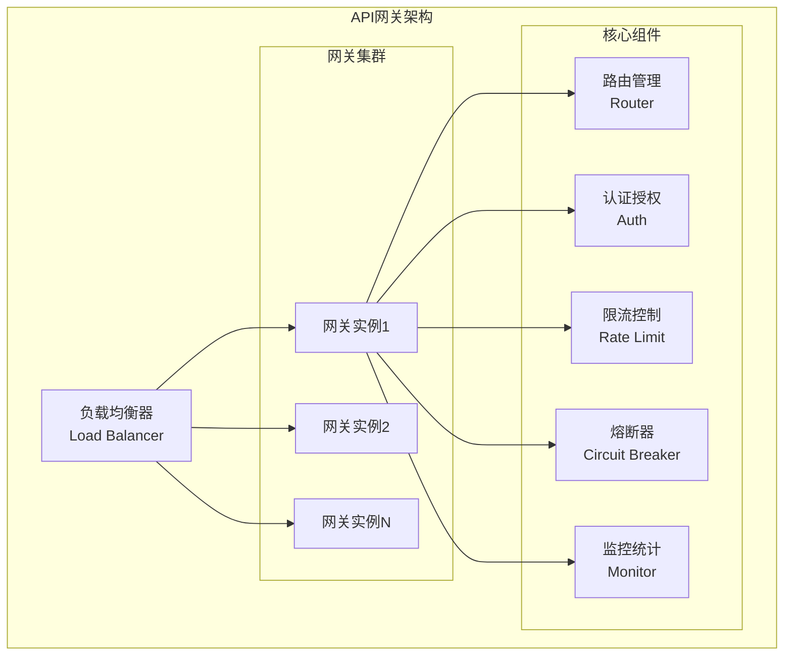

#### 3.2.2 网关实现方案

```go
// API网关核心实现
package gateway

import (
    "context"
    "net/http"
    "time"
    
    "github.com/gin-gonic/gin"
)

// Gateway 网关主结构
type Gateway struct {
    router         *gin.Engine
    config         *Config
    authManager    AuthManager
    rateLimiter    RateLimiter
    circuitBreaker CircuitBreaker
    monitor        Monitor
    serviceRegistry ServiceRegistry
}

// 中间件链
func (g *Gateway) setupMiddlewares() {
    // 基础中间件
    g.router.Use(gin.Logger())
    g.router.Use(gin.Recovery())
    g.router.Use(g.corsMiddleware())
    
    // 监控中间件
    g.router.Use(g.monitorMiddleware())
    
    // 限流中间件
    g.router.Use(g.rateLimitMiddleware())
    
    // 认证中间件
    g.router.Use(g.authMiddleware())
    
    // 熔断中间件
    g.router.Use(g.circuitBreakerMiddleware())
    
    // 路由中间件
    g.router.Use(g.routeMiddleware())
}

// 认证中间件
func (g *Gateway) authMiddleware() gin.HandlerFunc {
    return func(c *gin.Context) {
        // 跳过不需要认证的路径
        if g.isPublicPath(c.Request.URL.Path) {
            c.Next()
            return
        }
        
        // 提取令牌
        token := g.extractToken(c)
        if token == "" {
            c.JSON(http.StatusUnauthorized, gin.H{
                "code":    401,
                "message": "Missing authentication token",
            })
            c.Abort()
            return
        }
        
        // 验证令牌
        claims, err := g.authManager.ValidateToken(token)
        if err != nil {
            c.JSON(http.StatusUnauthorized, gin.H{
                "code":    401,
                "message": "Invalid authentication token",
            })
            c.Abort()
            return
        }
        
        // 设置用户信息
        c.Set("user_id", claims.UserID)
        c.Set("user_role", claims.Role)
        c.Next()
    }
}

// 限流中间件
func (g *Gateway) rateLimitMiddleware() gin.HandlerFunc {
    return func(c *gin.Context) {
        clientID := g.getClientID(c)
        
        allowed, err := g.rateLimiter.Allow(clientID, c.Request.URL.Path)
        if err != nil {
            c.JSON(http.StatusInternalServerError, gin.H{
                "code":    500,
                "message": "Rate limiter error",
            })
            c.Abort()
            return
        }
        
        if !allowed {
            c.JSON(http.StatusTooManyRequests, gin.H{
                "code":    429,
                "message": "Rate limit exceeded",
            })
            c.Abort()
            return
        }
        
        c.Next()
    }
}

// 熔断中间件
func (g *Gateway) circuitBreakerMiddleware() gin.HandlerFunc {
    return func(c *gin.Context) {
        serviceName := g.getServiceName(c.Request.URL.Path)
        
        err := g.circuitBreaker.Execute(serviceName, func() error {
            c.Next()
            
            // 检查响应状态
            if c.Writer.Status() >= 500 {
                return fmt.Errorf("service error: %d", c.Writer.Status())
            }
            return nil
        })
        
        if err != nil {
            if g.circuitBreaker.IsOpen(serviceName) {
                c.JSON(http.StatusServiceUnavailable, gin.H{
                    "code":    503,
                    "message": "Service temporarily unavailable",
                })
            } else {
                c.JSON(http.StatusInternalServerError, gin.H{
                    "code":    500,
                    "message": "Internal server error",
                })
            }
            c.Abort()
        }
    }
}

// 路由中间件
func (g *Gateway) routeMiddleware() gin.HandlerFunc {
    return func(c *gin.Context) {
        // 查找路由配置
        route, err := g.findRoute(c.Request.Method, c.Request.URL.Path)
        if err != nil {
            c.JSON(http.StatusNotFound, gin.H{
                "code":    404,
                "message": "Route not found",
            })
            c.Abort()
            return
        }
        
        // 服务发现
        service, err := g.serviceRegistry.Discover(route.ServiceName)
        if err != nil {
            c.JSON(http.StatusServiceUnavailable, gin.H{
                "code":    503,
                "message": "Service unavailable",
            })
            c.Abort()
            return
        }
        
        // 代理请求
        g.proxyRequest(c, service, route)
    }
}
```

### 3.3 性能优化方案

#### 3.3.1 缓存架构设计

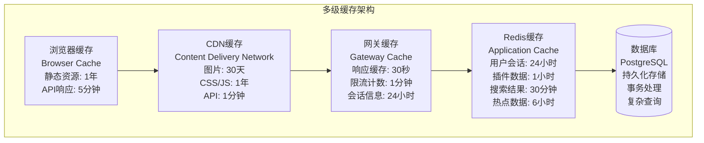

#### 3.3.2 缓存实现方案

```go
// 缓存管理器实现
package cache

import (
    "context"
    "encoding/json"
    "fmt"
    "sync"
    "time"
    
    "github.com/go-redis/redis/v8"
    "golang.org/x/sync/singleflight"
)

// CacheManager 缓存管理器
type CacheManager struct {
    redis       *redis.Client
    localCache  *sync.Map
    group       singleflight.Group
    config      CacheConfig
}

// CacheConfig 缓存配置
type CacheConfig struct {
    RedisAddr     string        `yaml:"redis_addr"`
    RedisPassword string        `yaml:"redis_password"`
    RedisDB       int           `yaml:"redis_db"`
    LocalTTL      time.Duration `yaml:"local_ttl"`
    RedisTTL      time.Duration `yaml:"redis_ttl"`
}

// Get 获取缓存数据
func (c *CacheManager) Get(ctx context.Context, key string, dest interface{}) error {
    // 1. 先查本地缓存
    if value, ok := c.localCache.Load(key); ok {
        if item, ok := value.(*CacheItem); ok && !item.IsExpired() {
            return json.Unmarshal(item.Data, dest)
        }
        c.localCache.Delete(key)
    }
    
    // 2. 再查Redis缓存
    data, err := c.redis.Get(ctx, key).Bytes()
    if err == nil {
        // 更新本地缓存
        c.setLocal(key, data, c.config.LocalTTL)
        return json.Unmarshal(data, dest)
    }
    
    return fmt.Errorf("cache miss: %s", key)
}

// Set 设置缓存数据
func (c *CacheManager) Set(ctx context.Context, key string, value interface{}, ttl time.Duration) error {
    data, err := json.Marshal(value)
    if err != nil {
        return err
    }
    
    // 设置Redis缓存
    if err := c.redis.Set(ctx, key, data, ttl).Err(); err != nil {
        return err
    }
    
    // 设置本地缓存
    localTTL := c.config.LocalTTL
    if ttl < localTTL {
        localTTL = ttl
    }
    c.setLocal(key, data, localTTL)
    
    return nil
}

// GetOrSet 获取或设置缓存（防缓存击穿）
func (c *CacheManager) GetOrSet(ctx context.Context, key string, dest interface{}, 
    ttl time.Duration, fn func() (interface{}, error)) error {
    
    // 使用singleflight防止缓存击穿
    val, err, _ := c.group.Do(key, func() (interface{}, error) {
        // 先尝试获取缓存
        if err := c.Get(ctx, key, dest); err == nil {
            return dest, nil
        }
        
        // 缓存未命中，执行回调函数
        result, err := fn()
        if err != nil {
            return nil, err
        }
        
        // 设置缓存
        if err := c.Set(ctx, key, result, ttl); err != nil {
            return result, err
        }
        
        return result, nil
    })
    
    if err != nil {
        return err
    }
    
    // 类型断言和赋值
    if val != dest {
        data, err := json.Marshal(val)
        if err != nil {
            return err
        }
        return json.Unmarshal(data, dest)
    }
    
    return nil
}

// 本地缓存项
type CacheItem struct {
    Data      []byte
    ExpiresAt time.Time
}

func (item *CacheItem) IsExpired() bool {
    return time.Now().After(item.ExpiresAt)
}

func (c *CacheManager) setLocal(key string, data []byte, ttl time.Duration) {
    item := &CacheItem{
        Data:      data,
        ExpiresAt: time.Now().Add(ttl),
    }
    c.localCache.Store(key, item)
}

// 缓存预热
func (c *CacheManager) Warmup(ctx context.Context) error {
    // 预热热点数据
    hotKeys := []string{
        "plugins:featured",
        "plugins:popular",
        "categories:all",
    }
    
    for _, key := range hotKeys {
        // 这里可以根据业务逻辑预热数据
        // 例如：从数据库加载数据并设置到缓存
    }
    
    return nil
}
```

#### 3.3.3 数据库优化方案

```sql
-- 数据库性能优化SQL
-- 1. 索引优化
-- 插件表复合索引
CREATE INDEX CONCURRENTLY idx_plugins_category_status_rating 
ON mp_plugins(category_id, status, rating DESC) 
WHERE status = 'published';

-- 插件搜索索引
CREATE INDEX CONCURRENTLY idx_plugins_search_vector 
ON mp_plugins USING gin(to_tsvector('english', name || ' ' || description));

-- 插件下载统计索引
CREATE INDEX CONCURRENTLY idx_plugin_downloads_date 
ON mp_plugin_downloads(plugin_id, created_at DESC);

-- 用户活动索引
CREATE INDEX CONCURRENTLY idx_user_activities_user_date 
ON user_activities(user_id, created_at DESC);

-- 2. 分区表设计
-- 按时间分区的下载记录表
CREATE TABLE mp_plugin_downloads_partitioned (
    id BIGSERIAL,
    plugin_id BIGINT NOT NULL,
    user_id BIGINT,
    ip_address INET,
    user_agent TEXT,
    created_at TIMESTAMP WITH TIME ZONE NOT NULL DEFAULT NOW()
) PARTITION BY RANGE (created_at);

-- 创建分区
CREATE TABLE mp_plugin_downloads_2024_01 PARTITION OF mp_plugin_downloads_partitioned
FOR VALUES FROM ('2024-01-01') TO ('2024-02-01');

CREATE TABLE mp_plugin_downloads_2024_02 PARTITION OF mp_plugin_downloads_partitioned
FOR VALUES FROM ('2024-02-01') TO ('2024-03-01');

-- 3. 物化视图优化
-- 插件统计物化视图
CREATE MATERIALIZED VIEW mv_plugin_stats AS
SELECT 
    p.id,
    p.name,
    p.category_id,
    COUNT(DISTINCT d.id) as download_count,
    COUNT(DISTINCT r.id) as review_count,
    AVG(r.rating) as avg_rating,
    MAX(d.created_at) as last_download_at
FROM mp_plugins p
LEFT JOIN mp_plugin_downloads d ON p.id = d.plugin_id
LEFT JOIN mp_plugin_reviews r ON p.id = r.plugin_id
WHERE p.status = 'published'
GROUP BY p.id, p.name, p.category_id;

-- 创建唯一索引
CREATE UNIQUE INDEX idx_mv_plugin_stats_id ON mv_plugin_stats(id);

-- 定时刷新物化视图
CREATE OR REPLACE FUNCTION refresh_plugin_stats()
RETURNS void AS $$
BEGIN
    REFRESH MATERIALIZED VIEW CONCURRENTLY mv_plugin_stats;
END;
$$ LANGUAGE plpgsql;

-- 4. 查询优化示例
-- 优化前的查询
/*
SELECT p.*, c.name as category_name, 
       COUNT(d.id) as download_count,
       AVG(r.rating) as avg_rating
FROM mp_plugins p
JOIN mp_categories c ON p.category_id = c.id
LEFT JOIN mp_plugin_downloads d ON p.id = d.plugin_id
LEFT JOIN mp_plugin_reviews r ON p.id = r.plugin_id
WHERE p.status = 'published'
  AND p.rating >= 4.0
GROUP BY p.id, c.name
ORDER BY download_count DESC
LIMIT 20;
*/

-- 优化后的查询（使用物化视图）
SELECT p.*, c.name as category_name, 
       s.download_count, s.avg_rating
FROM mp_plugins p
JOIN mp_categories c ON p.category_id = c.id
JOIN mv_plugin_stats s ON p.id = s.id
WHERE p.status = 'published'
  AND s.avg_rating >= 4.0
ORDER BY s.download_count DESC
LIMIT 20;

-- 5. 连接池配置优化
-- postgresql.conf 优化配置
/*
# 连接相关
max_connections = 200
shared_buffers = 256MB
effective_cache_size = 1GB
work_mem = 4MB
maintenance_work_mem = 64MB

# 检查点相关
checkpoint_completion_target = 0.9
wal_buffers = 16MB
default_statistics_target = 100

# 查询优化
random_page_cost = 1.1
effective_io_concurrency = 200
*/
```

### 3.4 安全架构加固

#### 3.4.1 安全防护体系

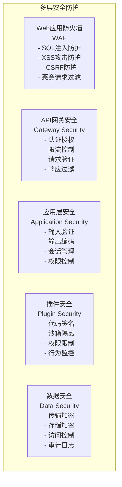

#### 3.4.2 插件安全沙箱实现

```go
// 插件安全沙箱实现
package security

import (
    "context"
    "fmt"
    "os"
    "os/exec"
    "path/filepath"
    "syscall"
    "time"
)

// SandboxManager 沙箱管理器
type SandboxManager struct {
    config    SandboxConfig
    sandboxes map[string]*Sandbox
    monitor   *SecurityMonitor
}

// SandboxConfig 沙箱配置
type SandboxConfig struct {
    BaseDir       string        `yaml:"base_dir"`
    TempDir       string        `yaml:"temp_dir"`
    MaxMemory     int64         `yaml:"max_memory"`     // bytes
    MaxCPU        float64       `yaml:"max_cpu"`        // percentage
    MaxDisk       int64         `yaml:"max_disk"`       // bytes
    MaxProcesses  int           `yaml:"max_processes"`
    MaxOpenFiles  int           `yaml:"max_open_files"`
    NetworkAccess bool          `yaml:"network_access"`
    Timeout       time.Duration `yaml:"timeout"`
}

// Sandbox 沙箱实例
type Sandbox struct {
    ID          string
    PluginID    string
    WorkDir     string
    Process     *os.Process
    Config      SandboxConfig
    StartTime   time.Time
    monitor     *ResourceMonitor
}

// CreateSandbox 创建沙箱
func (sm *SandboxManager) CreateSandbox(ctx context.Context, pluginID string) (*Sandbox, error) {
    sandboxID := generateSandboxID()
    workDir := filepath.Join(sm.config.BaseDir, sandboxID)
    
    // 创建工作目录
    if err := os.MkdirAll(workDir, 0755); err != nil {
        return nil, fmt.Errorf("failed to create work directory: %w", err)
    }
    
    // 设置目录权限
    if err := sm.setupDirectoryPermissions(workDir); err != nil {
        return nil, fmt.Errorf("failed to setup permissions: %w", err)
    }
    
    sandbox := &Sandbox{
        ID:        sandboxID,
        PluginID:  pluginID,
        WorkDir:   workDir,
        Config:    sm.config,
        StartTime: time.Now(),
        monitor:   NewResourceMonitor(),
    }
    
    sm.sandboxes[sandboxID] = sandbox
    return sandbox, nil
}

// ExecutePlugin 在沙箱中执行插件
func (s *Sandbox) ExecutePlugin(ctx context.Context, pluginPath string, args []string) error {
    // 验证插件文件
    if err := s.validatePlugin(pluginPath); err != nil {
        return fmt.Errorf("plugin validation failed: %w", err)
    }
    
    // 准备执行环境
    cmd := exec.CommandContext(ctx, pluginPath, args...)
    cmd.Dir = s.WorkDir
    
    // 设置环境变量
    cmd.Env = s.buildEnvironment()
    
    // 设置资源限制
    cmd.SysProcAttr = &syscall.SysProcAttr{
        Setpgid: true,
    }
    
    // 启动进程
    if err := cmd.Start(); err != nil {
        return fmt.Errorf("failed to start plugin: %w", err)
    }
    
    s.Process = cmd.Process
    
    // 启动资源监控
    go s.monitor.Start(ctx, s.Process.Pid)
    
    // 等待执行完成或超时
    done := make(chan error, 1)
    go func() {
        done <- cmd.Wait()
    }()
    
    select {
    case err := <-done:
        return err
    case <-time.After(s.Config.Timeout):
        s.Process.Kill()
        return fmt.Errorf("plugin execution timeout")
    case <-ctx.Done():
        s.Process.Kill()
        return ctx.Err()
    }
}

// validatePlugin 验证插件
func (s *Sandbox) validatePlugin(pluginPath string) error {
    // 1. 检查文件存在性
    if _, err := os.Stat(pluginPath); os.IsNotExist(err) {
        return fmt.Errorf("plugin file not found: %s", pluginPath)
    }
    
    // 2. 检查文件权限
    info, err := os.Stat(pluginPath)
    if err != nil {
        return err
    }
    
    if info.Mode()&0111 == 0 {
        return fmt.Errorf("plugin file is not executable")
    }
    
    // 3. 检查文件签名
    if err := s.verifySignature(pluginPath); err != nil {
        return fmt.Errorf("signature verification failed: %w", err)
    }
    
    // 4. 恶意代码检测
    if err := s.scanMalware(pluginPath); err != nil {
        return fmt.Errorf("malware detected: %w", err)
    }
    
    return nil
}

// verifySignature 验证数字签名
func (s *Sandbox) verifySignature(pluginPath string) error {
    // 实现数字签名验证逻辑
    // 这里可以使用GPG或其他签名验证工具
    return nil
}

// scanMalware 恶意代码扫描
func (s *Sandbox) scanMalware(pluginPath string) error {
    // 实现恶意代码扫描逻辑
    // 可以集成ClamAV或其他安全扫描工具
    return nil
}

// ResourceMonitor 资源监控器
type ResourceMonitor struct {
    pid     int
    metrics *ResourceMetrics
    alerts  chan SecurityAlert
}

// ResourceMetrics 资源使用指标
type ResourceMetrics struct {
    CPUUsage    float64   `json:"cpu_usage"`
    MemoryUsage int64     `json:"memory_usage"`
    DiskUsage   int64     `json:"disk_usage"`
    NetworkIO   NetworkIO `json:"network_io"`
    OpenFiles   int       `json:"open_files"`
    Processes   int       `json:"processes"`
    Timestamp   time.Time `json:"timestamp"`
}

// SecurityAlert 安全告警
type SecurityAlert struct {
    Type        string    `json:"type"`
    Severity    string    `json:"severity"`
    Message     string    `json:"message"`
    PluginID    string    `json:"plugin_id"`
    SandboxID   string    `json:"sandbox_id"`
    Metrics     *ResourceMetrics `json:"metrics"`
    Timestamp   time.Time `json:"timestamp"`
}

// Start 启动资源监控
func (rm *ResourceMonitor) Start(ctx context.Context, pid int) {
    rm.pid = pid
    ticker := time.NewTicker(time.Second)
    defer ticker.Stop()
    
    for {
        select {
        case <-ctx.Done():
            return
        case <-ticker.C:
            metrics, err := rm.collectMetrics()
            if err != nil {
                continue
            }
            
            rm.metrics = metrics
            
            // 检查资源使用是否超限
            if alert := rm.checkLimits(metrics); alert != nil {
                select {
                case rm.alerts <- *alert:
                default:
                    // 告警通道满了，丢弃告警
                }
            }
        }
    }
}

// collectMetrics 收集资源使用指标
func (rm *ResourceMonitor) collectMetrics() (*ResourceMetrics, error) {
    // 实现资源指标收集逻辑
    // 可以通过/proc文件系统或系统调用获取
    return &ResourceMetrics{
        Timestamp: time.Now(),
    }, nil
}
```

### 3.5 监控与运维体系

#### 3.5.1 监控架构设计

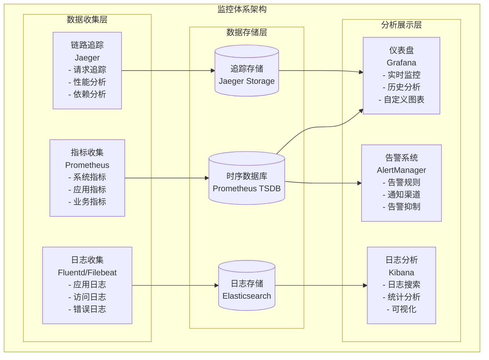

#### 3.5.2 监控指标定义

```yaml
# 监控指标配置
monitoring_metrics:
  # 系统指标
  system_metrics:
    - name: "cpu_usage_percent"
      type: "gauge"
      description: "CPU使用率"
      labels: ["instance", "cpu"]
      
    - name: "memory_usage_bytes"
      type: "gauge"
      description: "内存使用量"
      labels: ["instance", "type"]
      
    - name: "disk_usage_percent"
      type: "gauge"
      description: "磁盘使用率"
      labels: ["instance", "device", "mountpoint"]
      
    - name: "network_io_bytes"
      type: "counter"
      description: "网络IO字节数"
      labels: ["instance", "device", "direction"]
  
  # 应用指标
  application_metrics:
    - name: "http_requests_total"
      type: "counter"
      description: "HTTP请求总数"
      labels: ["method", "endpoint", "status"]
      
    - name: "http_request_duration_seconds"
      type: "histogram"
      description: "HTTP请求响应时间"
      labels: ["method", "endpoint"]
      buckets: [0.1, 0.25, 0.5, 1, 2.5, 5, 10]
      
    - name: "database_connections_active"
      type: "gauge"
      description: "活跃数据库连接数"
      labels: ["database"]
      
    - name: "cache_hit_ratio"
      type: "gauge"
      description: "缓存命中率"
      labels: ["cache_type"]
  
  # 业务指标
  business_metrics:
    - name: "plugin_downloads_total"
      type: "counter"
      description: "插件下载总数"
      labels: ["plugin_id", "category"]
      
    - name: "user_registrations_total"
      type: "counter"
      description: "用户注册总数"
      labels: ["source"]
      
    - name: "plugin_reviews_total"
      type: "counter"
      description: "插件评价总数"
      labels: ["plugin_id", "rating"]
      
    - name: "revenue_total"
      type: "counter"
      description: "总收入"
      labels: ["currency", "payment_method"]

# 告警规则配置
alerting_rules:
  - name: "HighCPUUsage"
    condition: "cpu_usage_percent > 80"
    duration: "5m"
    severity: "warning"
    message: "CPU使用率过高: {{ $value }}%"
    
  - name: "HighMemoryUsage"
    condition: "memory_usage_percent > 85"
    duration: "3m"
    severity: "warning"
    message: "内存使用率过高: {{ $value }}%"
    
  - name: "ServiceDown"
    condition: "up == 0"
    duration: "1m"
    severity: "critical"
    message: "服务不可用: {{ $labels.instance }}"
    
  - name: "HighErrorRate"
    condition: "rate(http_requests_total{status=~'5..'}[5m]) > 0.1"
    duration: "2m"
    severity: "critical"
    message: "错误率过高: {{ $value }}"
    
  - name: "SlowResponse"
    condition: "histogram_quantile(0.95, http_request_duration_seconds) > 2"
    duration: "5m"
    severity: "warning"
    message: "响应时间过长: {{ $value }}s"

# 日志配置
logging_config:
  level: "info"
  format: "json"
  output: "stdout"
  
  # 日志轮转
  rotation:
    max_size: "100MB"
    max_age: "30d"
    max_backups: 10
    compress: true
  
  # 结构化日志字段
  fields:
    - "timestamp"
    - "level"
    - "service"
    - "trace_id"
    - "user_id"
    - "request_id"
    - "message"
    - "error"
    - "duration"
```

---

## 4. 实施计划与路线图

### 4.1 实施阶段规划

#### 第一阶段：核心功能实现 (1-3个月)

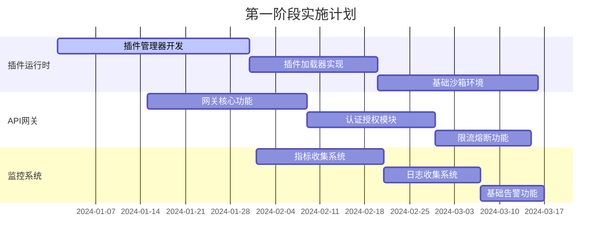

**第一阶段交付物:**
- 可运行的插件管理器
- 基础的插件沙箱环境
- 完整的API网关
- 基础监控告警系统

#### 第二阶段：性能优化与安全加固 (3-6个月)

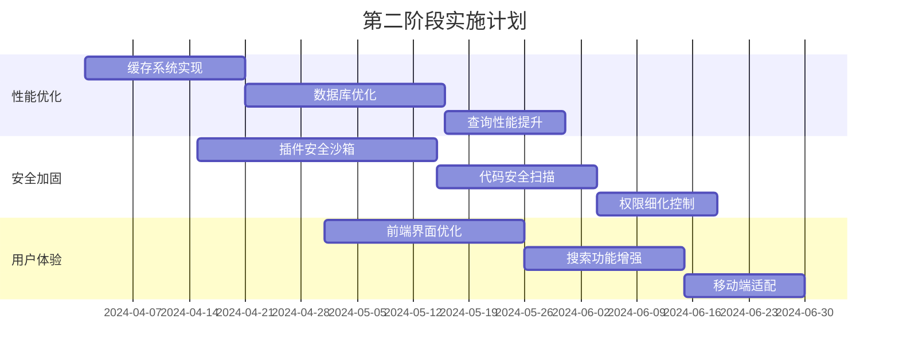

**第二阶段交付物:**
- 完整的多级缓存系统
- 高性能的数据库查询
- 企业级安全防护体系
- 优化的用户界面

#### 第三阶段：生态系统建设 (6-12个月)

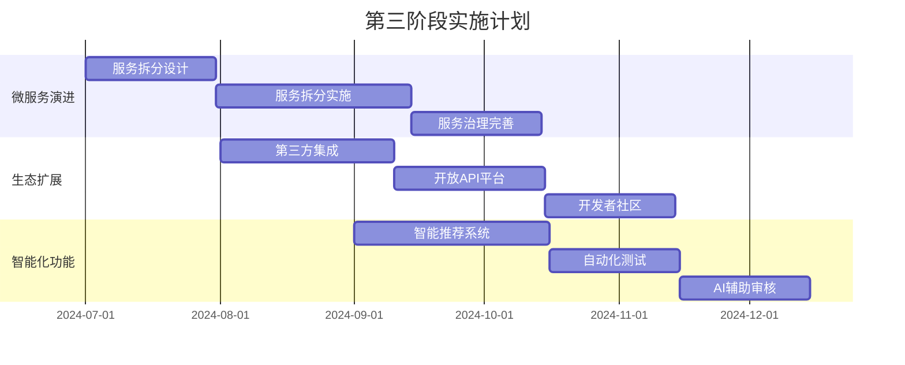

**第三阶段交付物:**
- 完整的微服务架构
- 开放的API生态系统
- 智能化的推荐和审核系统

### 4.2 资源需求评估

#### 人力资源需求

```yaml
resource_requirements:
  team_structure:
    backend_developers: 3-4人
    frontend_developers: 2-3人
    devops_engineers: 2人
    security_specialists: 1人
    qa_engineers: 2人
    product_managers: 1人
    
  skill_requirements:
    backend:
      - "Go语言开发经验 3年+"
      - "微服务架构经验"
      - "数据库优化经验"
      - "安全开发经验"
    
    frontend:
      - "React开发经验 2年+"
      - "TypeScript开发经验"
      - "UI/UX设计能力"
      - "性能优化经验"
    
    devops:
      - "Kubernetes运维经验"
      - "监控系统搭建经验"
      - "CI/CD流水线经验"
      - "安全运维经验"
```

#### 基础设施需求

```yaml
infrastructure_requirements:
  development_environment:
    servers: "4台 (16核32GB)"
    storage: "2TB SSD"
    network: "千兆网络"
    
  testing_environment:
    servers: "6台 (16核32GB)"
    storage: "4TB SSD"
    network: "千兆网络"
    
  production_environment:
    servers: "12台 (32核64GB)"
    storage: "10TB SSD"
    network: "万兆网络"
    load_balancer: "2台"
    
  cloud_services:
    cdn: "全球CDN服务"
    monitoring: "监控服务"
    backup: "备份服务"
    security: "安全服务"
```

### 4.3 风险控制措施

#### 技术风险控制

```yaml
technical_risk_control:
  development_risks:
    - risk: "技术选型风险"
      mitigation: "技术调研和POC验证"
      
    - risk: "性能风险"
      mitigation: "性能测试和压力测试"
      
    - risk: "安全风险"
      mitigation: "安全审计和渗透测试"
      
    - risk: "兼容性风险"
      mitigation: "兼容性测试和版本管理"
  
  operational_risks:
    - risk: "部署风险"
      mitigation: "蓝绿部署和自动回滚"
      
    - risk: "数据风险"
      mitigation: "数据备份和恢复测试"
      
    - risk: "监控风险"
      mitigation: "多层监控和告警机制"
```

#### 项目风险控制

```yaml
project_risk_control:
  schedule_risks:
    - risk: "进度延期风险"
      mitigation: "敏捷开发和迭代交付"
      
    - risk: "需求变更风险"
      mitigation: "需求管理和变更控制"
  
  resource_risks:
    - risk: "人员流失风险"
      mitigation: "知识文档化和交接机制"
      
    - risk: "技能不足风险"
      mitigation: "技术培训和外部支持"
  
  quality_risks:
    - risk: "质量风险"
      mitigation: "代码审查和自动化测试"
      
    - risk: "用户体验风险"
      mitigation: "用户测试和反馈收集"
```

---

## 5. 成本效益分析

### 5.1 投入成本估算

#### 开发成本

```yaml
development_costs:
  personnel_costs:
    backend_team: "3人 × 12月 × 25万/年 = 75万"
    frontend_team: "2人 × 12月 × 22万/年 = 44万"
    devops_team: "2人 × 12月 × 28万/年 = 56万"
    qa_team: "2人 × 12月 × 20万/年 = 40万"
    total_personnel: "215万/年"
  
  infrastructure_costs:
    development_env: "5万/年"
    testing_env: "8万/年"
    production_env: "30万/年"
    cloud_services: "15万/年"
    total_infrastructure: "58万/年"
  
  other_costs:
    software_licenses: "10万/年"
    training: "8万/年"
    consulting: "15万/年"
    total_other: "33万/年"
  
  total_annual_cost: "306万/年"
```

#### 运维成本

```yaml
operational_costs:
  personnel:
    operations_team: "2人 × 20万/年 = 40万"
    support_team: "1人 × 18万/年 = 18万"
    
  infrastructure:
    hosting: "50万/年"
    monitoring: "8万/年"
    security: "12万/年"
    backup: "5万/年"
    
  total_operational: "133万/年"
```

### 5.2 预期收益分析

#### 直接收益

```yaml
direct_benefits:
  revenue_streams:
    plugin_sales: "插件销售分成 20%"
    subscription: "企业订阅服务"
    advertising: "广告收入"
    premium_services: "增值服务"
  
  projected_revenue:
    year_1: "200万"
    year_2: "500万"
    year_3: "1000万"
    
  cost_savings:
    development_efficiency: "50万/年"
    operational_efficiency: "30万/年"
    maintenance_reduction: "20万/年"
```

#### 间接收益

```yaml
indirect_benefits:
  strategic_value:
    - "建立插件生态系统"
    - "提升技术品牌影响力"
    - "积累用户数据资产"
    - "培养技术团队能力"
  
  competitive_advantage:
    - "技术领先优势"
    - "用户粘性提升"
    - "市场份额扩大"
    - "合作伙伴吸引"
```

### 5.3 投资回报分析

#### ROI计算

```yaml
roi_analysis:
  investment:
    initial_investment: "306万 (第一年)"
    ongoing_investment: "133万/年 (运维)"
    
  returns:
    year_1: "200万"
    year_2: "500万"
    year_3: "1000万"
    
  roi_calculation:
    year_1_roi: "-34.6% ((200-306)/306)"
    year_2_roi: "44.4% ((500-133)/306)"
    year_3_roi: "283.3% ((1000-133)/306)"
    
  payback_period: "18个月"
```

---

## 6. 质量保证体系

### 6.1 代码质量标准

#### 代码规范

```yaml
code_standards:
  golang:
    style_guide: "Google Go Style Guide"
    linting: "golangci-lint"
    formatting: "gofmt"
    testing: "go test + testify"
    coverage: ">= 80%"
    
  javascript:
    style_guide: "Airbnb JavaScript Style Guide"
    linting: "ESLint"
    formatting: "Prettier"
    testing: "Jest + React Testing Library"
    coverage: ">= 75%"
    
  general:
    documentation: "必须有完整的API文档"
    comments: "复杂逻辑必须有注释"
    naming: "使用有意义的命名"
    complexity: "圈复杂度 < 10"
```

#### 代码审查流程

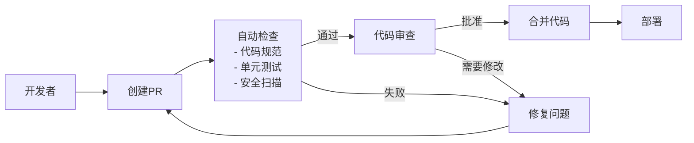

### 6.2 测试策略

#### 测试金字塔

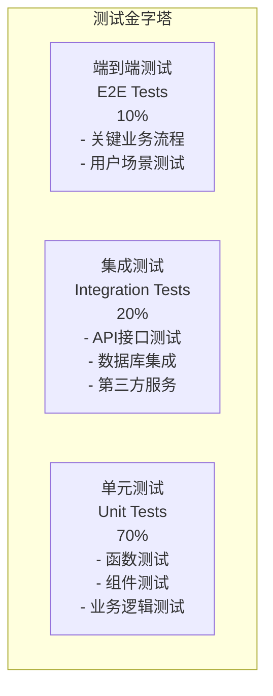

#### 测试实施方案

```yaml
testing_strategy:
  unit_testing:
    backend:
      framework: "Go testing + testify"
      coverage_target: ">= 80%"
      mock_framework: "gomock"
      
    frontend:
      framework: "Jest + React Testing Library"
      coverage_target: ">= 75%"
      mock_framework: "MSW"
  
  integration_testing:
    api_testing:
      framework: "Postman + Newman"
      test_data: "测试数据库"
      environment: "测试环境"
      
    database_testing:
      framework: "Go testing + testcontainers"
      test_database: "PostgreSQL Test Container"
  
  e2e_testing:
    framework: "Cypress"
    browsers: ["Chrome", "Firefox", "Safari"]
    devices: ["Desktop", "Tablet", "Mobile"]
    
  performance_testing:
    load_testing: "K6"
    stress_testing: "JMeter"
    monitoring: "Grafana + Prometheus"
    
  security_testing:
    static_analysis: "SonarQube"
    dependency_scan: "Snyk"
    penetration_testing: "OWASP ZAP"
```

### 6.3 部署质量控制

#### CI/CD流水线

```yaml
cicd_pipeline:
  stages:
    - name: "代码检查"
      steps:
        - "代码格式检查"
        - "代码规范检查"
        - "安全漏洞扫描"
        - "依赖检查"
      
    - name: "单元测试"
      steps:
        - "运行单元测试"
        - "生成覆盖率报告"
        - "质量门禁检查"
      
    - name: "构建镜像"
      steps:
        - "构建Docker镜像"
        - "镜像安全扫描"
        - "推送到镜像仓库"
      
    - name: "集成测试"
      steps:
        - "部署到测试环境"
        - "运行集成测试"
        - "运行E2E测试"
      
    - name: "性能测试"
      steps:
        - "负载测试"
        - "压力测试"
        - "性能基准对比"
      
    - name: "生产部署"
      steps:
        - "蓝绿部署"
        - "健康检查"
        - "烟雾测试"
        - "监控告警"
  
  quality_gates:
    - "单元测试覆盖率 >= 80%"
    - "集成测试通过率 = 100%"
    - "安全扫描无高危漏洞"
    - "性能测试满足SLA"
    - "代码审查通过"
```

---

## 7. 总结与建议

### 7.1 核心改进要点

1. **插件运行时实现**: 这是系统的核心功能，必须优先实现
2. **API网关完善**: 统一的入口管理和安全控制
3. **性能优化**: 多级缓存和数据库优化
4. **安全加固**: 插件沙箱和安全防护体系
5. **监控完善**: 全方位的监控和运维体系

### 7.2 实施建议

#### 优先级排序

```yaml
implementation_priority:
  phase_1_critical:
    - "插件运行时核心功能"
    - "API网关基础功能"
    - "基础监控告警"
    
  phase_2_important:
    - "性能优化改进"
    - "安全机制加强"
    - "用户体验提升"
    
  phase_3_enhancement:
    - "微服务架构演进"
    - "生态系统扩展"
    - "智能化功能"
```

#### 成功关键因素

1. **技术团队能力**: 确保团队具备相应的技术能力
2. **项目管理**: 采用敏捷开发方法，确保项目按时交付
3. **质量控制**: 建立完善的质量保证体系
4. **风险管理**: 识别和控制项目风险
5. **持续改进**: 基于用户反馈持续优化产品

### 7.3 预期成果

通过实施本改进方案，预期能够实现：

1. **技术成果**:
   - 完整的插件生态系统
   - 高性能的系统架构
   - 企业级的安全防护
   - 完善的运维体系

2. **业务成果**:
   - 提升用户体验
   - 增加收入来源
   - 扩大市场份额
   - 建立竞争优势

3. **团队成果**:
   - 提升技术能力
   - 积累项目经验
   - 建立技术品牌
   - 培养核心团队

### 7.4 最终建议

基于本次深入分析，强烈建议按照本改进方案的优先级和时间表，系统性地推进太上老君系统的架构改进工作。通过分阶段实施，既能够控制风险，又能够快速见到成效，最终将系统打造成为行业领先的企业级插件市场平台。

---

**建议书编制**: 系统架构改进团队  
**编制日期**: 2024年1月  
**版本**: v1.0  
**状态**: 最终版