# 太上老君系统模块依赖关系图

## 1. 整体架构依赖图

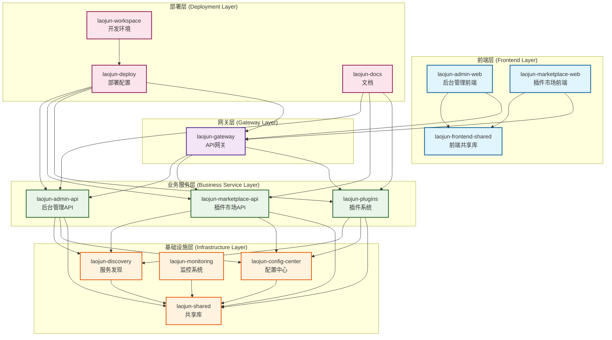

## 2. 详细模块依赖关系

### 2.1 前端模块依赖

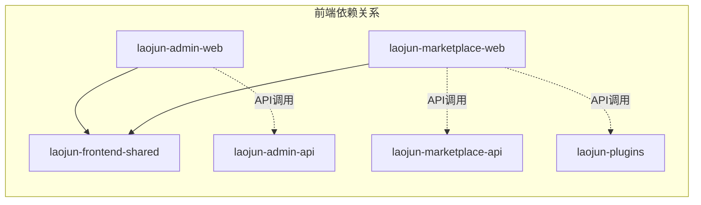

**依赖详情:**
- `laojun-admin-web` 依赖 `@laojun/frontend-shared` 共享组件库
- `laojun-marketplace-web` 依赖 `@laojun/frontend-shared` 共享组件库
- 前端通过 API Gateway 调用后端服务

### 2.2 API服务依赖

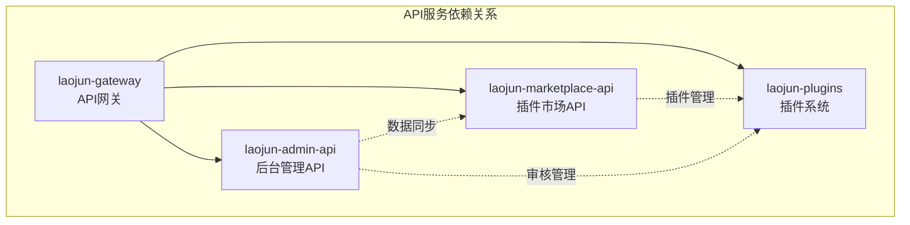

**依赖详情:**
- API Gateway 作为统一入口，路由到各个业务服务
- 后台管理API与插件市场API之间有数据同步关系
- 插件系统为其他服务提供插件管理能力

### 2.3 基础设施依赖

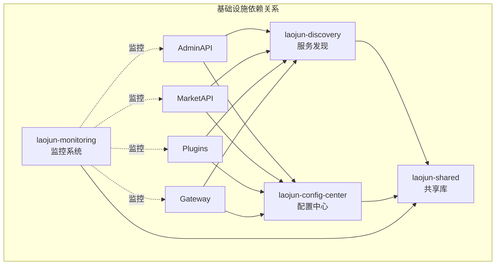

## 3. 数据流向图

### 3.1 用户请求流向

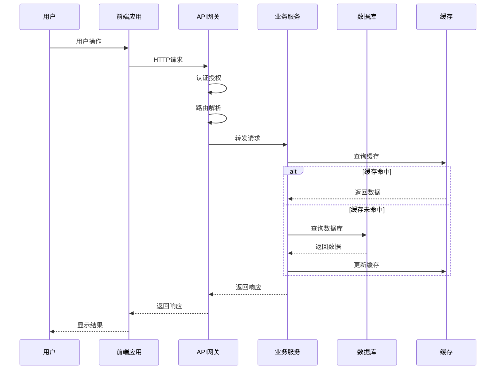

### 3.2 插件生命周期数据流

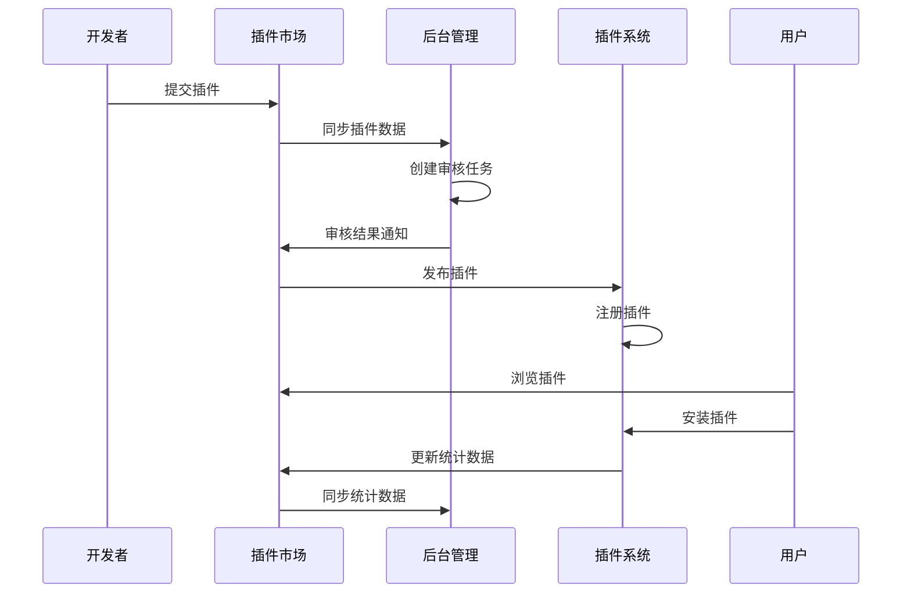

### 3.3 配置管理数据流

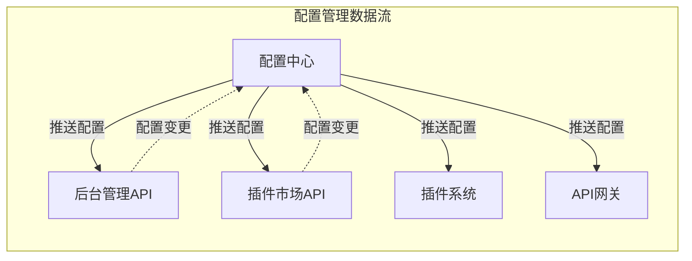

## 4. 接口依赖关系

### 4.1 内部API接口依赖

```yaml
# API接口依赖关系
api_dependencies:
  laojun-admin-api:
    provides:
      - /api/v1/admin/users
      - /api/v1/admin/plugins
      - /api/v1/admin/reviews
      - /api/v1/admin/stats
    consumes:
      - laojun-marketplace-api: /api/v1/marketplace/plugins
      - laojun-plugins: /api/v1/plugins/management
      - laojun-discovery: /api/v1/services
      - laojun-config-center: /api/v1/configs

  laojun-marketplace-api:
    provides:
      - /api/v1/marketplace/plugins
      - /api/v1/marketplace/categories
      - /api/v1/marketplace/reviews
      - /api/v1/marketplace/purchases
    consumes:
      - laojun-plugins: /api/v1/plugins/registry
      - laojun-admin-api: /api/v1/admin/sync
      - laojun-discovery: /api/v1/services
      - laojun-config-center: /api/v1/configs

  laojun-plugins:
    provides:
      - /api/v1/plugins/registry
      - /api/v1/plugins/management
      - /api/v1/plugins/runtime
      - /api/v1/plugins/lifecycle
    consumes:
      - laojun-discovery: /api/v1/services
      - laojun-config-center: /api/v1/configs

  laojun-gateway:
    provides:
      - /api/v1/gateway/routes
      - /api/v1/gateway/health
    consumes:
      - laojun-admin-api: /api/v1/admin/*
      - laojun-marketplace-api: /api/v1/marketplace/*
      - laojun-plugins: /api/v1/plugins/*
      - laojun-discovery: /api/v1/services
```

### 4.2 外部接口依赖

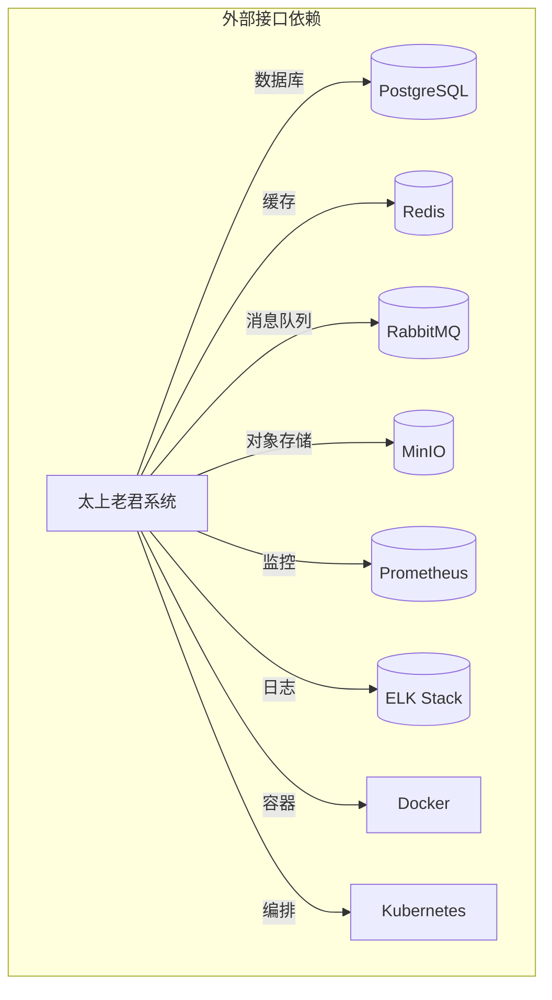

## 5. 数据库依赖关系

### 5.1 数据库表依赖

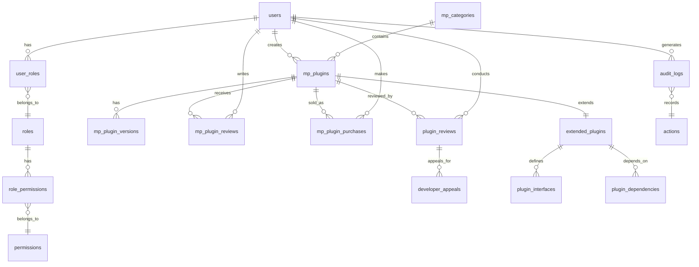

### 5.2 数据同步依赖

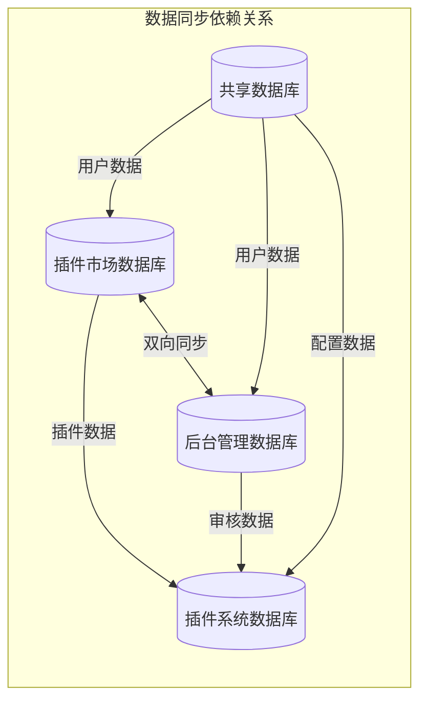

## 6. 服务通信依赖

### 6.1 同步通信依赖

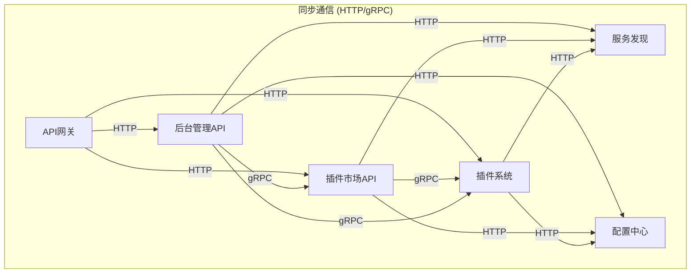

### 6.2 异步通信依赖

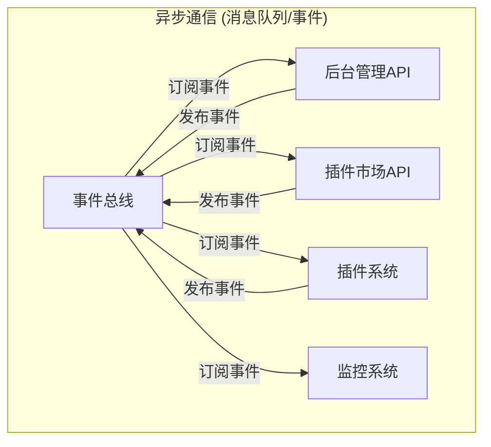

## 7. 部署依赖关系

### 7.1 容器依赖

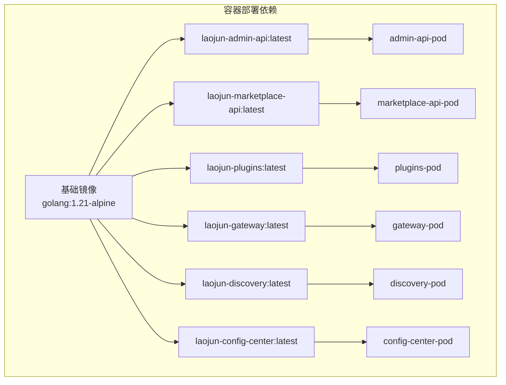

### 7.2 Kubernetes资源依赖

```yaml
# Kubernetes资源依赖关系
k8s_dependencies:
  namespaces:
    - laojun-system    # 系统组件
    - laojun-business  # 业务组件
    - laojun-frontend  # 前端组件

  config_maps:
    - laojun-config    # 全局配置
    - database-config  # 数据库配置
    - redis-config     # Redis配置

  secrets:
    - database-secret  # 数据库密码
    - jwt-secret      # JWT密钥
    - tls-secret      # TLS证书

  services:
    dependencies:
      gateway-service:
        - admin-api-service
        - marketplace-api-service
        - plugins-service
      
      admin-api-service:
        - database-service
        - redis-service
        - discovery-service
        - config-center-service
      
      marketplace-api-service:
        - database-service
        - redis-service
        - discovery-service
        - config-center-service
      
      plugins-service:
        - database-service
        - redis-service
        - discovery-service
        - config-center-service
```

## 8. 开发依赖关系

### 8.1 Go模块依赖

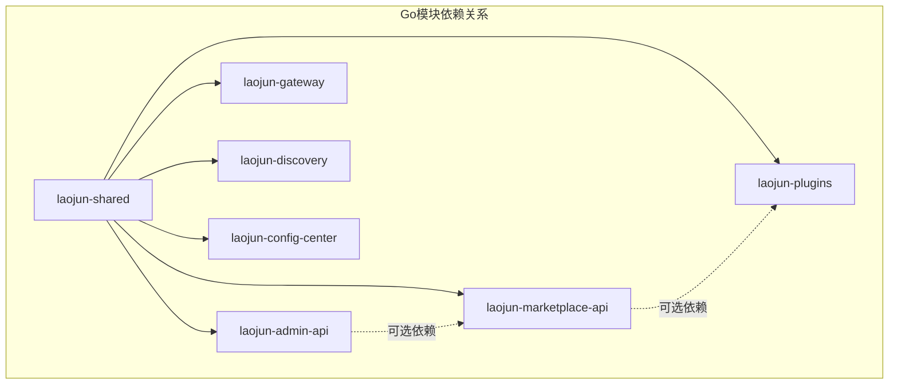

### 8.2 前端依赖关系

```json
{
  "frontend_dependencies": {
    "laojun-admin-web": {
      "dependencies": {
        "@laojun/frontend-shared": "workspace:*",
        "react": "^18.2.0",
        "antd": "^5.0.0",
        "zustand": "^4.4.0",
        "axios": "^1.5.0"
      }
    },
    "laojun-marketplace-web": {
      "dependencies": {
        "@laojun/frontend-shared": "workspace:*",
        "react": "^18.2.0",
        "antd": "^5.0.0",
        "zustand": "^4.4.0",
        "axios": "^1.5.0"
      }
    },
    "laojun-frontend-shared": {
      "peerDependencies": {
        "react": "^18.2.0",
        "antd": "^5.0.0"
      }
    }
  }
}
```

## 9. 运行时依赖关系

### 9.1 服务启动顺序

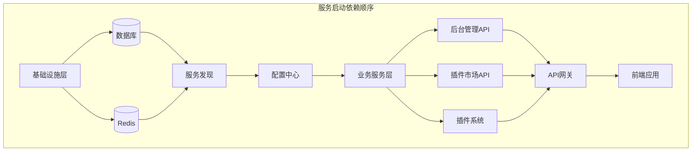

### 9.2 健康检查依赖

```yaml
# 健康检查依赖配置
health_check_dependencies:
  laojun-gateway:
    depends_on:
      - laojun-admin-api
      - laojun-marketplace-api
      - laojun-plugins
    
  laojun-admin-api:
    depends_on:
      - postgresql
      - redis
      - laojun-discovery
      - laojun-config-center
    
  laojun-marketplace-api:
    depends_on:
      - postgresql
      - redis
      - laojun-discovery
      - laojun-config-center
    
  laojun-plugins:
    depends_on:
      - postgresql
      - redis
      - laojun-discovery
      - laojun-config-center
```

## 10. 依赖管理策略

### 10.1 版本兼容性矩阵

| 模块 | laojun-shared | PostgreSQL | Redis | Go版本 |
|------|---------------|------------|-------|--------|
| laojun-admin-api | v1.0.x | 14+ | 6+ | 1.21+ |
| laojun-marketplace-api | v1.0.x | 14+ | 6+ | 1.21+ |
| laojun-plugins | v1.0.x | 14+ | 6+ | 1.21+ |
| laojun-gateway | v1.0.x | - | 6+ | 1.21+ |
| laojun-discovery | v1.0.x | - | 6+ | 1.21+ |
| laojun-config-center | v1.0.x | 14+ | 6+ | 1.21+ |

### 10.2 依赖更新策略

```yaml
dependency_update_strategy:
  # 自动更新策略
  auto_update:
    patch_versions: true    # 自动更新补丁版本
    minor_versions: false   # 手动更新次版本
    major_versions: false   # 手动更新主版本
  
  # 测试策略
  testing:
    unit_tests: required
    integration_tests: required
    e2e_tests: required
    performance_tests: optional
  
  # 回滚策略
  rollback:
    automatic: true
    conditions:
      - health_check_failure
      - performance_degradation
      - error_rate_increase
```

---

## 总结

本文档详细描述了太上老君系统的模块依赖关系，包括：

1. **整体架构依赖**: 展示了各层级之间的依赖关系
2. **数据流向**: 描述了数据在系统中的流转路径
3. **接口依赖**: 定义了内部和外部接口的依赖关系
4. **部署依赖**: 说明了容器和Kubernetes资源的依赖
5. **开发依赖**: 展示了代码模块之间的依赖关系
6. **运行时依赖**: 描述了服务启动和运行时的依赖顺序

这些依赖关系图为系统的开发、部署、运维和扩展提供了重要的参考依据。