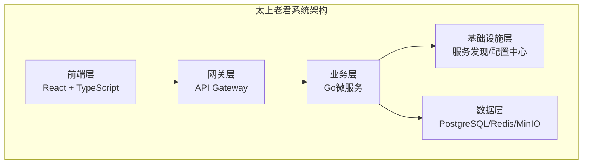
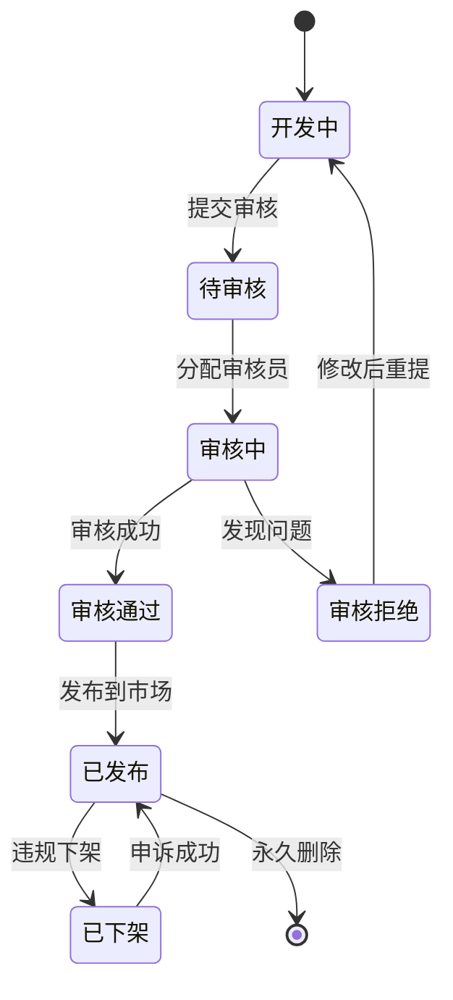
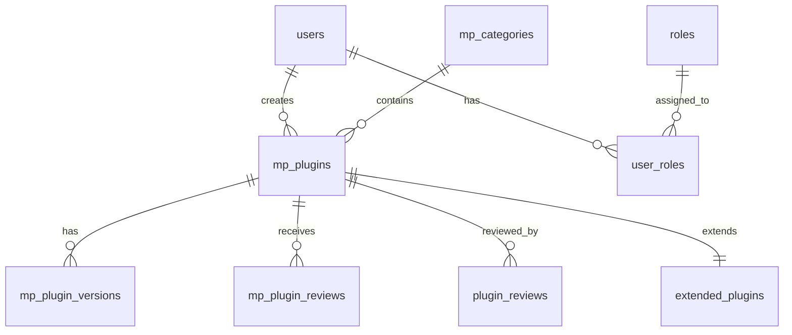
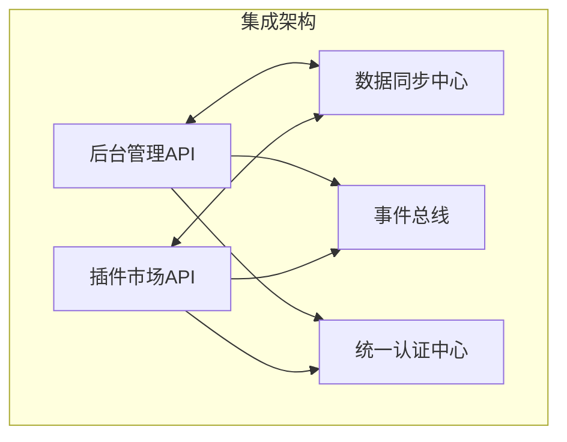
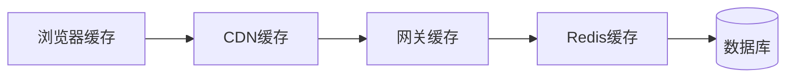
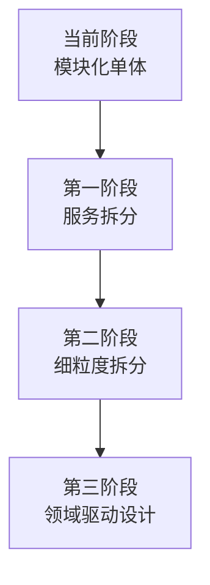
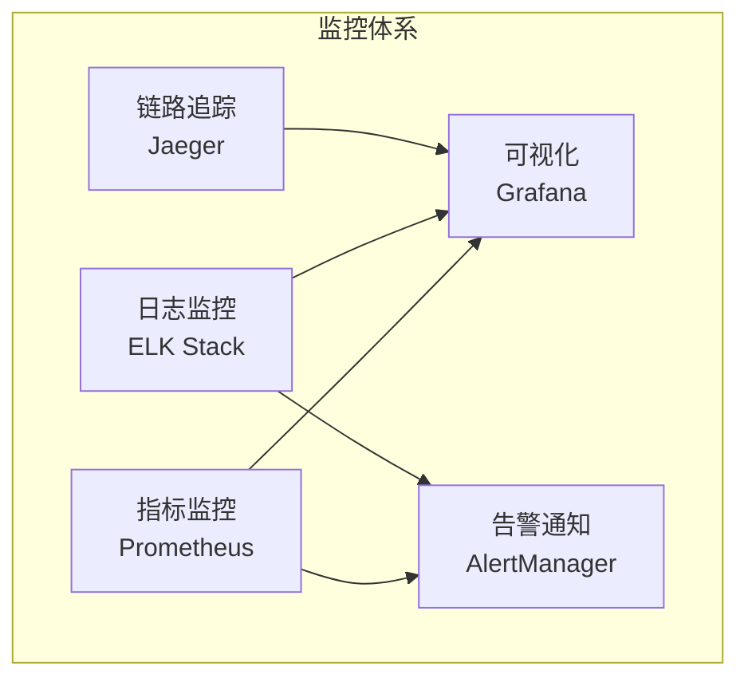
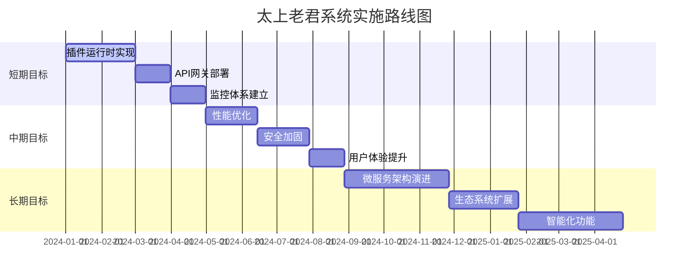

# 太上老君系统架构分析报告

## 执行摘要

本报告对太上老君系统进行了全面的架构分析，重点关注插件市场与总后台的技术架构、集成方案和优化建议。通过深入分析代码结构、数据模型、业务流程和技术实现，为系统的进一步发展提供了详细的技术指导。

### 主要发现

1. **系统架构完整性**: 太上老君系统采用了现代化的微服务架构，具备良好的模块化设计
2. **插件生态系统**: 建立了完整的插件开发、审核、发布、管理生命周期
3. **技术栈先进性**: 采用Go + React技术栈，具备高性能和良好的开发体验
4. **扩展性设计**: 系统具备良好的水平扩展能力和微服务演进潜力

### 关键建议

1. **完善插件运行时**: 当前插件运行时模块需要进一步实现和完善
2. **加强安全机制**: 建议实施更严格的插件安全沙箱和代码审核机制
3. **优化性能**: 通过缓存策略、数据库优化等手段提升系统性能
4. **增强监控**: 建立完整的监控、日志、告警体系

---

## 1. 项目概述

### 1.1 项目背景

太上老君系统是一个企业级的插件市场平台，旨在为开发者提供插件开发、发布、管理的完整生态系统，同时为企业用户提供丰富的插件资源和统一的管理后台。

### 1.2 系统架构概览



### 1.3 核心模块

| 模块名称 | 功能描述 | 技术栈 | 状态 |
|---------|----------|--------|------|
| laojun-admin-web | 后台管理前端 | React + Antd | ✅ 已实现 |
| laojun-marketplace-web | 插件市场前端 | React + Antd | ✅ 已实现 |
| laojun-admin-api | 后台管理API | Go + Gin | ✅ 已实现 |
| laojun-marketplace-api | 插件市场API | Go + Gin | ✅ 已实现 |
| laojun-plugins | 插件系统 | Go + 插件运行时 | ⚠️ 部分实现 |
| laojun-gateway | API网关 | Go + Gin | ⚠️ 待实现 |
| laojun-shared | 共享库 | Go | ✅ 已实现 |

---

## 2. 技术架构分析

### 2.1 整体架构评估

#### 优势分析

1. **模块化设计**: 系统采用清晰的模块化架构，职责分离明确
2. **技术栈统一**: 后端统一使用Go语言，前端统一使用React，降低维护成本
3. **数据模型完整**: 建立了完整的插件、用户、审核、交易数据模型
4. **业务流程清晰**: 插件从开发到发布的完整生命周期管理

#### 存在问题

1. **插件运行时缺失**: `laojun-plugins/runtime`、`laojun-plugins/registry`、`laojun-plugins/sdk`目录为空
2. **服务发现未实现**: `laojun-discovery`和`laojun-config-center`模块缺失
3. **API网关待完善**: 统一的API网关层需要进一步实现
4. **监控体系不完整**: 缺乏完整的监控、日志、告警机制

### 2.2 插件系统架构分析

#### 当前实现状态

```yaml
plugin_system_status:
  已实现:
    - 插件数据模型 (Plugin, PluginVersion, ExtendedPlugin)
    - 插件管理API (CRUD操作)
    - 插件审核流程 (审核状态管理)
    - 插件市场展示 (分类、搜索、评价)
  
  待实现:
    - 插件运行时环境
    - 插件加载器
    - 插件沙箱隔离
    - 插件SDK框架
    - 插件注册中心
```

#### 插件生命周期管理



### 2.3 数据架构分析

#### 数据库设计评估

**优势:**
- 完整的关系模型设计
- 支持插件版本管理
- 完善的用户权限体系
- 详细的审核流程记录

**改进建议:**
- 增加数据分区策略
- 优化查询索引设计
- 实施读写分离
- 增加数据备份策略

#### 核心数据模型



---

## 3. 集成方案分析

### 3.1 插件市场与总后台集成

#### 集成架构设计



#### 数据同步策略

1. **实时同步**: 关键业务数据通过事件驱动实时同步
2. **批量同步**: 统计数据通过定时任务批量同步
3. **冲突解决**: 基于时间戳和业务规则的冲突解决机制
4. **数据一致性**: 通过分布式事务保证数据一致性

### 3.2 权限控制集成

#### 统一权限模型

```yaml
rbac_model:
  roles:
    - name: "super_admin"
      permissions: ["*"]
    
    - name: "admin"
      permissions:
        - "user.manage"
        - "plugin.review"
        - "system.config"
    
    - name: "developer"
      permissions:
        - "plugin.create"
        - "plugin.update"
        - "plugin.publish"
    
    - name: "user"
      permissions:
        - "plugin.view"
        - "plugin.purchase"
        - "plugin.review"
```

### 3.3 通信协议设计

#### API接口标准

```yaml
api_standards:
  rest_api:
    base_url: "https://api.laojun.com"
    version: "v1"
    authentication: "Bearer Token"
    content_type: "application/json"
    
  response_format:
    success:
      code: 200
      message: "success"
      data: {}
      timestamp: "2024-01-01T00:00:00Z"
    
    error:
      code: 400
      message: "error message"
      error: "detailed error"
      timestamp: "2024-01-01T00:00:00Z"
```

---

## 4. 性能分析与优化

### 4.1 性能现状分析

#### 潜在性能瓶颈

1. **数据库查询**: 复杂的关联查询可能影响性能
2. **文件上传**: 大文件上传处理需要优化
3. **搜索功能**: 全文搜索性能有待提升
4. **缓存策略**: 缺乏完整的缓存体系

#### 性能优化建议

```yaml
performance_optimization:
  database:
    - "添加适当索引"
    - "实施查询优化"
    - "使用连接池"
    - "读写分离"
  
  cache:
    - "Redis缓存热点数据"
    - "CDN缓存静态资源"
    - "应用层缓存"
    - "数据库查询缓存"
  
  application:
    - "异步处理"
    - "批量操作"
    - "连接复用"
    - "内存优化"
```

### 4.2 缓存策略设计

#### 多级缓存架构



#### 缓存配置建议

```yaml
cache_config:
  browser_cache:
    static_resources: "1 year"
    api_responses: "5 minutes"
  
  cdn_cache:
    images: "30 days"
    css_js: "1 year"
    api: "1 minute"
  
  redis_cache:
    user_sessions: "24 hours"
    plugin_data: "1 hour"
    search_results: "30 minutes"
    hot_data: "6 hours"
```

---

## 5. 安全分析与建议

### 5.1 安全现状评估

#### 已实现的安全措施

1. **身份认证**: JWT令牌认证机制
2. **权限控制**: 基于角色的访问控制(RBAC)
3. **数据验证**: 输入参数验证和过滤
4. **审核机制**: 插件代码审核流程

#### 安全风险识别

1. **插件安全**: 缺乏完整的插件沙箱隔离
2. **代码注入**: 需要加强代码安全扫描
3. **数据泄露**: 敏感数据加密存储待完善
4. **访问控制**: API接口权限控制需要细化

### 5.2 安全加固建议

#### 插件安全沙箱

```yaml
plugin_security:
  sandbox:
    - "进程隔离"
    - "资源限制"
    - "网络隔离"
    - "文件系统隔离"
  
  code_review:
    - "静态代码分析"
    - "恶意代码检测"
    - "依赖安全扫描"
    - "人工审核"
  
  runtime_protection:
    - "行为监控"
    - "异常检测"
    - "资源监控"
    - "安全事件记录"
```

#### 数据安全措施

```yaml
data_security:
  encryption:
    - "传输加密: TLS 1.3"
    - "存储加密: AES-256"
    - "密钥管理: HSM"
    - "数字签名: RSA-2048"
  
  access_control:
    - "最小权限原则"
    - "动态权限控制"
    - "API访问限制"
    - "数据脱敏"
  
  audit:
    - "操作日志记录"
    - "访问日志分析"
    - "异常行为检测"
    - "合规性报告"
```

---

## 6. 可扩展性分析

### 6.1 当前扩展能力

#### 水平扩展能力

1. **无状态设计**: 业务服务采用无状态设计，支持水平扩展
2. **数据库分离**: 数据库与应用分离，支持独立扩展
3. **负载均衡**: 支持多实例负载均衡部署
4. **容器化**: 支持Docker容器化部署

#### 垂直扩展能力

1. **资源配置**: 支持动态调整CPU、内存资源
2. **数据库优化**: 支持数据库性能调优
3. **缓存扩展**: 支持Redis集群扩展
4. **存储扩展**: 支持对象存储扩展

### 6.2 微服务演进路径

#### 演进阶段规划



#### 服务拆分建议

```yaml
microservices_evolution:
  phase_1:
    services:
      - "用户服务 (User Service)"
      - "插件服务 (Plugin Service)"
      - "订单服务 (Order Service)"
      - "审核服务 (Review Service)"
  
  phase_2:
    services:
      - "认证服务 (Auth Service)"
      - "支付服务 (Payment Service)"
      - "通知服务 (Notification Service)"
      - "搜索服务 (Search Service)"
      - "文件服务 (File Service)"
  
  phase_3:
    domains:
      - "用户域 (User Domain)"
      - "商品域 (Product Domain)"
      - "交易域 (Transaction Domain)"
      - "运营域 (Operation Domain)"
```

---

## 7. 运维与监控

### 7.1 监控体系建议

#### 监控架构设计



#### 关键监控指标

```yaml
monitoring_metrics:
  system_metrics:
    - "CPU使用率"
    - "内存使用率"
    - "磁盘使用率"
    - "网络流量"
  
  application_metrics:
    - "请求响应时间"
    - "请求成功率"
    - "并发用户数"
    - "错误率"
  
  business_metrics:
    - "插件下载量"
    - "用户注册数"
    - "交易成功率"
    - "审核通过率"
```

### 7.2 运维自动化

#### CI/CD流水线

```yaml
cicd_pipeline:
  stages:
    - name: "代码检查"
      tools: ["ESLint", "Go Vet", "SonarQube"]
    
    - name: "单元测试"
      coverage: ">= 80%"
      tools: ["Jest", "Go Test"]
    
    - name: "构建镜像"
      registry: "Harbor"
      security_scan: true
    
    - name: "部署测试"
      environment: "staging"
      smoke_test: true
    
    - name: "生产发布"
      strategy: "蓝绿部署"
      rollback: "自动回滚"
```

---

## 8. 成本效益分析

### 8.1 技术债务评估

#### 当前技术债务

1. **插件运行时**: 核心功能缺失，需要大量开发工作
2. **基础设施**: 服务发现、配置中心等基础组件待实现
3. **监控体系**: 缺乏完整的监控、日志、告警机制
4. **安全机制**: 插件安全沙箱需要完善

#### 债务偿还优先级

```yaml
technical_debt_priority:
  high_priority:
    - "插件运行时实现"
    - "API网关完善"
    - "安全机制加强"
    - "监控体系建立"
  
  medium_priority:
    - "性能优化"
    - "缓存策略"
    - "数据库优化"
    - "自动化测试"
  
  low_priority:
    - "代码重构"
    - "文档完善"
    - "UI优化"
    - "功能增强"
```

### 8.2 投入产出分析

#### 开发成本估算

| 模块 | 开发工作量 | 优先级 | 预期收益 |
|------|------------|--------|----------|
| 插件运行时 | 3-4人月 | 高 | 核心功能实现 |
| API网关 | 2-3人月 | 高 | 统一入口管理 |
| 监控体系 | 2-3人月 | 中 | 运维效率提升 |
| 性能优化 | 1-2人月 | 中 | 用户体验提升 |
| 安全加固 | 2-3人月 | 高 | 风险控制 |

#### 收益预期

1. **业务收益**: 完整的插件生态系统，提升平台价值
2. **技术收益**: 现代化架构，提升开发效率
3. **运维收益**: 自动化运维，降低运维成本
4. **安全收益**: 完善的安全机制，降低安全风险

---

## 9. 风险评估与应对

### 9.1 技术风险

#### 主要技术风险

1. **插件兼容性**: 不同版本插件的兼容性问题
2. **性能瓶颈**: 大规模并发访问的性能问题
3. **数据一致性**: 分布式环境下的数据一致性
4. **安全漏洞**: 插件代码的安全风险

#### 风险应对策略

```yaml
risk_mitigation:
  compatibility:
    - "版本管理策略"
    - "向后兼容设计"
    - "渐进式升级"
    - "兼容性测试"
  
  performance:
    - "性能测试"
    - "容量规划"
    - "弹性扩展"
    - "降级策略"
  
  consistency:
    - "分布式事务"
    - "最终一致性"
    - "补偿机制"
    - "数据校验"
  
  security:
    - "代码审核"
    - "安全扫描"
    - "沙箱隔离"
    - "安全监控"
```

### 9.2 业务风险

#### 主要业务风险

1. **市场竞争**: 同类产品的竞争压力
2. **用户接受度**: 用户对新平台的接受程度
3. **内容质量**: 插件质量参差不齐
4. **法律合规**: 知识产权和合规性问题

#### 风险控制措施

```yaml
business_risk_control:
  competition:
    - "差异化定位"
    - "技术优势"
    - "生态建设"
    - "用户体验"
  
  adoption:
    - "用户教育"
    - "激励机制"
    - "社区建设"
    - "技术支持"
  
  quality:
    - "审核机制"
    - "评价系统"
    - "质量标准"
    - "持续改进"
  
  compliance:
    - "法律咨询"
    - "合规审查"
    - "知识产权保护"
    - "用户协议"
```

---

## 10. 实施建议与路线图

### 10.1 短期目标 (1-3个月)

#### 核心功能完善

1. **插件运行时实现**
   - 插件加载器开发
   - 基础沙箱环境
   - 简单的插件SDK

2. **API网关部署**
   - 统一入口实现
   - 基础认证授权
   - 简单的负载均衡

3. **监控体系建立**
   - 基础指标监控
   - 日志收集系统
   - 简单的告警机制

### 10.2 中期目标 (3-6个月)

#### 功能增强与优化

1. **性能优化**
   - 缓存策略实施
   - 数据库优化
   - 查询性能提升

2. **安全加固**
   - 插件安全沙箱
   - 代码安全扫描
   - 权限细化控制

3. **用户体验提升**
   - 前端界面优化
   - 搜索功能增强
   - 移动端适配

### 10.3 长期目标 (6-12个月)

#### 生态系统建设

1. **微服务架构演进**
   - 服务拆分实施
   - 服务治理完善
   - 分布式架构优化

2. **生态系统扩展**
   - 第三方集成
   - 开放API平台
   - 开发者社区

3. **智能化功能**
   - 智能推荐系统
   - 自动化测试
   - AI辅助审核

### 10.4 实施路线图



---

## 11. 结论与建议

### 11.1 总体评估

太上老君系统具备了良好的架构基础和清晰的业务模型，主要优势包括：

1. **架构设计合理**: 采用现代化的微服务架构思想
2. **技术栈先进**: Go + React技术栈具备高性能和良好的开发体验
3. **业务模型完整**: 建立了完整的插件生态系统
4. **扩展性良好**: 具备水平扩展和微服务演进能力

### 11.2 关键改进建议

#### 技术层面

1. **优先实现插件运行时**: 这是系统的核心功能，应该优先投入资源
2. **完善基础设施**: 服务发现、配置中心等基础组件需要尽快实现
3. **加强安全机制**: 插件安全沙箱和代码审核机制需要重点关注
4. **建立监控体系**: 完整的监控、日志、告警机制对运维至关重要

#### 业务层面

1. **制定插件标准**: 建立统一的插件开发标准和规范
2. **建设开发者生态**: 提供完善的开发工具和技术支持
3. **优化用户体验**: 持续改进前端界面和交互体验
4. **加强质量控制**: 建立严格的插件质量审核机制

### 11.3 成功关键因素

1. **技术团队能力**: 需要具备Go、React、微服务等技术能力的团队
2. **产品定位清晰**: 明确的市场定位和差异化竞争策略
3. **生态系统建设**: 开发者社区和用户生态的建设
4. **持续迭代优化**: 基于用户反馈的持续产品迭代

### 11.4 最终建议

基于本次分析，建议按照以下优先级推进系统建设：

1. **第一优先级**: 插件运行时实现、API网关完善、基础监控建立
2. **第二优先级**: 性能优化、安全加固、用户体验提升
3. **第三优先级**: 微服务演进、生态扩展、智能化功能

通过系统性的规划和实施，太上老君系统有望成为一个成功的企业级插件市场平台。

---

## 附录

### A. 技术选型对比

| 技术领域 | 当前选择 | 替代方案 | 选择理由 |
|---------|----------|----------|----------|
| 后端语言 | Go | Java, Python, Node.js | 高性能、并发支持、部署简单 |
| Web框架 | Gin | Echo, Fiber, Chi | 性能优秀、生态丰富、文档完善 |
| 数据库 | PostgreSQL | MySQL, MongoDB | ACID事务、复杂查询、JSON支持 |
| 缓存 | Redis | Memcached, Hazelcast | 数据结构丰富、持久化、集群 |
| 前端框架 | React | Vue, Angular | 生态丰富、组件化、性能优秀 |
| UI组件库 | Ant Design | Material-UI, Chakra UI | 企业级、组件丰富、中文友好 |

### B. 性能基准测试

```yaml
performance_benchmarks:
  api_response_time:
    target: "< 200ms"
    current: "未测试"
    
  concurrent_users:
    target: "1000+"
    current: "未测试"
    
  database_queries:
    target: "< 100ms"
    current: "未测试"
    
  file_upload:
    target: "< 10s for 100MB"
    current: "未测试"
```

### C. 安全检查清单

```yaml
security_checklist:
  authentication:
    - [ ] JWT令牌安全配置
    - [ ] 密码强度策略
    - [ ] 多因子认证
    - [ ] 会话管理
    
  authorization:
    - [ ] RBAC权限模型
    - [ ] API权限控制
    - [ ] 资源访问控制
    - [ ] 权限审计
    
  data_protection:
    - [ ] 数据传输加密
    - [ ] 数据存储加密
    - [ ] 敏感数据脱敏
    - [ ] 数据备份加密
    
  plugin_security:
    - [ ] 代码签名验证
    - [ ] 沙箱隔离
    - [ ] 恶意代码检测
    - [ ] 运行时监控
```

### D. 部署配置示例

```yaml
# Kubernetes部署配置示例
apiVersion: apps/v1
kind: Deployment
metadata:
  name: laojun-admin-api
spec:
  replicas: 3
  selector:
    matchLabels:
      app: laojun-admin-api
  template:
    metadata:
      labels:
        app: laojun-admin-api
    spec:
      containers:
      - name: admin-api
        image: laojun/admin-api:latest
        ports:
        - containerPort: 8080
        env:
        - name: DB_HOST
          value: "postgresql"
        - name: REDIS_HOST
          value: "redis"
        resources:
          requests:
            memory: "256Mi"
            cpu: "250m"
          limits:
            memory: "512Mi"
            cpu: "500m"
```

---

**报告编制**: 系统架构分析团队  
**报告日期**: 2024年1月  
**版本**: v1.0  
**状态**: 最终版