# 太上老君系统技术架构图

## 1. 整体技术架构图

```mermaid
graph TB
    %% 用户层
    subgraph "用户层 (User Layer)"
        AdminUser[系统管理员]
        Developer[插件开发者]
        EndUser[终端用户]
    end

    %% 接入层
    subgraph "接入层 (Access Layer)"
        CDN[CDN<br/>内容分发网络]
        LoadBalancer[负载均衡器<br/>Nginx/HAProxy]
        SSL[SSL终端<br/>TLS 1.3]
    end

    %% 前端层
    subgraph "前端层 (Frontend Layer)"
        AdminWeb[后台管理前端<br/>React + TypeScript + Antd]
        MarketWeb[插件市场前端<br/>React + TypeScript + Antd]
        FrontendShared[前端共享库<br/>@laojun/frontend-shared]
    end

    %% 网关层
    subgraph "网关层 (Gateway Layer)"
        APIGateway[API网关<br/>Go + Gin + JWT]
        RateLimit[限流组件<br/>Redis + Lua]
        Auth[认证中心<br/>OAuth 2.0 + RBAC]
    end

    %% 业务服务层
    subgraph "业务服务层 (Business Service Layer)"
        AdminAPI[后台管理API<br/>Go + Gin + GORM]
        MarketAPI[插件市场API<br/>Go + Gin + GORM]
        PluginSystem[插件系统<br/>Go + 插件运行时]
    end

    %% 基础设施层
    subgraph "基础设施层 (Infrastructure Layer)"
        ServiceDiscovery[服务发现<br/>Consul/Etcd]
        ConfigCenter[配置中心<br/>Consul/Etcd]
        MessageQueue[消息队列<br/>RabbitMQ/Kafka]
        Monitoring[监控系统<br/>Prometheus + Grafana]
    end

    %% 数据层
    subgraph "数据层 (Data Layer)"
        PostgreSQL[(主数据库<br/>PostgreSQL 14+)]
        Redis[(缓存数据库<br/>Redis 6+)]
        MinIO[(对象存储<br/>MinIO)]
        ElasticSearch[(搜索引擎<br/>ElasticSearch)]
    end

    %% 部署层
    subgraph "部署层 (Deployment Layer)"
        Kubernetes[容器编排<br/>Kubernetes]
        Docker[容器运行时<br/>Docker]
        Harbor[镜像仓库<br/>Harbor]
    end

    %% 连接关系
    AdminUser --> CDN
    Developer --> CDN
    EndUser --> CDN
    
    CDN --> LoadBalancer
    LoadBalancer --> SSL
    SSL --> AdminWeb
    SSL --> MarketWeb
    
    AdminWeb --> FrontendShared
    MarketWeb --> FrontendShared
    
    AdminWeb --> APIGateway
    MarketWeb --> APIGateway
    
    APIGateway --> RateLimit
    APIGateway --> Auth
    APIGateway --> AdminAPI
    APIGateway --> MarketAPI
    APIGateway --> PluginSystem
    
    AdminAPI --> ServiceDiscovery
    AdminAPI --> ConfigCenter
    AdminAPI --> MessageQueue
    MarketAPI --> ServiceDiscovery
    MarketAPI --> ConfigCenter
    MarketAPI --> MessageQueue
    PluginSystem --> ServiceDiscovery
    PluginSystem --> ConfigCenter
    PluginSystem --> MessageQueue
    
    AdminAPI --> PostgreSQL
    AdminAPI --> Redis
    AdminAPI --> MinIO
    MarketAPI --> PostgreSQL
    MarketAPI --> Redis
    MarketAPI --> MinIO
    MarketAPI --> ElasticSearch
    PluginSystem --> PostgreSQL
    PluginSystem --> Redis
    
    Monitoring --> AdminAPI
    Monitoring --> MarketAPI
    Monitoring --> PluginSystem
    Monitoring --> APIGateway
    
    Docker --> Kubernetes
    Harbor --> Kubernetes
    Kubernetes --> AdminAPI
    Kubernetes --> MarketAPI
    Kubernetes --> PluginSystem
    Kubernetes --> APIGateway

    %% 样式定义
    classDef user fill:#e3f2fd,stroke:#1976d2,stroke-width:2px
    classDef access fill:#f3e5f5,stroke:#7b1fa2,stroke-width:2px
    classDef frontend fill:#e8f5e8,stroke:#388e3c,stroke-width:2px
    classDef gateway fill:#fff3e0,stroke:#f57c00,stroke-width:2px
    classDef business fill:#fce4ec,stroke:#c2185b,stroke-width:2px
    classDef infrastructure fill:#e0f2f1,stroke:#00796b,stroke-width:2px
    classDef data fill:#fff8e1,stroke:#fbc02d,stroke-width:2px
    classDef deployment fill:#efebe9,stroke:#5d4037,stroke-width:2px

    class AdminUser,Developer,EndUser user
    class CDN,LoadBalancer,SSL access
    class AdminWeb,MarketWeb,FrontendShared frontend
    class APIGateway,RateLimit,Auth gateway
    class AdminAPI,MarketAPI,PluginSystem business
    class ServiceDiscovery,ConfigCenter,MessageQueue,Monitoring infrastructure
    class PostgreSQL,Redis,MinIO,ElasticSearch data
    class Kubernetes,Docker,Harbor deployment
```

## 2. 分层架构详细设计

### 2.1 用户层 (User Layer)

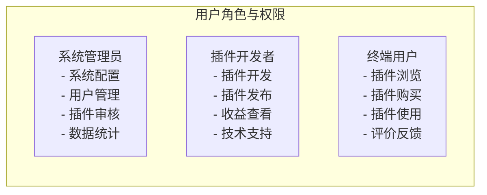

**技术特点:**
- 基于RBAC的权限控制模型
- 支持多租户隔离
- 统一身份认证(SSO)
- 细粒度权限控制

### 2.2 接入层 (Access Layer)

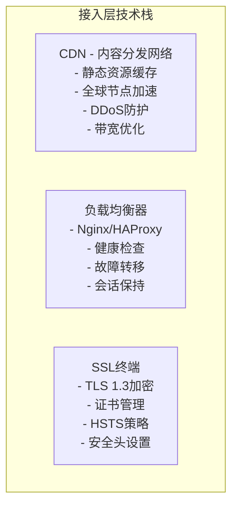

**技术规格:**
```yaml
access_layer_specs:
  cdn:
    provider: "CloudFlare/阿里云CDN"
    cache_policy: "静态资源永久缓存，API响应短期缓存"
    security: "DDoS防护，WAF规则"
  
  load_balancer:
    type: "Nginx"
    algorithm: "least_conn"
    health_check: "HTTP /health"
    ssl_termination: true
  
  ssl:
    protocol: "TLS 1.3"
    cipher_suites: "ECDHE-RSA-AES256-GCM-SHA384"
    hsts: "max-age=31536000; includeSubDomains"
```

### 2.3 前端层 (Frontend Layer)

```mermaid
graph TB
    subgraph "前端技术架构"
        Framework[React 18 + TypeScript<br/>- 函数式组件<br/>- Hooks API<br/>- 严格类型检查<br/>- 代码分割]
        
        UI[Ant Design 5.x<br/>- 企业级UI组件<br/>- 主题定制<br/>- 响应式设计<br/>- 国际化支持]
        
        StateManagement[状态管理<br/>- Zustand (轻量级)<br/>- React Query (服务端状态)<br/>- 本地存储持久化<br/>- 状态同步]
        
        BuildTools[构建工具<br/>- Vite (快速构建)<br/>- ESLint + Prettier<br/>- Husky (Git Hooks)<br/>- 自动化测试]
    end
```

**前端技术栈配置:**
```json
{
  "frontend_tech_stack": {
    "framework": {
      "react": "^18.2.0",
      "typescript": "^5.0.0",
      "react-router-dom": "^6.8.0"
    },
    "ui_library": {
      "antd": "^5.0.0",
      "@ant-design/icons": "^5.0.0",
      "@ant-design/pro-components": "^2.4.0"
    },
    "state_management": {
      "zustand": "^4.4.0",
      "@tanstack/react-query": "^4.28.0"
    },
    "build_tools": {
      "vite": "^4.3.0",
      "eslint": "^8.38.0",
      "prettier": "^2.8.0",
      "husky": "^8.0.0"
    },
    "testing": {
      "vitest": "^0.30.0",
      "@testing-library/react": "^14.0.0",
      "cypress": "^12.10.0"
    }
  }
}
```

### 2.4 网关层 (Gateway Layer)

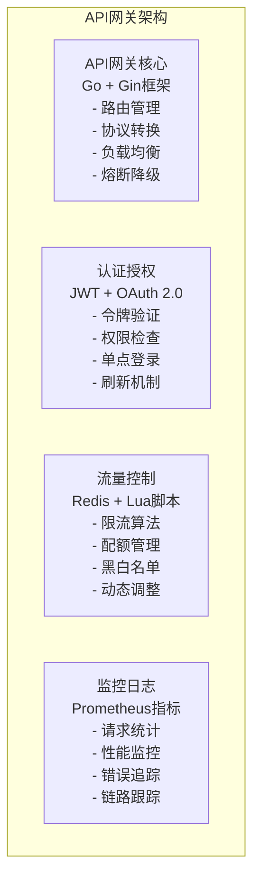

**网关技术实现:**
```go
// API网关核心配置
type GatewayConfig struct {
    Server struct {
        Port         int           `yaml:"port"`
        ReadTimeout  time.Duration `yaml:"read_timeout"`
        WriteTimeout time.Duration `yaml:"write_timeout"`
        IdleTimeout  time.Duration `yaml:"idle_timeout"`
    } `yaml:"server"`
    
    RateLimit struct {
        Redis    RedisConfig `yaml:"redis"`
        Rules    []RateRule  `yaml:"rules"`
        Enabled  bool        `yaml:"enabled"`
    } `yaml:"rate_limit"`
    
    Auth struct {
        JWTSecret     string        `yaml:"jwt_secret"`
        TokenExpiry   time.Duration `yaml:"token_expiry"`
        RefreshExpiry time.Duration `yaml:"refresh_expiry"`
    } `yaml:"auth"`
    
    Routes []RouteConfig `yaml:"routes"`
}

// 路由配置
type RouteConfig struct {
    Path        string            `yaml:"path"`
    Method      string            `yaml:"method"`
    Backend     string            `yaml:"backend"`
    Timeout     time.Duration     `yaml:"timeout"`
    Retry       int               `yaml:"retry"`
    CircuitBreaker CircuitConfig  `yaml:"circuit_breaker"`
    Auth        bool              `yaml:"auth"`
    RateLimit   *RateLimitConfig  `yaml:"rate_limit"`
}
```

### 2.5 业务服务层 (Business Service Layer)

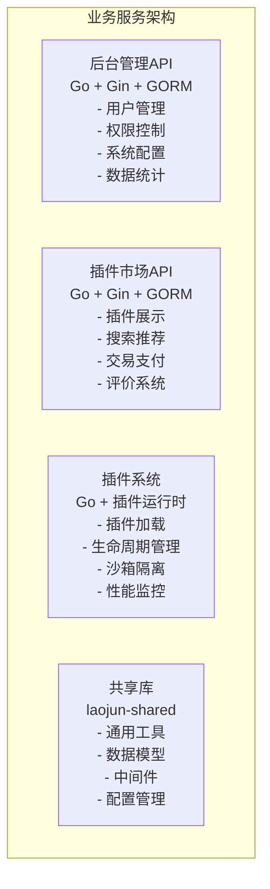

**业务服务技术规格:**
```yaml
business_services:
  admin_api:
    framework: "Go 1.21 + Gin"
    orm: "GORM v2"
    features:
      - "RESTful API设计"
      - "Swagger文档生成"
      - "参数验证"
      - "错误处理"
      - "日志记录"
    
  marketplace_api:
    framework: "Go 1.21 + Gin"
    orm: "GORM v2"
    search_engine: "ElasticSearch"
    features:
      - "全文搜索"
      - "推荐算法"
      - "支付集成"
      - "评分系统"
    
  plugin_system:
    framework: "Go 1.21"
    runtime: "自定义插件运行时"
    features:
      - "动态加载"
      - "沙箱隔离"
      - "资源限制"
      - "热更新"
```

### 2.6 基础设施层 (Infrastructure Layer)

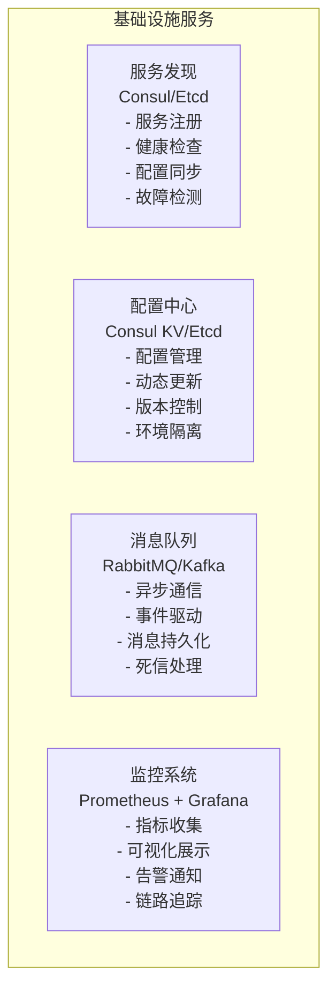

**基础设施配置:**
```yaml
infrastructure_config:
  service_discovery:
    type: "consul"
    cluster:
      - "consul-1:8500"
      - "consul-2:8500"
      - "consul-3:8500"
    health_check:
      interval: "10s"
      timeout: "3s"
      deregister_critical_after: "30s"
  
  config_center:
    type: "consul_kv"
    prefix: "laojun/"
    watch: true
    backup: true
  
  message_queue:
    type: "rabbitmq"
    cluster:
      - "rabbitmq-1:5672"
      - "rabbitmq-2:5672"
      - "rabbitmq-3:5672"
    exchanges:
      - name: "laojun.events"
        type: "topic"
        durable: true
  
  monitoring:
    prometheus:
      scrape_interval: "15s"
      retention: "30d"
    grafana:
      dashboards:
        - "system-overview"
        - "business-metrics"
        - "plugin-performance"
```

### 2.7 数据层 (Data Layer)

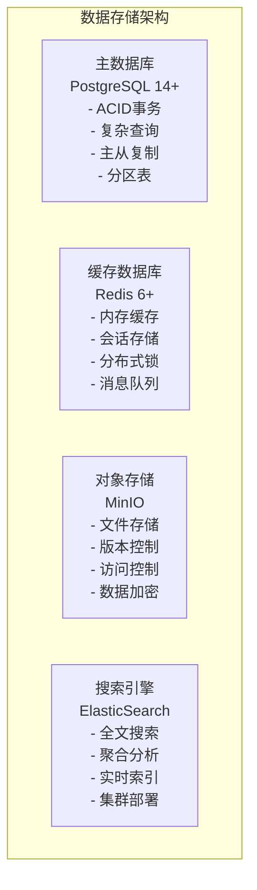

**数据层技术规格:**
```yaml
data_layer_specs:
  postgresql:
    version: "14.8"
    configuration:
      max_connections: 200
      shared_buffers: "256MB"
      effective_cache_size: "1GB"
      work_mem: "4MB"
    replication:
      type: "streaming"
      sync_mode: "async"
      standby_count: 2
    backup:
      type: "pg_dump + WAL-E"
      schedule: "daily"
      retention: "30 days"
  
  redis:
    version: "6.2"
    configuration:
      maxmemory: "2GB"
      maxmemory_policy: "allkeys-lru"
      save: "900 1 300 10 60 10000"
    cluster:
      enabled: true
      nodes: 6
      replicas: 1
  
  minio:
    version: "latest"
    configuration:
      storage_class: "STANDARD"
      versioning: true
      encryption: "AES256"
    buckets:
      - "laojun-plugins"
      - "laojun-uploads"
      - "laojun-backups"
  
  elasticsearch:
    version: "8.8"
    cluster:
      nodes: 3
      heap_size: "2g"
    indices:
      - name: "plugins"
        shards: 3
        replicas: 1
      - name: "logs"
        shards: 5
        replicas: 1
```

## 3. 技术栈选型说明

### 3.1 后端技术栈

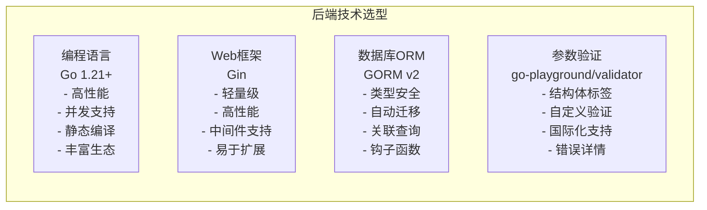

**技术选型理由:**
```yaml
backend_tech_selection:
  golang:
    reasons:
      - "高性能：编译型语言，运行效率高"
      - "并发：原生goroutine支持"
      - "部署：单一可执行文件，部署简单"
      - "生态：丰富的第三方库"
    alternatives: ["Java", "Python", "Node.js"]
  
  gin:
    reasons:
      - "性能：HTTP路由性能优秀"
      - "简洁：API设计简单易用"
      - "中间件：丰富的中间件生态"
      - "文档：完善的文档和示例"
    alternatives: ["Echo", "Fiber", "Chi"]
  
  gorm:
    reasons:
      - "功能：功能完整的ORM"
      - "性能：查询性能优化"
      - "迁移：自动数据库迁移"
      - "关联：复杂关联查询支持"
    alternatives: ["Ent", "SQLBoiler", "原生SQL"]
```

### 3.2 前端技术栈

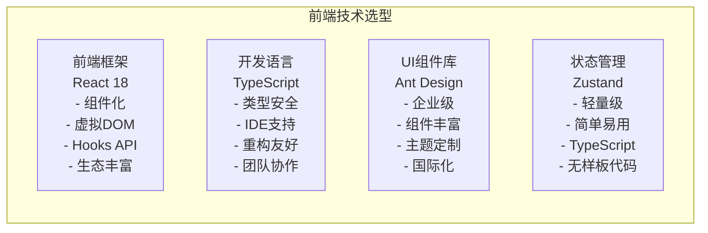

### 3.3 数据库技术栈

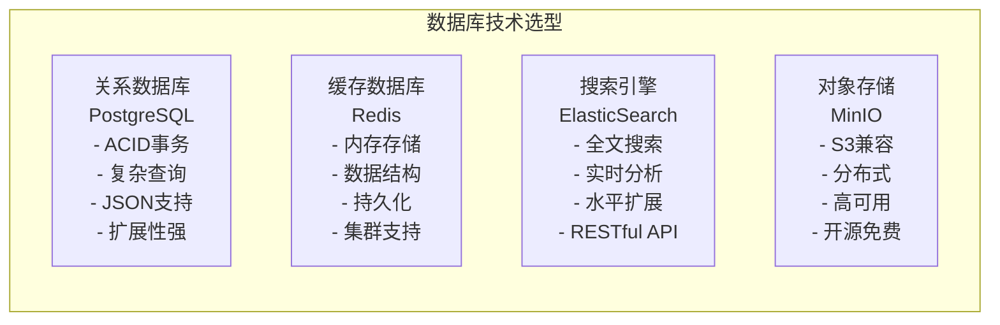

## 4. 组件交互设计

### 4.1 请求处理流程

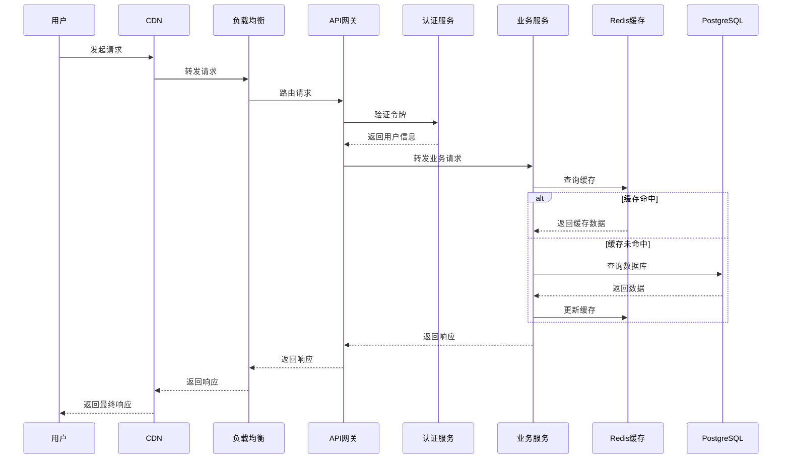

### 4.2 插件生命周期管理

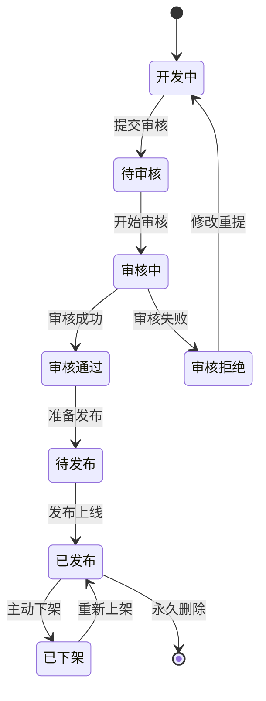

### 4.3 数据同步机制

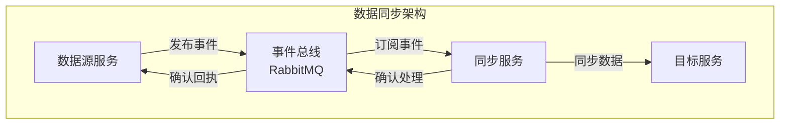

## 5. 性能优化设计

### 5.1 缓存策略

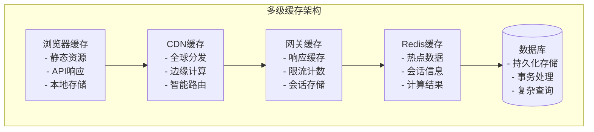

### 5.2 数据库优化

```sql
-- 数据库性能优化配置
-- 1. 索引优化
CREATE INDEX CONCURRENTLY idx_plugins_category_status 
ON mp_plugins(category_id, status) 
WHERE status = 'published';

CREATE INDEX CONCURRENTLY idx_plugins_search 
ON mp_plugins USING gin(to_tsvector('english', name || ' ' || description));

-- 2. 分区表设计
CREATE TABLE mp_plugin_downloads_y2024 PARTITION OF mp_plugin_downloads
FOR VALUES FROM ('2024-01-01') TO ('2025-01-01');

-- 3. 查询优化
EXPLAIN (ANALYZE, BUFFERS) 
SELECT p.*, c.name as category_name 
FROM mp_plugins p 
JOIN mp_categories c ON p.category_id = c.id 
WHERE p.status = 'published' 
  AND p.rating >= 4.0 
ORDER BY p.download_count DESC 
LIMIT 20;
```

### 5.3 应用性能优化

```go
// Go应用性能优化示例
package main

import (
    "context"
    "sync"
    "time"
    
    "github.com/gin-gonic/gin"
    "github.com/go-redis/redis/v8"
    "golang.org/x/sync/singleflight"
)

// 缓存管理器
type CacheManager struct {
    redis  *redis.Client
    group  singleflight.Group
    mutex  sync.RWMutex
    local  map[string]interface{}
}

// 防缓存击穿
func (c *CacheManager) GetWithSingleFlight(key string, fn func() (interface{}, error)) (interface{}, error) {
    val, err, _ := c.group.Do(key, func() (interface{}, error) {
        // 先查本地缓存
        c.mutex.RLock()
        if val, ok := c.local[key]; ok {
            c.mutex.RUnlock()
            return val, nil
        }
        c.mutex.RUnlock()
        
        // 再查Redis缓存
        val, err := c.redis.Get(context.Background(), key).Result()
        if err == nil {
            return val, nil
        }
        
        // 最后查数据库
        result, err := fn()
        if err != nil {
            return nil, err
        }
        
        // 更新缓存
        c.redis.Set(context.Background(), key, result, time.Hour)
        c.mutex.Lock()
        c.local[key] = result
        c.mutex.Unlock()
        
        return result, nil
    })
    
    return val, err
}

// 连接池优化
func setupDatabase() *gorm.DB {
    db, err := gorm.Open(postgres.Open(dsn), &gorm.Config{
        Logger: logger.Default.LogMode(logger.Info),
    })
    if err != nil {
        panic(err)
    }
    
    sqlDB, err := db.DB()
    if err != nil {
        panic(err)
    }
    
    // 连接池配置
    sqlDB.SetMaxIdleConns(10)
    sqlDB.SetMaxOpenConns(100)
    sqlDB.SetConnMaxLifetime(time.Hour)
    
    return db
}
```

## 6. 安全架构设计

### 6.1 安全防护体系

```mermaid
graph TB
    subgraph "安全防护架构"
        WAF[Web应用防火墙<br/>- SQL注入防护<br/>- XSS攻击防护<br/>- CSRF防护<br/>- 恶意请求过滤]
        
        Auth[身份认证<br/>- JWT令牌<br/>- OAuth 2.0<br/>- 多因子认证<br/>- 单点登录]
        
        Authorization[权限控制<br/>- RBAC模型<br/>- 资源权限<br/>- 动态权限<br/>- 权限继承]
        
        Encryption[数据加密<br/>- 传输加密(TLS)<br/>- 存储加密(AES)<br/>- 密钥管理<br/>- 数字签名]
        
        Audit[安全审计<br/>- 操作日志<br/>- 访问记录<br/>- 异常检测<br/>- 合规报告]
    end
```

### 6.2 插件安全沙箱

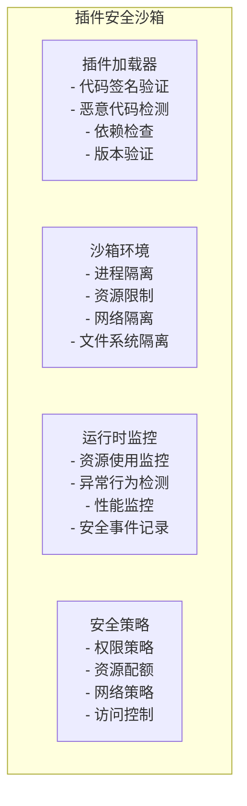

## 7. 监控与运维

### 7.1 监控体系

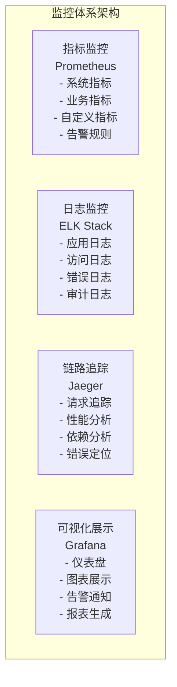

### 7.2 运维自动化

```yaml
# 运维自动化配置
automation_config:
  ci_cd:
    pipeline: "GitLab CI/CD"
    stages:
      - "代码检查"
      - "单元测试"
      - "构建镜像"
      - "安全扫描"
      - "部署测试"
      - "生产发布"
  
  deployment:
    strategy: "蓝绿部署"
    rollback: "自动回滚"
    health_check: "健康检查"
    
  monitoring:
    alerts:
      - name: "服务不可用"
        condition: "up == 0"
        duration: "1m"
        severity: "critical"
      
      - name: "响应时间过长"
        condition: "http_request_duration_seconds > 2"
        duration: "5m"
        severity: "warning"
  
  backup:
    database:
      schedule: "0 2 * * *"
      retention: "30d"
      encryption: true
    
    files:
      schedule: "0 3 * * *"
      retention: "7d"
      compression: true
```

## 8. 扩展性设计

### 8.1 水平扩展

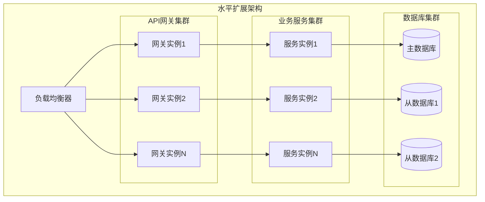

### 8.2 微服务架构演进

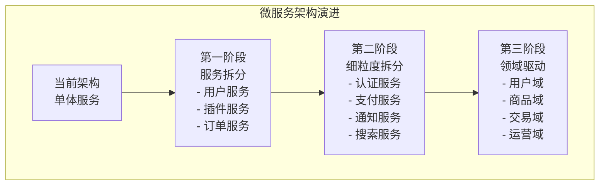

---

## 总结

本技术架构图详细展示了太上老君系统的：

1. **分层架构设计**: 从用户层到部署层的完整技术栈
2. **技术选型说明**: 每个技术组件的选择理由和替代方案
3. **组件交互机制**: 各组件之间的通信和协作方式
4. **性能优化策略**: 缓存、数据库、应用层面的优化方案
5. **安全架构体系**: 全方位的安全防护和插件沙箱机制
6. **监控运维体系**: 完整的监控、日志、运维自动化方案
7. **扩展性设计**: 水平扩展和微服务演进路径

该架构设计确保了系统的高性能、高可用、高安全性和良好的扩展性。