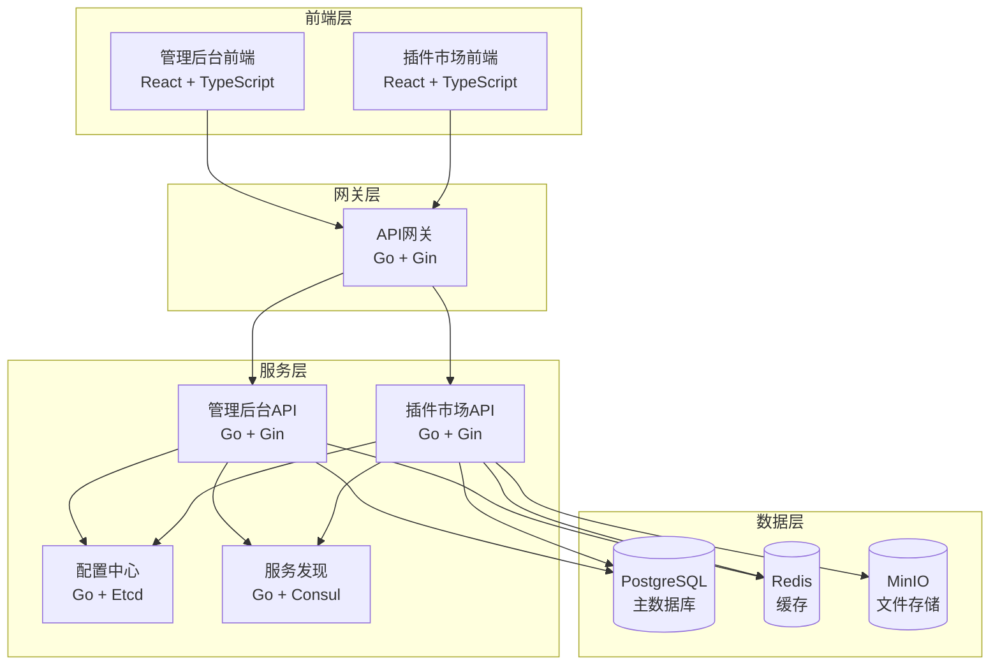

# 太上老君系统部署概览

## 概述

太上老君系统支持多种部署方式，包括本地开发部署、Docker容器化部署、Kubernetes集群部署等。本文档提供各种部署方式的概览和选择指南。

## 部署架构

### 系统组件


## 部署方式对比

| 部署方式 | 适用场景 | 优势 | 劣势 | 复杂度 |
|---------|----------|------|------|--------|
| 本地开发 | 开发调试 | 快速启动、易调试 | 环境依赖多 | 低 |
| Docker Compose | 测试环境 | 环境一致、易管理 | 单机限制 | 中 |
| Kubernetes | 生产环境 | 高可用、可扩展 | 配置复杂 | 高 |
| 云原生 | 企业生产 | 托管服务、免运维 | 成本较高 | 中 |

## 环境要求

### 基础环境
- **操作系统**: Linux (推荐 Ubuntu 20.04+), macOS, Windows
- **CPU**: 最低 2 核，推荐 4 核以上
- **内存**: 最低 4GB，推荐 8GB 以上
- **存储**: 最低 20GB，推荐 50GB 以上

### 软件依赖
- **Go**: 1.21+ (本地开发)
- **Node.js**: 18+ (前端构建)
- **Docker**: 20.10+ (容器化部署)
- **Kubernetes**: 1.20+ (集群部署)

### 数据库要求
- **PostgreSQL**: 13+ (主数据库)
- **Redis**: 6+ (缓存)
- **MinIO**: 最新版 (文件存储)

## 快速部署

### 一键部署脚本
```bash
# Windows 用户
.\deploy\scripts\deploy.ps1 prod deploy

# Linux/macOS 用户
./deploy/scripts/deploy.sh prod deploy
```

### Docker Compose 部署
```bash
# 克隆项目
git clone https://github.com/your-org/laojun.git
cd laojun

# 启动所有服务
docker compose -f deploy/docker/docker-compose.yml up -d

# 查看服务状态
docker compose ps

# 访问服务
# 管理后台: http://localhost:3000
# 插件市场: http://localhost:3001
# API文档: http://localhost:8080/swagger
```

## 部署配置

### 环境变量配置
```bash
# 基础配置
export APP_ENV=production
export APP_DEBUG=false

# 数据库配置
export DB_HOST=postgres
export DB_PORT=5432
export DB_USER=laojun
export DB_PASSWORD=your-secure-password
export DB_NAME=laojun

# Redis 配置
export REDIS_HOST=redis
export REDIS_PORT=6379

# JWT 配置
export JWT_SECRET=your-super-secret-jwt-key

# 文件存储配置
export STORAGE_TYPE=minio
export MINIO_ENDPOINT=minio:9000
export MINIO_ACCESS_KEY=minioadmin
export MINIO_SECRET_KEY=your-secure-secret
```

### 服务端口配置
| 服务 | 默认端口 | 描述 |
|------|----------|------|
| 管理后台前端 | 3000 | React 应用 |
| 插件市场前端 | 3001 | React 应用 |
| API 网关 | 8083 | 统一入口 |
| 管理后台 API | 8080 | 后台管理接口 |
| 插件市场 API | 8081 | 市场业务接口 |
| 配置中心 | 8082 | 配置管理 |
| PostgreSQL | 5432 | 主数据库 |
| Redis | 6379 | 缓存数据库 |
| MinIO | 9000 | 对象存储 |

## 健康检查

### 服务健康检查端点
```bash
# 管理后台 API
curl http://localhost:8080/health

# 插件市场 API
curl http://localhost:8081/health

# 配置中心
curl http://localhost:8082/health

# API 网关
curl http://localhost:8083/health
```

### 数据库连接检查
```bash
# PostgreSQL 连接测试
docker exec -it laojun-postgres psql -U laojun -d laojun -c "SELECT version();"

# Redis 连接测试
docker exec -it laojun-redis redis-cli ping
```

## 监控和日志

### 监控服务
- **Prometheus**: http://localhost:9090 (指标收集)
- **Grafana**: http://localhost:3000 (可视化面板)
- **Jaeger**: http://localhost:16686 (链路追踪)

### 日志查看
```bash
# 查看所有服务日志
docker compose logs -f

# 查看特定服务日志
docker compose logs -f admin-api
docker compose logs -f marketplace-api

# 查看实时日志
docker compose logs -f --tail=100 admin-api
```

## 扩展和优化

### 水平扩展
```yaml
# docker-compose.yml 扩展配置
services:
  admin-api:
    deploy:
      replicas: 3
    
  marketplace-api:
    deploy:
      replicas: 2
```

### 性能优化
1. **数据库优化**
   - 配置连接池
   - 添加索引
   - 查询优化

2. **缓存策略**
   - Redis 缓存热点数据
   - CDN 加速静态资源
   - 应用层缓存

3. **负载均衡**
   - Nginx 反向代理
   - 服务发现和负载均衡
   - 健康检查

## 安全配置

### 网络安全
```yaml
# 防火墙配置
networks:
  laojun-network:
    driver: bridge
    internal: true
```

### 数据安全
- 数据库密码加密
- JWT 密钥定期轮换
- HTTPS 证书配置
- 敏感数据脱敏

### 访问控制
- RBAC 权限控制
- API 限流
- 跨域配置
- 安全头设置

## 备份和恢复

### 数据备份
```bash
# 数据库备份
docker exec laojun-postgres pg_dump -U laojun laojun > backup.sql

# Redis 备份
docker exec laojun-redis redis-cli BGSAVE

# 文件备份
docker exec laojun-minio mc mirror /data /backup
```

### 数据恢复
```bash
# 数据库恢复
docker exec -i laojun-postgres psql -U laojun -d laojun < backup.sql

# Redis 恢复
docker cp dump.rdb laojun-redis:/data/
docker restart laojun-redis
```

## 故障排查

### 常见问题
1. **服务启动失败**
   - 检查端口占用
   - 验证配置文件
   - 查看错误日志

2. **数据库连接失败**
   - 检查数据库服务状态
   - 验证连接参数
   - 确认网络连通性

3. **前端访问失败**
   - 检查 Nginx 配置
   - 验证静态文件路径
   - 确认 API 代理设置

### 调试工具
```bash
# 容器状态检查
docker ps -a

# 网络连通性测试
docker exec -it laojun-admin-api ping postgres

# 资源使用情况
docker stats

# 容器日志
docker logs laojun-admin-api
```

## 升级和维护

### 版本升级
```bash
# 拉取最新镜像
docker compose pull

# 重启服务
docker compose up -d

# 数据库迁移
docker exec laojun-admin-api ./migrate up
```

### 定期维护
- 日志清理
- 数据库优化
- 缓存清理
- 安全更新

## 相关文档

- [Docker 部署指南](./docker.md)
- [Kubernetes 部署指南](./kubernetes.md)
- [环境配置说明](./environments/)
- [CI/CD 流程](./ci-cd/)
- [监控运维指南](../operations/monitoring.md)

---

**文档版本**: v1.0  
**最后更新**: 2024年12月  
**维护团队**: 太上老君运维团队