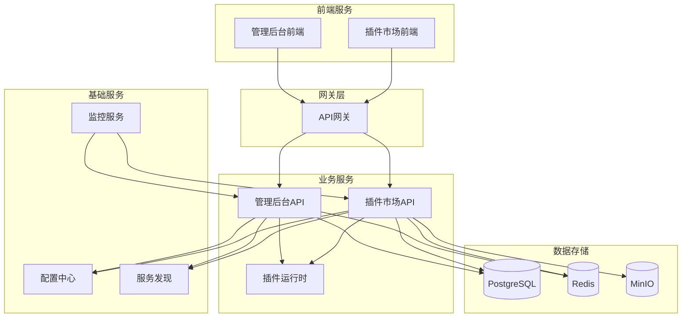

# 太上老君系统开发概览

## 概述

太上老君系统是一个基于云原生架构的微服务平台，采用现代化的技术栈和开发模式。本文档为开发者提供系统开发的全面指南。

## 技术栈

### 后端技术栈
- **编程语言**: Go 1.21+
- **Web框架**: Gin
- **数据库**: PostgreSQL 13+
- **缓存**: Redis 6+
- **消息队列**: RabbitMQ / Apache Kafka
- **服务发现**: Consul
- **配置管理**: Etcd
- **监控**: Prometheus + Grafana
- **链路追踪**: Jaeger
- **文件存储**: MinIO

### 前端技术栈
- **框架**: React 18+
- **语言**: TypeScript 4.9+
- **构建工具**: Vite
- **状态管理**: Zustand
- **UI组件**: Ant Design
- **路由**: React Router
- **HTTP客户端**: Axios
- **样式**: Tailwind CSS

### DevOps 技术栈
- **容器化**: Docker + Docker Compose
- **编排**: Kubernetes
- **CI/CD**: GitHub Actions
- **代码质量**: SonarQube
- **安全扫描**: Trivy
- **包管理**: Go Modules, npm/yarn

## 项目结构

### 整体架构
```
laojun/
├── laojun-admin-api/          # 管理后台API服务
├── laojun-admin-web/          # 管理后台前端
├── laojun-marketplace-api/    # 插件市场API服务
├── laojun-marketplace-web/    # 插件市场前端
├── laojun-gateway/            # API网关
├── laojun-config-center/      # 配置中心
├── laojun-discovery/          # 服务发现
├── laojun-monitoring/         # 监控服务
├── laojun-plugins/            # 插件系统
├── laojun-shared/             # 共享库
├── laojun-deploy/             # 部署配置
├── laojun-docs/               # 文档中心
└── laojun-workspace/          # 工作空间配置
```

### 服务依赖关系


## 开发环境搭建

### 前置要求
- Go 1.21+
- Node.js 18+
- Docker 20.10+
- PostgreSQL 13+
- Redis 6+

### 快速开始
```bash
# 1. 克隆项目
git clone https://github.com/your-org/laojun.git
cd laojun

# 2. 安装依赖
make install

# 3. 启动基础服务
docker compose -f deploy/docker/docker-compose.dev.yml up -d postgres redis minio

# 4. 初始化数据库
make db-migrate

# 5. 启动后端服务
make dev-backend

# 6. 启动前端服务
make dev-frontend

# 7. 访问应用
# 管理后台: http://localhost:3000
# 插件市场: http://localhost:3001
# API文档: http://localhost:8080/swagger
```

### 开发工具配置

#### VS Code 配置
```json
{
  "go.toolsManagement.checkForUpdates": "local",
  "go.useLanguageServer": true,
  "go.gopath": "",
  "go.goroot": "",
  "go.lintTool": "golangci-lint",
  "go.formatTool": "goimports",
  "go.testFlags": ["-v", "-race"],
  "typescript.preferences.importModuleSpecifier": "relative",
  "editor.formatOnSave": true,
  "editor.codeActionsOnSave": {
    "source.organizeImports": true
  }
}
```

#### Git Hooks 配置
```bash
# 安装 pre-commit hooks
make install-hooks

# 手动运行检查
make lint
make test
make security-check
```

## 开发规范

### 代码规范

#### Go 代码规范
```go
// 包命名：小写，简洁，有意义
package user

// 接口命名：以 -er 结尾
type UserManager interface {
    CreateUser(ctx context.Context, user *User) error
    GetUser(ctx context.Context, id string) (*User, error)
}

// 结构体命名：大驼峰
type UserService struct {
    repo UserRepository
    logger *zap.Logger
}

// 方法命名：大驼峰，动词开头
func (s *UserService) CreateUser(ctx context.Context, req *CreateUserRequest) (*User, error) {
    // 参数验证
    if err := s.validateCreateUserRequest(req); err != nil {
        return nil, fmt.Errorf("invalid request: %w", err)
    }
    
    // 业务逻辑
    user := &User{
        ID:       uuid.New().String(),
        Username: req.Username,
        Email:    req.Email,
        CreateAt: time.Now(),
    }
    
    // 数据持久化
    if err := s.repo.Create(ctx, user); err != nil {
        s.logger.Error("failed to create user", zap.Error(err))
        return nil, fmt.Errorf("create user failed: %w", err)
    }
    
    return user, nil
}
```

#### TypeScript 代码规范
```typescript
// 接口命名：以 I 开头或使用描述性名称
interface User {
  id: string;
  username: string;
  email: string;
  createdAt: string;
}

// 类型命名：大驼峰
type UserStatus = 'active' | 'inactive' | 'pending';

// 组件命名：大驼峰
const UserList: React.FC<UserListProps> = ({ users, onUserClick }) => {
  // Hook 使用
  const [loading, setLoading] = useState(false);
  const [error, setError] = useState<string | null>(null);
  
  // 事件处理函数：handle 开头
  const handleUserClick = useCallback((user: User) => {
    onUserClick?.(user);
  }, [onUserClick]);
  
  // 异步操作
  const fetchUsers = useCallback(async () => {
    try {
      setLoading(true);
      setError(null);
      const response = await userApi.getUsers();
      setUsers(response.data);
    } catch (err) {
      setError(err instanceof Error ? err.message : 'Unknown error');
    } finally {
      setLoading(false);
    }
  }, []);
  
  return (
    <div className="user-list">
      {loading && <Spin />}
      {error && <Alert type="error" message={error} />}
      {users.map(user => (
        <UserCard 
          key={user.id} 
          user={user} 
          onClick={handleUserClick}
        />
      ))}
    </div>
  );
};
```

### API 设计规范

#### RESTful API 设计
```yaml
# 用户管理 API
paths:
  /api/v1/users:
    get:
      summary: 获取用户列表
      parameters:
        - name: page
          in: query
          schema:
            type: integer
            default: 1
        - name: size
          in: query
          schema:
            type: integer
            default: 20
    post:
      summary: 创建用户
      requestBody:
        content:
          application/json:
            schema:
              $ref: '#/components/schemas/CreateUserRequest'
  
  /api/v1/users/{id}:
    get:
      summary: 获取用户详情
    put:
      summary: 更新用户
    delete:
      summary: 删除用户
```

#### 响应格式规范
```json
{
  "code": 200,
  "message": "success",
  "data": {
    "id": "user-123",
    "username": "john_doe",
    "email": "john@example.com"
  },
  "timestamp": "2024-12-19T10:30:00Z",
  "request_id": "req-456"
}
```

### 数据库设计规范

#### 表命名规范
```sql
-- 表名：小写，下划线分隔，复数形式
CREATE TABLE users (
    id UUID PRIMARY KEY DEFAULT gen_random_uuid(),
    username VARCHAR(50) NOT NULL UNIQUE,
    email VARCHAR(100) NOT NULL UNIQUE,
    password_hash VARCHAR(255) NOT NULL,
    status VARCHAR(20) DEFAULT 'active',
    created_at TIMESTAMP DEFAULT CURRENT_TIMESTAMP,
    updated_at TIMESTAMP DEFAULT CURRENT_TIMESTAMP,
    deleted_at TIMESTAMP NULL
);

-- 索引命名：idx_表名_字段名
CREATE INDEX idx_users_email ON users(email);
CREATE INDEX idx_users_status ON users(status);
CREATE INDEX idx_users_created_at ON users(created_at);
```

#### 迁移文件规范
```sql
-- 文件名：YYYYMMDDHHMMSS_description.up.sql
-- 20241219103000_create_users_table.up.sql

-- 创建表
CREATE TABLE users (
    -- 字段定义
);

-- 创建索引
CREATE INDEX idx_users_email ON users(email);

-- 插入初始数据
INSERT INTO users (username, email, password_hash) VALUES 
('admin', 'admin@example.com', '$2a$10$...');
```

## 测试策略

### 测试金字塔
```
    /\
   /  \     E2E Tests (10%)
  /____\    
 /      \   Integration Tests (20%)
/________\  Unit Tests (70%)
```

### 单元测试
```go
func TestUserService_CreateUser(t *testing.T) {
    // 准备测试数据
    tests := []struct {
        name    string
        req     *CreateUserRequest
        want    *User
        wantErr bool
    }{
        {
            name: "valid user creation",
            req: &CreateUserRequest{
                Username: "testuser",
                Email:    "test@example.com",
            },
            want: &User{
                Username: "testuser",
                Email:    "test@example.com",
            },
            wantErr: false,
        },
        {
            name: "invalid email",
            req: &CreateUserRequest{
                Username: "testuser",
                Email:    "invalid-email",
            },
            want:    nil,
            wantErr: true,
        },
    }
    
    for _, tt := range tests {
        t.Run(tt.name, func(t *testing.T) {
            // 创建 mock 依赖
            mockRepo := &MockUserRepository{}
            service := NewUserService(mockRepo, zap.NewNop())
            
            // 执行测试
            got, err := service.CreateUser(context.Background(), tt.req)
            
            // 验证结果
            if (err != nil) != tt.wantErr {
                t.Errorf("CreateUser() error = %v, wantErr %v", err, tt.wantErr)
                return
            }
            
            if !tt.wantErr && got.Username != tt.want.Username {
                t.Errorf("CreateUser() got = %v, want %v", got, tt.want)
            }
        })
    }
}
```

### 集成测试
```go
func TestUserAPI_Integration(t *testing.T) {
    // 启动测试服务器
    testServer := setupTestServer(t)
    defer testServer.Close()
    
    // 准备测试数据
    user := &CreateUserRequest{
        Username: "testuser",
        Email:    "test@example.com",
    }
    
    // 发送 HTTP 请求
    resp, err := http.Post(
        testServer.URL+"/api/v1/users",
        "application/json",
        strings.NewReader(toJSON(user)),
    )
    require.NoError(t, err)
    defer resp.Body.Close()
    
    // 验证响应
    assert.Equal(t, http.StatusCreated, resp.StatusCode)
    
    var result APIResponse
    err = json.NewDecoder(resp.Body).Decode(&result)
    require.NoError(t, err)
    
    assert.Equal(t, "success", result.Message)
    assert.NotEmpty(t, result.Data["id"])
}
```

## 部署和发布

### 本地开发部署
```bash
# 启动开发环境
make dev

# 运行测试
make test

# 构建应用
make build

# 清理环境
make clean
```

### Docker 部署
```bash
# 构建镜像
make docker-build

# 启动服务
docker compose up -d

# 查看日志
docker compose logs -f
```

### 生产环境部署
```bash
# 部署到 Kubernetes
make k8s-deploy

# 检查部署状态
kubectl get pods -n laojun

# 查看服务日志
kubectl logs -f deployment/laojun-admin-api -n laojun
```

## 监控和调试

### 日志规范
```go
// 使用结构化日志
logger.Info("user created successfully",
    zap.String("user_id", user.ID),
    zap.String("username", user.Username),
    zap.Duration("duration", time.Since(start)),
)

logger.Error("failed to create user",
    zap.Error(err),
    zap.String("username", req.Username),
    zap.String("trace_id", traceID),
)
```

### 性能监控
```go
// 添加 Prometheus 指标
var (
    requestDuration = prometheus.NewHistogramVec(
        prometheus.HistogramOpts{
            Name: "http_request_duration_seconds",
            Help: "HTTP request duration in seconds",
        },
        []string{"method", "endpoint", "status"},
    )
)

// 在处理函数中记录指标
func (h *Handler) CreateUser(c *gin.Context) {
    start := time.Now()
    defer func() {
        requestDuration.WithLabelValues(
            c.Request.Method,
            c.FullPath(),
            strconv.Itoa(c.Writer.Status()),
        ).Observe(time.Since(start).Seconds())
    }()
    
    // 业务逻辑
}
```

### 链路追踪
```go
// 添加链路追踪
func (s *UserService) CreateUser(ctx context.Context, req *CreateUserRequest) (*User, error) {
    span, ctx := opentracing.StartSpanFromContext(ctx, "UserService.CreateUser")
    defer span.Finish()
    
    span.SetTag("user.username", req.Username)
    span.SetTag("user.email", req.Email)
    
    // 业务逻辑
    user, err := s.createUser(ctx, req)
    if err != nil {
        span.SetTag("error", true)
        span.LogFields(log.Error(err))
        return nil, err
    }
    
    span.SetTag("user.id", user.ID)
    return user, nil
}
```

## 常见问题和解决方案

### 开发环境问题
1. **端口冲突**
   ```bash
   # 查看端口占用
   netstat -tulpn | grep :8080
   
   # 修改配置文件中的端口
   vim configs/app.yaml
   ```

2. **数据库连接失败**
   ```bash
   # 检查数据库服务状态
   docker ps | grep postgres
   
   # 查看数据库日志
   docker logs laojun-postgres
   
   # 测试连接
   psql -h localhost -p 5432 -U laojun -d laojun
   ```

3. **依赖安装失败**
   ```bash
   # 清理 Go 模块缓存
   go clean -modcache
   
   # 重新下载依赖
   go mod download
   
   # 清理 npm 缓存
   npm cache clean --force
   
   # 重新安装依赖
   npm install
   ```

### 性能优化建议
1. **数据库优化**
   - 添加适当的索引
   - 使用连接池
   - 优化查询语句

2. **缓存策略**
   - Redis 缓存热点数据
   - 应用层缓存
   - CDN 加速静态资源

3. **代码优化**
   - 避免 N+1 查询
   - 使用批量操作
   - 异步处理耗时任务

## 相关文档

- [API 文档](../api/overview.md)
- [数据库设计](../database/schema.md)
- [部署指南](../deployment/overview.md)
- [运维手册](../operations/monitoring.md)
- [插件开发指南](../marketplace/plugin-development.md)

---

**文档版本**: v1.0  
**最后更新**: 2024年12月  
**维护团队**: 太上老君开发团队