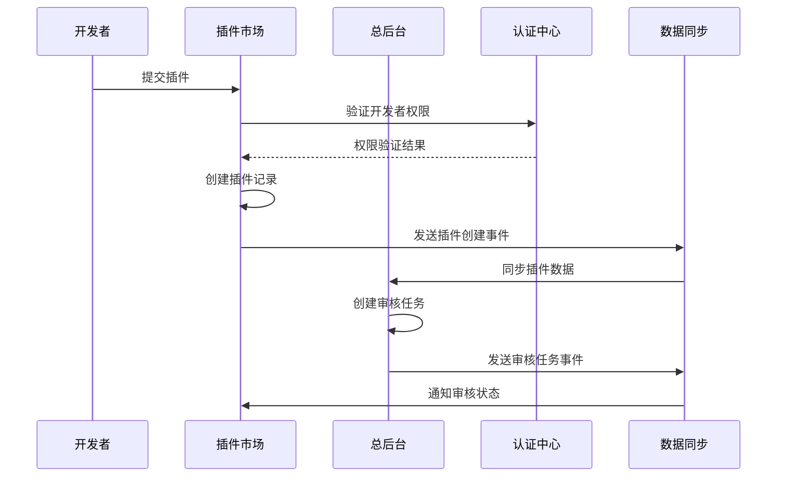

# 插件市场与总后台完整衔接方案设计

## 1. 方案概述

### 1.1 设计目标
- **统一管理**: 实现插件市场与总后台的统一管理和监控
- **数据同步**: 确保插件数据、用户数据、审核状态的实时同步
- **权限统一**: 建立统一的权限管理和认证体系
- **流程闭环**: 形成从插件开发到上线的完整业务闭环

### 1.2 核心原则
- **松耦合**: 各模块保持独立性，通过标准接口通信
- **高可用**: 支持故障转移和服务降级
- **可扩展**: 支持水平扩展和功能扩展
- **安全性**: 确保数据传输和存储的安全性

## 2. 系统架构设计

### 2.1 整体架构图

```
┌─────────────────────────────────────────────────────────────────┐
│                        API Gateway                              │
│                    (laojun-gateway)                            │
└─────────────────────┬───────────────────────────────────────────┘
                      │
        ┌─────────────┼─────────────┐
        │             │             │
┌───────▼──────┐ ┌────▼────┐ ┌──────▼──────┐
│ 插件市场前端  │ │总后台前端│ │ 开发者工具   │
│(marketplace) │ │(admin)  │ │   (CLI)     │
└──────────────┘ └─────────┘ └─────────────┘
        │             │             │
        └─────────────┼─────────────┘
                      │
┌─────────────────────▼─────────────────────┐
│              Service Mesh                 │
│           (服务间通信层)                   │
└─────────────────────┬─────────────────────┘
                      │
    ┌─────────────────┼─────────────────┐
    │                 │                 │
┌───▼────────┐ ┌──────▼──────┐ ┌────────▼────┐
│插件市场API │ │  总后台API   │ │  插件系统    │
│(mp-api)   │ │ (admin-api) │ │ (plugins)   │
└────────────┘ └─────────────┘ └─────────────┘
    │                 │                 │
    └─────────────────┼─────────────────┘
                      │
┌─────────────────────▼─────────────────────┐
│              共享数据层                    │
│    PostgreSQL + Redis + 消息队列          │
└───────────────────────────────────────────┘
```

### 2.2 核心组件

#### 2.2.1 数据同步中心 (Data Sync Hub)
```go
type DataSyncHub struct {
    pluginSyncer    *PluginSyncer
    userSyncer      *UserSyncer
    reviewSyncer    *ReviewSyncer
    configSyncer    *ConfigSyncer
    eventBus        *EventBus
    messageQueue    *MessageQueue
}

// 插件数据同步器
type PluginSyncer struct {
    marketplaceAPI  *MarketplaceAPIClient
    adminAPI        *AdminAPIClient
    syncInterval    time.Duration
    conflictResolver *ConflictResolver
}
```

#### 2.2.2 统一认证中心 (Unified Auth Center)
```go
type AuthCenter struct {
    jwtManager      *JWTManager
    permissionMgr   *PermissionManager
    userService     *UserService
    sessionStore    *SessionStore
}

// 权限管理器
type PermissionManager struct {
    roleService     *RoleService
    policyEngine    *PolicyEngine
    auditLogger     *AuditLogger
}
```

#### 2.2.3 事件总线 (Event Bus)
```go
type EventBus struct {
    subscribers     map[string][]EventHandler
    publisher       *EventPublisher
    messageQueue    *MessageQueue
    retryPolicy     *RetryPolicy
}

// 事件类型定义
const (
    PluginCreated    = "plugin.created"
    PluginUpdated    = "plugin.updated"
    PluginReviewed   = "plugin.reviewed"
    UserRegistered   = "user.registered"
    ConfigChanged    = "config.changed"
)
```

## 3. 注册机制设计

### 3.1 服务注册流程



### 3.2 插件注册表设计

```sql
-- 统一插件注册表
CREATE TABLE unified_plugin_registry (
    id UUID PRIMARY KEY DEFAULT gen_random_uuid(),
    plugin_id UUID NOT NULL,
    marketplace_id UUID, -- 插件市场中的ID
    admin_id UUID,       -- 总后台中的ID
    name VARCHAR(255) NOT NULL,
    version VARCHAR(50) NOT NULL,
    status plugin_status_enum NOT NULL,
    sync_status sync_status_enum DEFAULT 'pending',
    last_sync_at TIMESTAMP,
    created_at TIMESTAMP DEFAULT NOW(),
    updated_at TIMESTAMP DEFAULT NOW(),
    
    UNIQUE(plugin_id, version)
);

-- 同步状态枚举
CREATE TYPE sync_status_enum AS ENUM (
    'pending',    -- 待同步
    'syncing',    -- 同步中
    'synced',     -- 已同步
    'failed',     -- 同步失败
    'conflict'    -- 冲突
);
```

### 3.3 服务发现机制

```go
type ServiceRegistry struct {
    services    map[string]*ServiceInfo
    healthCheck *HealthChecker
    loadBalancer *LoadBalancer
}

type ServiceInfo struct {
    ID          string            `json:"id"`
    Name        string            `json:"name"`
    Address     string            `json:"address"`
    Port        int               `json:"port"`
    Tags        []string          `json:"tags"`
    Meta        map[string]string `json:"meta"`
    Health      HealthStatus      `json:"health"`
    LastSeen    time.Time         `json:"last_seen"`
}
```

## 4. 权限控制设计

### 4.1 统一权限模型

```yaml
# 权限模型定义
roles:
  # 超级管理员
  super_admin:
    permissions:
      - "*"
    
  # 插件市场管理员
  marketplace_admin:
    permissions:
      - "marketplace.*"
      - "plugin.view_all"
      - "plugin.manage"
      - "category.manage"
      - "user.view"
    
  # 插件审核员
  plugin_reviewer:
    permissions:
      - "plugin.review"
      - "plugin.view_queue"
      - "plugin.assign"
      - "review.create"
      - "review.update"
    
  # 开发者
  developer:
    permissions:
      - "plugin.create"
      - "plugin.update_own"
      - "plugin.view_own"
      - "plugin.delete_own"
      - "version.create"
      - "version.update_own"
    
  # 普通用户
  user:
    permissions:
      - "plugin.view_public"
      - "plugin.install"
      - "review.create_own"
      - "profile.update_own"

# 资源权限映射
resources:
  plugin:
    actions: [create, read, update, delete, review, publish]
    conditions:
      own: "resource.developer_id == user.id"
      public: "resource.status == 'published'"
  
  review:
    actions: [create, read, update, delete]
    conditions:
      own: "resource.user_id == user.id"
```

### 4.2 权限验证中间件

```go
type PermissionMiddleware struct {
    authCenter    *AuthCenter
    policyEngine  *PolicyEngine
}

func (m *PermissionMiddleware) RequirePermission(permission string) gin.HandlerFunc {
    return func(c *gin.Context) {
        // 获取用户信息
        user, exists := c.Get("user")
        if !exists {
            c.JSON(401, gin.H{"error": "Unauthorized"})
            c.Abort()
            return
        }
        
        // 检查权限
        if !m.authCenter.CheckPermission(user.(*User), permission, c) {
            c.JSON(403, gin.H{"error": "Forbidden"})
            c.Abort()
            return
        }
        
        c.Next()
    }
}
```

### 4.3 动态权限控制

```go
type DynamicPermissionController struct {
    ruleEngine    *RuleEngine
    contextMgr    *ContextManager
    auditLogger   *AuditLogger
}

// 权限规则定义
type PermissionRule struct {
    ID          string                 `json:"id"`
    Name        string                 `json:"name"`
    Resource    string                 `json:"resource"`
    Action      string                 `json:"action"`
    Conditions  []PermissionCondition  `json:"conditions"`
    Effect      PermissionEffect       `json:"effect"`
    Priority    int                    `json:"priority"`
}

type PermissionCondition struct {
    Field    string      `json:"field"`
    Operator string      `json:"operator"`
    Value    interface{} `json:"value"`
}
```

## 5. 通信协议设计

### 5.1 API通信协议

#### 5.1.1 RESTful API 标准
```http
# 插件管理API
GET    /api/v1/plugins                    # 获取插件列表
POST   /api/v1/plugins                    # 创建插件
GET    /api/v1/plugins/{id}               # 获取插件详情
PUT    /api/v1/plugins/{id}               # 更新插件
DELETE /api/v1/plugins/{id}               # 删除插件

# 审核管理API
GET    /api/v1/reviews/queue              # 获取审核队列
POST   /api/v1/reviews/{plugin_id}        # 提交审核
PUT    /api/v1/reviews/{review_id}        # 更新审核状态

# 同步API
POST   /api/v1/sync/plugins/{id}          # 同步插件数据
POST   /api/v1/sync/users/{id}            # 同步用户数据
GET    /api/v1/sync/status                # 获取同步状态
```

#### 5.1.2 统一响应格式
```go
type APIResponse struct {
    Success   bool        `json:"success"`
    Data      interface{} `json:"data,omitempty"`
    Error     *APIError   `json:"error,omitempty"`
    Meta      *Meta       `json:"meta,omitempty"`
    Timestamp int64       `json:"timestamp"`
    RequestID string      `json:"request_id"`
}

type APIError struct {
    Code    string `json:"code"`
    Message string `json:"message"`
    Details string `json:"details,omitempty"`
}

type Meta struct {
    Pagination *Pagination `json:"pagination,omitempty"`
    Total      int64       `json:"total,omitempty"`
    Page       int         `json:"page,omitempty"`
    Limit      int         `json:"limit,omitempty"`
}
```

### 5.2 事件驱动通信

#### 5.2.1 事件消息格式
```go
type Event struct {
    ID          string                 `json:"id"`
    Type        string                 `json:"type"`
    Source      string                 `json:"source"`
    Subject     string                 `json:"subject"`
    Data        interface{}            `json:"data"`
    Metadata    map[string]interface{} `json:"metadata"`
    Timestamp   time.Time              `json:"timestamp"`
    Version     string                 `json:"version"`
}

// 插件事件数据结构
type PluginEventData struct {
    PluginID    string      `json:"plugin_id"`
    Action      string      `json:"action"`
    OldState    interface{} `json:"old_state,omitempty"`
    NewState    interface{} `json:"new_state"`
    UserID      string      `json:"user_id"`
    Reason      string      `json:"reason,omitempty"`
}
```

#### 5.2.2 消息队列配置
```yaml
message_queue:
  type: "redis" # redis, rabbitmq, kafka
  redis:
    addr: "localhost:6379"
    db: 3
    streams:
      plugin_events: "plugin:events"
      user_events: "user:events"
      review_events: "review:events"
  
  topics:
    - name: "plugin.lifecycle"
      partitions: 3
      retention: "7d"
    - name: "user.activity"
      partitions: 2
      retention: "30d"
    - name: "system.audit"
      partitions: 1
      retention: "90d"
```

### 5.3 gRPC服务间通信

```protobuf
// plugin_service.proto
syntax = "proto3";

package laojun.plugins.v1;

service PluginService {
    rpc GetPlugin(GetPluginRequest) returns (GetPluginResponse);
    rpc CreatePlugin(CreatePluginRequest) returns (CreatePluginResponse);
    rpc UpdatePlugin(UpdatePluginRequest) returns (UpdatePluginResponse);
    rpc DeletePlugin(DeletePluginRequest) returns (DeletePluginResponse);
    rpc SyncPlugin(SyncPluginRequest) returns (SyncPluginResponse);
}

message Plugin {
    string id = 1;
    string name = 2;
    string description = 3;
    string version = 4;
    string status = 5;
    int64 created_at = 6;
    int64 updated_at = 7;
    map<string, string> metadata = 8;
}

message GetPluginRequest {
    string id = 1;
    bool include_metadata = 2;
}

message GetPluginResponse {
    Plugin plugin = 1;
}
```

## 6. 数据同步策略

### 6.1 同步模式

#### 6.1.1 实时同步
```go
type RealTimeSyncer struct {
    eventBus      *EventBus
    syncHandlers  map[string]SyncHandler
    retryPolicy   *RetryPolicy
    conflictResolver *ConflictResolver
}

func (s *RealTimeSyncer) HandlePluginEvent(event *Event) error {
    switch event.Type {
    case PluginCreated:
        return s.syncPluginToAdmin(event.Data)
    case PluginUpdated:
        return s.syncPluginUpdate(event.Data)
    case PluginReviewed:
        return s.syncReviewResult(event.Data)
    default:
        return fmt.Errorf("unknown event type: %s", event.Type)
    }
}
```

#### 6.1.2 批量同步
```go
type BatchSyncer struct {
    batchSize     int
    syncInterval  time.Duration
    syncQueue     chan SyncTask
    workers       []*SyncWorker
}

type SyncTask struct {
    Type      string      `json:"type"`
    Data      interface{} `json:"data"`
    Priority  int         `json:"priority"`
    Timestamp time.Time   `json:"timestamp"`
    Retries   int         `json:"retries"`
}
```

### 6.2 冲突解决策略

```go
type ConflictResolver struct {
    strategies map[string]ConflictStrategy
}

type ConflictStrategy interface {
    Resolve(local, remote interface{}) (interface{}, error)
}

// 时间戳优先策略
type TimestampFirstStrategy struct{}

func (s *TimestampFirstStrategy) Resolve(local, remote interface{}) (interface{}, error) {
    localPlugin := local.(*Plugin)
    remotePlugin := remote.(*Plugin)
    
    if remotePlugin.UpdatedAt.After(localPlugin.UpdatedAt) {
        return remotePlugin, nil
    }
    return localPlugin, nil
}

// 手动解决策略
type ManualResolveStrategy struct {
    conflictQueue chan ConflictCase
}
```

### 6.3 数据一致性保证

```go
type ConsistencyManager struct {
    checksum      *ChecksumCalculator
    validator     *DataValidator
    reconciler    *DataReconciler
}

// 数据校验和计算
type ChecksumCalculator struct{}

func (c *ChecksumCalculator) Calculate(data interface{}) string {
    hash := sha256.New()
    json.NewEncoder(hash).Encode(data)
    return hex.EncodeToString(hash.Sum(nil))
}

// 数据一致性检查
func (m *ConsistencyManager) CheckConsistency() (*ConsistencyReport, error) {
    report := &ConsistencyReport{
        CheckTime: time.Now(),
        Issues:    []ConsistencyIssue{},
    }
    
    // 检查插件数据一致性
    pluginIssues, err := m.checkPluginConsistency()
    if err != nil {
        return nil, err
    }
    report.Issues = append(report.Issues, pluginIssues...)
    
    return report, nil
}
```

## 7. 监控和运维

### 7.1 监控指标

```yaml
metrics:
  # 业务指标
  business:
    - name: "plugin_sync_success_rate"
      type: "gauge"
      description: "插件同步成功率"
    - name: "review_queue_length"
      type: "gauge"
      description: "审核队列长度"
    - name: "api_request_duration"
      type: "histogram"
      description: "API请求耗时"
  
  # 技术指标
  technical:
    - name: "database_connection_pool"
      type: "gauge"
      description: "数据库连接池状态"
    - name: "message_queue_lag"
      type: "gauge"
      description: "消息队列延迟"
    - name: "cache_hit_rate"
      type: "gauge"
      description: "缓存命中率"
```

### 7.2 告警规则

```yaml
alerts:
  - name: "PluginSyncFailure"
    condition: "plugin_sync_success_rate < 0.95"
    duration: "5m"
    severity: "warning"
    message: "插件同步成功率低于95%"
  
  - name: "ReviewQueueOverload"
    condition: "review_queue_length > 100"
    duration: "10m"
    severity: "critical"
    message: "审核队列积压超过100个"
  
  - name: "APIResponseSlow"
    condition: "api_request_duration_p95 > 2s"
    duration: "5m"
    severity: "warning"
    message: "API响应时间P95超过2秒"
```

### 7.3 日志管理

```go
type AuditLogger struct {
    logger    *logrus.Logger
    storage   AuditStorage
    formatter AuditFormatter
}

type AuditLog struct {
    ID        string                 `json:"id"`
    UserID    string                 `json:"user_id"`
    Action    string                 `json:"action"`
    Resource  string                 `json:"resource"`
    Details   map[string]interface{} `json:"details"`
    Result    string                 `json:"result"`
    IP        string                 `json:"ip"`
    UserAgent string                 `json:"user_agent"`
    Timestamp time.Time              `json:"timestamp"`
}
```

## 8. 安全设计

### 8.1 API安全

```go
type SecurityMiddleware struct {
    rateLimiter   *RateLimiter
    authValidator *AuthValidator
    encryptor     *Encryptor
}

// API限流
type RateLimiter struct {
    redis    *redis.Client
    rules    map[string]RateRule
}

type RateRule struct {
    Requests int           `json:"requests"`
    Window   time.Duration `json:"window"`
    Burst    int           `json:"burst"`
}

// 请求加密
type RequestEncryptor struct {
    publicKey  *rsa.PublicKey
    privateKey *rsa.PrivateKey
}
```

### 8.2 数据安全

```go
type DataSecurity struct {
    encryptor    *AESEncryptor
    hasher       *PasswordHasher
    tokenManager *TokenManager
}

// 敏感数据加密
type SensitiveDataEncryptor struct {
    key []byte
}

func (e *SensitiveDataEncryptor) Encrypt(data string) (string, error) {
    block, err := aes.NewCipher(e.key)
    if err != nil {
        return "", err
    }
    
    gcm, err := cipher.NewGCM(block)
    if err != nil {
        return "", err
    }
    
    nonce := make([]byte, gcm.NonceSize())
    if _, err = io.ReadFull(rand.Reader, nonce); err != nil {
        return "", err
    }
    
    ciphertext := gcm.Seal(nonce, nonce, []byte(data), nil)
    return base64.StdEncoding.EncodeToString(ciphertext), nil
}
```

## 9. 部署方案

### 9.1 容器化部署

```dockerfile
# 插件市场API
FROM golang:1.21-alpine AS builder
WORKDIR /app
COPY . .
RUN go mod download
RUN go build -o marketplace-api ./cmd/marketplace-api

FROM alpine:latest
RUN apk --no-cache add ca-certificates
WORKDIR /root/
COPY --from=builder /app/marketplace-api .
COPY --from=builder /app/configs ./configs
CMD ["./marketplace-api"]
```

### 9.2 Kubernetes配置

```yaml
apiVersion: apps/v1
kind: Deployment
metadata:
  name: marketplace-api
  namespace: laojun
spec:
  replicas: 3
  selector:
    matchLabels:
      app: marketplace-api
  template:
    metadata:
      labels:
        app: marketplace-api
    spec:
      containers:
      - name: marketplace-api
        image: laojun/marketplace-api:latest
        ports:
        - containerPort: 8080
        env:
        - name: DB_HOST
          valueFrom:
            secretKeyRef:
              name: db-secret
              key: host
        resources:
          requests:
            memory: "256Mi"
            cpu: "250m"
          limits:
            memory: "512Mi"
            cpu: "500m"
---
apiVersion: v1
kind: Service
metadata:
  name: marketplace-api-service
  namespace: laojun
spec:
  selector:
    app: marketplace-api
  ports:
  - protocol: TCP
    port: 80
    targetPort: 8080
  type: ClusterIP
```

## 10. 性能优化

### 10.1 缓存策略

```go
type CacheManager struct {
    redis       *redis.Client
    localCache  *cache.Cache
    strategies  map[string]CacheStrategy
}

type CacheStrategy struct {
    TTL         time.Duration `json:"ttl"`
    MaxSize     int           `json:"max_size"`
    EvictPolicy string        `json:"evict_policy"`
    Compress    bool          `json:"compress"`
}

// 多级缓存
func (m *CacheManager) Get(key string) (interface{}, error) {
    // 1. 尝试本地缓存
    if value, found := m.localCache.Get(key); found {
        return value, nil
    }
    
    // 2. 尝试Redis缓存
    value, err := m.redis.Get(context.Background(), key).Result()
    if err == nil {
        // 回填本地缓存
        m.localCache.Set(key, value, cache.DefaultExpiration)
        return value, nil
    }
    
    return nil, cache.ErrCacheMiss
}
```

### 10.2 数据库优化

```sql
-- 插件查询优化索引
CREATE INDEX CONCURRENTLY idx_plugins_category_status 
ON mp_plugins(category_id, status) 
WHERE status = 'published';

CREATE INDEX CONCURRENTLY idx_plugins_search 
ON mp_plugins USING gin(to_tsvector('english', name || ' ' || description));

-- 审核队列优化索引
CREATE INDEX CONCURRENTLY idx_reviews_queue 
ON mp_plugin_reviews(status, priority, created_at) 
WHERE status IN ('pending', 'in_review');

-- 分区表设计
CREATE TABLE mp_audit_logs (
    id UUID DEFAULT gen_random_uuid(),
    created_at TIMESTAMP NOT NULL,
    -- 其他字段
) PARTITION BY RANGE (created_at);

CREATE TABLE mp_audit_logs_2024_01 PARTITION OF mp_audit_logs
FOR VALUES FROM ('2024-01-01') TO ('2024-02-01');
```

## 11. 故障处理

### 11.1 故障恢复机制

```go
type FailoverManager struct {
    healthChecker *HealthChecker
    circuitBreaker *CircuitBreaker
    retryPolicy   *RetryPolicy
}

type CircuitBreaker struct {
    state         CircuitState
    failureCount  int
    threshold     int
    timeout       time.Duration
    lastFailTime  time.Time
}

func (cb *CircuitBreaker) Call(fn func() error) error {
    if cb.state == CircuitOpen {
        if time.Since(cb.lastFailTime) > cb.timeout {
            cb.state = CircuitHalfOpen
        } else {
            return ErrCircuitOpen
        }
    }
    
    err := fn()
    if err != nil {
        cb.onFailure()
        return err
    }
    
    cb.onSuccess()
    return nil
}
```

### 11.2 数据恢复策略

```go
type DataRecoveryManager struct {
    backupService   *BackupService
    validator       *DataValidator
    reconciler      *DataReconciler
}

// 数据一致性修复
func (m *DataRecoveryManager) RepairInconsistency(issue *ConsistencyIssue) error {
    switch issue.Type {
    case "missing_record":
        return m.restoreMissingRecord(issue)
    case "data_mismatch":
        return m.resolveDataMismatch(issue)
    case "orphaned_record":
        return m.cleanupOrphanedRecord(issue)
    default:
        return fmt.Errorf("unknown issue type: %s", issue.Type)
    }
}
```

## 12. 扩展性设计

### 12.1 插件化架构

```go
type PluginManager struct {
    plugins     map[string]Plugin
    hooks       map[string][]HookFunc
    loader      *PluginLoader
}

type Plugin interface {
    Name() string
    Version() string
    Initialize(config map[string]interface{}) error
    Execute(ctx context.Context, input interface{}) (interface{}, error)
    Cleanup() error
}

// 钩子函数
type HookFunc func(ctx context.Context, data interface{}) error

// 注册钩子
func (m *PluginManager) RegisterHook(event string, hook HookFunc) {
    m.hooks[event] = append(m.hooks[event], hook)
}
```

### 12.2 微服务扩展

```go
type ServiceMesh struct {
    registry    *ServiceRegistry
    loadBalancer *LoadBalancer
    gateway     *APIGateway
    monitor     *ServiceMonitor
}

// 服务自动发现
func (sm *ServiceMesh) DiscoverServices() error {
    services, err := sm.registry.ListServices()
    if err != nil {
        return err
    }
    
    for _, service := range services {
        if err := sm.loadBalancer.AddService(service); err != nil {
            log.Errorf("Failed to add service %s: %v", service.Name, err)
        }
    }
    
    return nil
}
```

---

## 总结

本方案设计了插件市场与总后台的完整衔接架构，包括：

1. **统一的服务注册和发现机制**
2. **完善的权限控制和认证体系**
3. **可靠的数据同步和一致性保证**
4. **高效的通信协议和事件驱动架构**
5. **全面的监控、日志和安全措施**
6. **灵活的部署和扩展方案**

该方案确保了插件市场与总后台之间的无缝集成，同时保持了系统的高可用性、可扩展性和安全性。