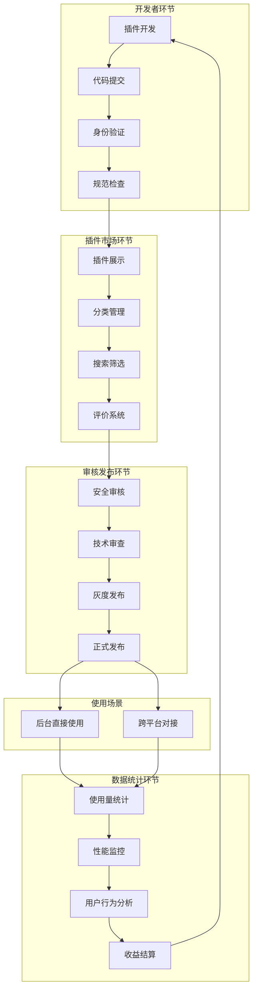
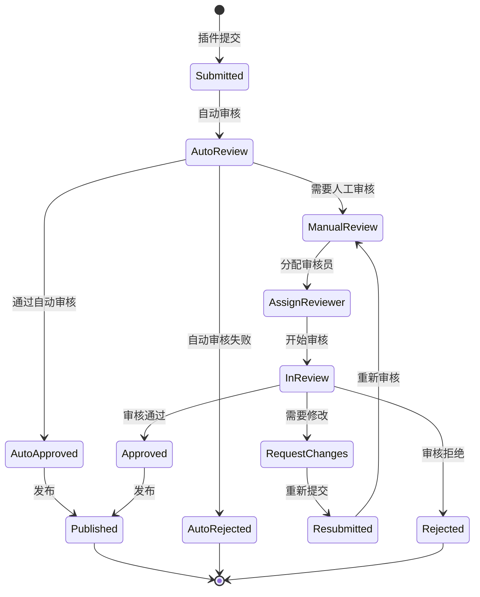
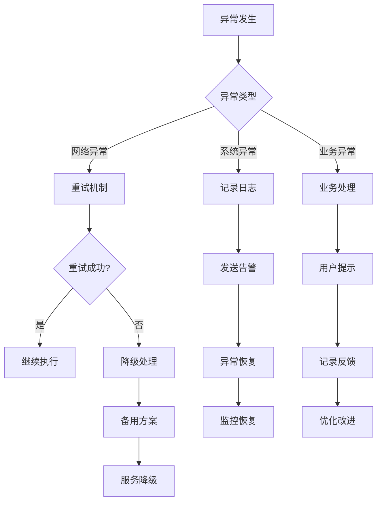

# 太上老君插件业务闭环全流程设计 🔄

## 📋 概述

本文档详细描述了太上老君平台插件生态系统的完整业务闭环，从开发者提交插件到用户使用的全流程，确保每个环节都有明确的标准、异常处理机制和性能保障。

## 🏗️ 业务闭环架构图



## 1️⃣ 开发者提交环节

### 1.1 插件提交规范

#### 代码格式标准
```yaml
# 插件元数据规范 (plugin.yaml)
plugin:
  id: "com.example.my-plugin"           # 唯一标识符
  name: "我的插件"                       # 插件名称
  version: "1.0.0"                      # 语义化版本
  description: "插件功能描述"             # 详细描述
  author: "开发者名称"                   # 作者信息
  license: "MIT"                        # 开源协议
  homepage: "https://example.com"       # 主页地址
  repository: "https://github.com/..."  # 代码仓库
  
  # 技术规范
  runtime:
    go_version: ">=1.21"                # Go版本要求
    dependencies:                       # 依赖列表
      - "github.com/gin-gonic/gin@v1.9.1"
    permissions:                        # 权限要求
      - "read:user"
      - "write:data"
  
  # 功能规范
  capabilities:
    - "data-processing"                 # 功能类别
    - "ui-component"
  
  # 配置规范
  config:
    schema: "./config/schema.json"      # 配置模式
    default: "./config/default.yaml"   # 默认配置
```

#### 文档要求标准
```markdown
# 必需文档清单
├── README.md                 # 插件说明文档
├── CHANGELOG.md             # 版本更新日志
├── docs/
│   ├── installation.md     # 安装指南
│   ├── configuration.md    # 配置说明
│   ├── api.md             # API文档
│   └── examples.md        # 使用示例
├── tests/                  # 测试用例
└── screenshots/           # 功能截图
```

#### 兼容性标准
```go
// 插件兼容性接口
type PluginCompatibility struct {
    MinPlatformVersion string            `json:"min_platform_version"`
    MaxPlatformVersion string            `json:"max_platform_version"`
    SupportedOS        []string          `json:"supported_os"`
    SupportedArch      []string          `json:"supported_arch"`
    ConflictPlugins    []string          `json:"conflict_plugins"`
    RequiredPlugins    []PluginDep       `json:"required_plugins"`
}

type PluginDep struct {
    ID      string `json:"id"`
    Version string `json:"version"`
    Optional bool  `json:"optional"`
}
```

### 1.2 版本控制机制

#### 语义化版本规范
```yaml
# 版本号格式: MAJOR.MINOR.PATCH
version_rules:
  major:        # 主版本号 (不兼容的API修改)
    - breaking_changes
    - api_removal
  minor:        # 次版本号 (向下兼容的功能性新增)
    - new_features
    - api_additions
  patch:        # 修订号 (向下兼容的问题修正)
    - bug_fixes
    - security_patches
```

#### 更新策略
```go
// 插件更新策略
type UpdateStrategy struct {
    AutoUpdate      bool              `json:"auto_update"`
    UpdateChannel   string            `json:"update_channel"`   // stable, beta, alpha
    RollbackPolicy  RollbackPolicy    `json:"rollback_policy"`
    UpdateWindow    UpdateWindow      `json:"update_window"`
}

type RollbackPolicy struct {
    Enabled         bool              `json:"enabled"`
    MaxRollbackDays int               `json:"max_rollback_days"`
    AutoRollback    AutoRollbackRule  `json:"auto_rollback"`
}

type UpdateWindow struct {
    Timezone    string    `json:"timezone"`
    StartTime   string    `json:"start_time"`   // "02:00"
    EndTime     string    `json:"end_time"`     // "06:00"
    Weekdays    []int     `json:"weekdays"`     // 1-7 (Monday-Sunday)
}
```

### 1.3 开发者身份验证和权限管理

#### 身份验证体系
```go
// 开发者认证模型
type Developer struct {
    ID              uuid.UUID         `json:"id"`
    Username        string            `json:"username"`
    Email           string            `json:"email"`
    FullName        string            `json:"full_name"`
    Organization    string            `json:"organization"`
    
    // 认证信息
    VerificationStatus VerifyStatus   `json:"verification_status"`
    VerifiedAt         *time.Time     `json:"verified_at"`
    VerificationDocs   []Document     `json:"verification_docs"`
    
    // 权限信息
    Permissions     []Permission      `json:"permissions"`
    Tier           DeveloperTier      `json:"tier"`
    
    // 统计信息
    PluginCount     int               `json:"plugin_count"`
    TotalDownloads  int64             `json:"total_downloads"`
    Rating          float64           `json:"rating"`
    
    CreatedAt       time.Time         `json:"created_at"`
    UpdatedAt       time.Time         `json:"updated_at"`
}

type VerifyStatus string
const (
    VerifyPending   VerifyStatus = "pending"
    VerifyApproved  VerifyStatus = "approved"
    VerifyRejected  VerifyStatus = "rejected"
    VerifySuspended VerifyStatus = "suspended"
)

type DeveloperTier string
const (
    TierBasic       DeveloperTier = "basic"      // 基础开发者
    TierVerified    DeveloperTier = "verified"   // 认证开发者
    TierPartner     DeveloperTier = "partner"    // 合作伙伴
    TierEnterprise  DeveloperTier = "enterprise" // 企业开发者
)
```

#### 权限管理体系
```yaml
# 开发者权限配置
developer_permissions:
  basic:
    - "plugin.create"
    - "plugin.update_own"
    - "plugin.view_own"
    - "plugin.delete_own"
    - "version.create_own"
    
  verified:
    - "plugin.*_own"
    - "version.*_own"
    - "analytics.view_own"
    - "revenue.view_own"
    
  partner:
    - "plugin.*_own"
    - "version.*_own"
    - "analytics.*_own"
    - "revenue.*_own"
    - "support.priority"
    
  enterprise:
    - "plugin.*_own"
    - "version.*_own"
    - "analytics.*_own"
    - "revenue.*_own"
    - "support.dedicated"
    - "api.extended_limits"
```

### 1.4 提交流程API设计

```http
# 1. 开发者认证
POST /api/v1/developers/register
Content-Type: application/json

{
  "username": "developer123",
  "email": "dev@example.com",
  "full_name": "张三",
  "organization": "示例公司",
  "verification_docs": [
    {
      "type": "identity",
      "url": "https://storage.example.com/id.jpg"
    }
  ]
}

# 2. 插件提交
POST /api/v1/plugins
Content-Type: multipart/form-data
Authorization: Bearer {developer_token}

{
  "metadata": "plugin.yaml内容",
  "package": "插件包文件",
  "documentation": "文档压缩包",
  "screenshots": ["截图文件1", "截图文件2"]
}

# 3. 版本更新
POST /api/v1/plugins/{plugin_id}/versions
Content-Type: application/json
Authorization: Bearer {developer_token}

{
  "version": "1.1.0",
  "changelog": "更新日志",
  "package_url": "https://storage.example.com/plugin-v1.1.0.zip",
  "checksum": "sha256:...",
  "update_strategy": {
    "auto_update": true,
    "update_channel": "stable"
  }
}
```

## 2️⃣ 插件市场环节

### 2.1 插件分类和展示方案

#### 分类体系设计
```yaml
# 插件分类层次结构
categories:
  productivity:           # 效率工具
    name: "效率工具"
    subcategories:
      - task_management   # 任务管理
      - time_tracking     # 时间追踪
      - automation        # 自动化工具
      
  integration:           # 集成工具
    name: "集成工具"
    subcategories:
      - api_connectors    # API连接器
      - data_sync         # 数据同步
      - webhooks          # Webhook工具
      
  analytics:             # 数据分析
    name: "数据分析"
    subcategories:
      - reporting         # 报表工具
      - visualization     # 可视化
      - metrics           # 指标监控
      
  ui_components:         # UI组件
    name: "界面组件"
    subcategories:
      - forms             # 表单组件
      - charts            # 图表组件
      - widgets           # 小部件
```

#### 展示方案设计
```go
// 插件展示模型
type PluginDisplay struct {
    // 基础信息
    ID              uuid.UUID         `json:"id"`
    Name            string            `json:"name"`
    ShortDesc       string            `json:"short_description"`
    LongDesc        string            `json:"long_description"`
    
    // 展示素材
    Icon            string            `json:"icon"`
    Screenshots     []Screenshot      `json:"screenshots"`
    Video           *VideoInfo        `json:"video"`
    
    // 分类信息
    Category        Category          `json:"category"`
    Tags            []string          `json:"tags"`
    
    // 统计信息
    Downloads       int64             `json:"downloads"`
    Rating          float64           `json:"rating"`
    ReviewCount     int               `json:"review_count"`
    
    // 版本信息
    LatestVersion   string            `json:"latest_version"`
    UpdatedAt       time.Time         `json:"updated_at"`
    
    // 开发者信息
    Developer       DeveloperInfo     `json:"developer"`
    
    // 状态信息
    Status          PluginStatus      `json:"status"`
    Featured        bool              `json:"featured"`
    Trending        bool              `json:"trending"`
}

type Screenshot struct {
    URL         string  `json:"url"`
    Caption     string  `json:"caption"`
    Order       int     `json:"order"`
}

type VideoInfo struct {
    URL         string  `json:"url"`
    Thumbnail   string  `json:"thumbnail"`
    Duration    int     `json:"duration"`
}
```

### 2.2 搜索、筛选和排序功能

#### 搜索功能设计
```go
// 搜索参数
type SearchParams struct {
    // 基础搜索
    Query           string            `json:"query"`
    Category        string            `json:"category"`
    Tags            []string          `json:"tags"`
    
    // 筛选条件
    MinRating       float64           `json:"min_rating"`
    MaxPrice        decimal.Decimal   `json:"max_price"`
    IsFree          *bool             `json:"is_free"`
    HasTrial        *bool             `json:"has_trial"`
    
    // 开发者筛选
    DeveloperTier   DeveloperTier     `json:"developer_tier"`
    VerifiedOnly    bool              `json:"verified_only"`
    
    // 时间筛选
    UpdatedAfter    *time.Time        `json:"updated_after"`
    CreatedAfter    *time.Time        `json:"created_after"`
    
    // 排序选项
    SortBy          SortOption        `json:"sort_by"`
    SortOrder       SortOrder         `json:"sort_order"`
    
    // 分页参数
    Page            int               `json:"page"`
    PageSize        int               `json:"page_size"`
}

type SortOption string
const (
    SortByRelevance     SortOption = "relevance"      // 相关性
    SortByDownloads     SortOption = "downloads"      // 下载量
    SortByRating        SortOption = "rating"         // 评分
    SortByUpdated       SortOption = "updated"        // 更新时间
    SortByCreated       SortOption = "created"        // 创建时间
    SortByName          SortOption = "name"           // 名称
    SortByPrice         SortOption = "price"          // 价格
)
```

#### 搜索算法实现
```go
// 搜索服务接口
type SearchService interface {
    Search(ctx context.Context, params SearchParams) (*SearchResult, error)
    GetSuggestions(ctx context.Context, query string) ([]string, error)
    GetTrendingSearches(ctx context.Context) ([]string, error)
    UpdateSearchIndex(ctx context.Context, plugin *Plugin) error
}

// 搜索结果
type SearchResult struct {
    Plugins         []PluginDisplay   `json:"plugins"`
    Total           int64             `json:"total"`
    Page            int               `json:"page"`
    PageSize        int               `json:"page_size"`
    Facets          SearchFacets      `json:"facets"`
    SearchTime      time.Duration     `json:"search_time"`
}

type SearchFacets struct {
    Categories      []FacetItem       `json:"categories"`
    Tags            []FacetItem       `json:"tags"`
    Developers      []FacetItem       `json:"developers"`
    PriceRanges     []FacetItem       `json:"price_ranges"`
}

type FacetItem struct {
    Value           string            `json:"value"`
    Count           int               `json:"count"`
    Selected        bool              `json:"selected"`
}
```

### 2.3 评分和评价系统

#### 评价模型设计
```go
// 评价模型
type Review struct {
    ID              uuid.UUID         `json:"id"`
    PluginID        uuid.UUID         `json:"plugin_id"`
    UserID          uuid.UUID         `json:"user_id"`
    
    // 评价内容
    Rating          int               `json:"rating"`          // 1-5星
    Title           string            `json:"title"`
    Content         string            `json:"content"`
    
    // 详细评分
    DetailedRating  DetailedRating    `json:"detailed_rating"`
    
    // 使用信息
    UsageDuration   int               `json:"usage_duration"`  // 使用天数
    PluginVersion   string            `json:"plugin_version"`
    
    // 状态信息
    Status          ReviewStatus      `json:"status"`
    IsVerified      bool              `json:"is_verified"`     // 已验证购买
    
    // 互动信息
    HelpfulCount    int               `json:"helpful_count"`
    ReportCount     int               `json:"report_count"`
    
    // 开发者回复
    DeveloperReply  *DeveloperReply   `json:"developer_reply"`
    
    CreatedAt       time.Time         `json:"created_at"`
    UpdatedAt       time.Time         `json:"updated_at"`
}

type DetailedRating struct {
    Functionality   int               `json:"functionality"`   // 功能性
    Usability       int               `json:"usability"`       // 易用性
    Performance     int               `json:"performance"`     // 性能
    Support         int               `json:"support"`         // 支持
    Documentation   int               `json:"documentation"`   // 文档
}

type DeveloperReply struct {
    Content         string            `json:"content"`
    CreatedAt       time.Time         `json:"created_at"`
}
```

#### 评价系统API
```http
# 创建评价
POST /api/v1/plugins/{plugin_id}/reviews
Content-Type: application/json
Authorization: Bearer {user_token}

{
  "rating": 5,
  "title": "非常好用的插件",
  "content": "功能强大，界面友好，推荐使用！",
  "detailed_rating": {
    "functionality": 5,
    "usability": 4,
    "performance": 5,
    "support": 4,
    "documentation": 4
  },
  "usage_duration": 30
}

# 获取评价列表
GET /api/v1/plugins/{plugin_id}/reviews
Query: page=1&page_size=20&sort=helpful&filter=verified

# 评价互动
POST /api/v1/reviews/{review_id}/helpful
POST /api/v1/reviews/{review_id}/report
```

## 3️⃣ 审核发布环节

### 3.1 安全审核标准

#### 安全检查清单
```yaml
# 安全审核标准
security_checklist:
  code_security:
    - sql_injection_check      # SQL注入检查
    - xss_vulnerability        # XSS漏洞检查
    - csrf_protection          # CSRF保护检查
    - input_validation         # 输入验证检查
    - output_encoding          # 输出编码检查
    
  data_security:
    - sensitive_data_handling  # 敏感数据处理
    - encryption_usage         # 加密使用检查
    - data_transmission        # 数据传输安全
    - storage_security         # 存储安全检查
    
  permission_security:
    - privilege_escalation     # 权限提升检查
    - unauthorized_access      # 未授权访问检查
    - resource_access          # 资源访问控制
    - api_security            # API安全检查
    
  dependency_security:
    - vulnerable_dependencies  # 依赖漏洞检查
    - license_compliance      # 许可证合规检查
    - version_compatibility   # 版本兼容性检查
```

#### 自动化安全扫描
```go
// 安全扫描服务
type SecurityScanner interface {
    ScanCode(ctx context.Context, codebase string) (*SecurityReport, error)
    ScanDependencies(ctx context.Context, deps []Dependency) (*DependencyReport, error)
    ScanPermissions(ctx context.Context, permissions []Permission) (*PermissionReport, error)
    GenerateSecurityScore(ctx context.Context, reports []Report) (float64, error)
}

type SecurityReport struct {
    OverallScore    float64           `json:"overall_score"`
    Vulnerabilities []Vulnerability   `json:"vulnerabilities"`
    Recommendations []Recommendation  `json:"recommendations"`
    ScanTime        time.Time         `json:"scan_time"`
}

type Vulnerability struct {
    ID              string            `json:"id"`
    Severity        Severity          `json:"severity"`
    Category        string            `json:"category"`
    Description     string            `json:"description"`
    Location        Location          `json:"location"`
    Recommendation  string            `json:"recommendation"`
}

type Severity string
const (
    SeverityCritical Severity = "critical"
    SeverityHigh     Severity = "high"
    SeverityMedium   Severity = "medium"
    SeverityLow      Severity = "low"
    SeverityInfo     Severity = "info"
)
```

### 3.2 技术审查流程

#### 审查流程设计


#### 审核规则引擎
```go
// 审核规则引擎
type ReviewRuleEngine struct {
    rules       []ReviewRule
    scorers     []QualityScorer
    validators  []Validator
}

type ReviewRule interface {
    Name() string
    Description() string
    Evaluate(ctx context.Context, plugin *Plugin) (*RuleResult, error)
    Priority() int
}

type QualityScorer interface {
    ScoreCode(ctx context.Context, codebase string) (float64, error)
    ScoreDocumentation(ctx context.Context, docs []Document) (float64, error)
    ScoreTests(ctx context.Context, tests []TestFile) (float64, error)
}

// 审核结果
type ReviewResult struct {
    PluginID        uuid.UUID         `json:"plugin_id"`
    ReviewerID      uuid.UUID         `json:"reviewer_id"`
    Status          ReviewStatus      `json:"status"`
    
    // 评分结果
    OverallScore    float64           `json:"overall_score"`
    SecurityScore   float64           `json:"security_score"`
    QualityScore    float64           `json:"quality_score"`
    
    // 检查结果
    RuleResults     []RuleResult      `json:"rule_results"`
    Issues          []ReviewIssue     `json:"issues"`
    Recommendations []string          `json:"recommendations"`
    
    // 审核信息
    ReviewNotes     string            `json:"review_notes"`
    ReviewTime      time.Duration     `json:"review_time"`
    CreatedAt       time.Time         `json:"created_at"`
}

type ReviewIssue struct {
    Severity        Severity          `json:"severity"`
    Category        string            `json:"category"`
    Description     string            `json:"description"`
    Location        *Location         `json:"location"`
    Suggestion      string            `json:"suggestion"`
    Blocking        bool              `json:"blocking"`
}
```

### 3.3 审核周期和反馈机制

#### 审核SLA标准
```yaml
# 审核服务等级协议
review_sla:
  auto_review:
    target_time: "5分钟"
    max_time: "15分钟"
    
  manual_review:
    basic_plugin:
      target_time: "24小时"
      max_time: "72小时"
    
    complex_plugin:
      target_time: "72小时"
      max_time: "168小时"  # 7天
    
    enterprise_plugin:
      target_time: "48小时"
      max_time: "120小时"  # 5天
      
  appeal_review:
    target_time: "48小时"
    max_time: "120小时"
```

#### 反馈机制设计
```go
// 审核反馈服务
type ReviewFeedbackService interface {
    SendReviewResult(ctx context.Context, result *ReviewResult) error
    SendProgressUpdate(ctx context.Context, pluginID uuid.UUID, status ReviewStatus) error
    SendReminderNotification(ctx context.Context, reviewID uuid.UUID) error
    HandleAppeal(ctx context.Context, appeal *ReviewAppeal) error
}

type ReviewAppeal struct {
    ID              uuid.UUID         `json:"id"`
    PluginID        uuid.UUID         `json:"plugin_id"`
    DeveloperID     uuid.UUID         `json:"developer_id"`
    OriginalReviewID uuid.UUID        `json:"original_review_id"`
    
    Reason          string            `json:"reason"`
    Evidence        []Evidence        `json:"evidence"`
    RequestedAction AppealAction      `json:"requested_action"`
    
    Status          AppealStatus      `json:"status"`
    Response        *AppealResponse   `json:"response"`
    
    CreatedAt       time.Time         `json:"created_at"`
    ResolvedAt      *time.Time        `json:"resolved_at"`
}
```

### 3.4 灰度发布和回滚策略

#### 灰度发布配置
```go
// 灰度发布配置
type GrayReleaseConfig struct {
    Enabled         bool              `json:"enabled"`
    Strategy        ReleaseStrategy   `json:"strategy"`
    Stages          []ReleaseStage    `json:"stages"`
    Criteria        ReleaseCriteria   `json:"criteria"`
    Rollback        RollbackConfig    `json:"rollback"`
}

type ReleaseStrategy string
const (
    StrategyCanary      ReleaseStrategy = "canary"      // 金丝雀发布
    StrategyBlueGreen   ReleaseStrategy = "blue_green"  // 蓝绿部署
    StrategyRolling     ReleaseStrategy = "rolling"     // 滚动发布
)

type ReleaseStage struct {
    Name            string            `json:"name"`
    TrafficPercent  int               `json:"traffic_percent"`
    Duration        time.Duration     `json:"duration"`
    SuccessCriteria SuccessCriteria   `json:"success_criteria"`
    AutoPromote     bool              `json:"auto_promote"`
}

type SuccessCriteria struct {
    MinSuccessRate  float64           `json:"min_success_rate"`
    MaxErrorRate    float64           `json:"max_error_rate"`
    MinSampleSize   int               `json:"min_sample_size"`
}
```

## 4️⃣ 使用场景分类

### 4.1 后台直接安装使用场景

#### 前端集成方案
```typescript
// 插件前端集成接口
interface PluginFrontendIntegration {
  // 插件基础信息
  id: string;
  name: string;
  version: string;
  
  // 前端资源
  assets: {
    js: string[];
    css: string[];
    images: string[];
  };
  
  // 集成配置
  integration: {
    mountPoint: string;           // 挂载点
    routePrefix: string;          // 路由前缀
    permissions: string[];        // 所需权限
    dependencies: string[];       // 前端依赖
  };
  
  // 生命周期钩子
  hooks: {
    onMount?: () => Promise<void>;
    onUnmount?: () => Promise<void>;
    onUpdate?: (config: any) => Promise<void>;
  };
}

// 插件管理器
class PluginManager {
  private plugins: Map<string, PluginInstance> = new Map();
  
  async installPlugin(pluginId: string, config?: any): Promise<void> {
    // 1. 下载插件资源
    const plugin = await this.downloadPlugin(pluginId);
    
    // 2. 验证权限
    await this.validatePermissions(plugin.integration.permissions);
    
    // 3. 加载依赖
    await this.loadDependencies(plugin.integration.dependencies);
    
    // 4. 挂载插件
    await this.mountPlugin(plugin, config);
    
    // 5. 注册路由
    await this.registerRoutes(plugin);
  }
  
  async uninstallPlugin(pluginId: string): Promise<void> {
    const plugin = this.plugins.get(pluginId);
    if (plugin) {
      await plugin.hooks.onUnmount?.();
      await this.unmountPlugin(plugin);
      this.plugins.delete(pluginId);
    }
  }
}
```

#### 权限配置规范
```yaml
# 插件权限配置规范
plugin_permissions:
  # 数据权限
  data:
    read:
      - "user.profile"          # 用户资料读取
      - "user.preferences"      # 用户偏好读取
      - "system.config"         # 系统配置读取
    write:
      - "user.preferences"      # 用户偏好写入
      - "plugin.data"           # 插件数据写入
    delete:
      - "plugin.data"           # 插件数据删除
  
  # 功能权限
  features:
    - "ui.menu.add"             # 添加菜单项
    - "ui.toolbar.add"          # 添加工具栏按钮
    - "api.external.call"       # 调用外部API
    - "notification.send"       # 发送通知
    - "file.upload"             # 文件上传
    - "file.download"           # 文件下载
  
  # 系统权限
  system:
    - "background.task"         # 后台任务
    - "scheduled.job"           # 定时任务
    - "webhook.register"        # 注册Webhook
    - "event.listen"            # 监听系统事件
```

#### 数据隔离机制
```go
// 数据隔离服务
type DataIsolationService interface {
    CreatePluginNamespace(ctx context.Context, pluginID string) (*Namespace, error)
    GetPluginData(ctx context.Context, pluginID, key string) (interface{}, error)
    SetPluginData(ctx context.Context, pluginID, key string, value interface{}) error
    DeletePluginData(ctx context.Context, pluginID, key string) error
    ListPluginData(ctx context.Context, pluginID string) (map[string]interface{}, error)
}

// 数据命名空间
type Namespace struct {
    PluginID        string            `json:"plugin_id"`
    DatabaseSchema  string            `json:"database_schema"`
    CachePrefix     string            `json:"cache_prefix"`
    FileDirectory   string            `json:"file_directory"`
    Permissions     []Permission      `json:"permissions"`
    Quotas          ResourceQuotas    `json:"quotas"`
}

type ResourceQuotas struct {
    MaxDatabaseSize int64             `json:"max_database_size"`
    MaxCacheSize    int64             `json:"max_cache_size"`
    MaxFileSize     int64             `json:"max_file_size"`
    MaxAPIRequests  int               `json:"max_api_requests"`
}
```

### 4.2 跨平台业务对接场景

#### API对接标准
```yaml
# 跨平台API对接规范
api_integration:
  # 认证标准
  authentication:
    type: "oauth2"                    # 认证类型
    scopes:                          # 权限范围
      - "plugin.read"
      - "plugin.write"
    token_endpoint: "/oauth/token"
    refresh_endpoint: "/oauth/refresh"
  
  # 数据格式标准
  data_format:
    request:
      content_type: "application/json"
      charset: "utf-8"
      schema_version: "v1"
    response:
      content_type: "application/json"
      charset: "utf-8"
      envelope: true                  # 使用响应包装
  
  # 错误处理标准
  error_handling:
    format: "rfc7807"                # 错误格式标准
    include_trace: false             # 是否包含堆栈跟踪
    localization: true               # 错误信息本地化
```

#### 数据格式转换规范
```go
// 数据转换服务
type DataTransformService interface {
    Transform(ctx context.Context, data interface{}, from, to DataFormat) (interface{}, error)
    RegisterTransformer(from, to DataFormat, transformer Transformer) error
    GetSupportedFormats() []DataFormat
}

type DataFormat string
const (
    FormatJSON      DataFormat = "json"
    FormatXML       DataFormat = "xml"
    FormatYAML      DataFormat = "yaml"
    FormatProtobuf  DataFormat = "protobuf"
    FormatAvro      DataFormat = "avro"
)

// 标准数据包装格式
type APIResponse struct {
    Success     bool            `json:"success"`
    Data        interface{}     `json:"data,omitempty"`
    Error       *APIError       `json:"error,omitempty"`
    Metadata    *Metadata       `json:"metadata,omitempty"`
    Timestamp   time.Time       `json:"timestamp"`
    RequestID   string          `json:"request_id"`
}

type APIError struct {
    Code        string          `json:"code"`
    Message     string          `json:"message"`
    Details     interface{}     `json:"details,omitempty"`
    TraceID     string          `json:"trace_id,omitempty"`
}

type Metadata struct {
    Version     string          `json:"version"`
    Pagination  *Pagination     `json:"pagination,omitempty"`
    RateLimit   *RateLimit      `json:"rate_limit,omitempty"`
}
```

#### 异常处理流程
```go
// 异常处理策略
type ExceptionHandlingStrategy struct {
    RetryPolicy     RetryPolicy       `json:"retry_policy"`
    CircuitBreaker  CircuitBreaker    `json:"circuit_breaker"`
    Fallback        FallbackStrategy  `json:"fallback"`
    Monitoring      MonitoringConfig  `json:"monitoring"`
}

type RetryPolicy struct {
    MaxAttempts     int               `json:"max_attempts"`
    InitialDelay    time.Duration     `json:"initial_delay"`
    MaxDelay        time.Duration     `json:"max_delay"`
    BackoffFactor   float64           `json:"backoff_factor"`
    RetryableErrors []string          `json:"retryable_errors"`
}

type CircuitBreaker struct {
    Enabled         bool              `json:"enabled"`
    FailureThreshold int              `json:"failure_threshold"`
    RecoveryTimeout time.Duration     `json:"recovery_timeout"`
    HalfOpenRequests int              `json:"half_open_requests"`
}

type FallbackStrategy struct {
    Enabled         bool              `json:"enabled"`
    FallbackData    interface{}       `json:"fallback_data"`
    CacheEnabled    bool              `json:"cache_enabled"`
    CacheTTL        time.Duration     `json:"cache_ttl"`
}
```

## 5️⃣ 数据统计环节

### 5.1 使用量统计维度设计

#### 统计维度模型
```go
// 使用量统计模型
type UsageStatistics struct {
    PluginID        uuid.UUID         `json:"plugin_id"`
    TimeRange       TimeRange         `json:"time_range"`
    
    // 基础统计
    InstallCount    int64             `json:"install_count"`
    ActiveUsers     int64             `json:"active_users"`
    TotalSessions   int64             `json:"total_sessions"`
    TotalDuration   time.Duration     `json:"total_duration"`
    
    // 详细统计
    DailyStats      []DailyUsage      `json:"daily_stats"`
    GeographicStats []GeographicUsage `json:"geographic_stats"`
    VersionStats    []VersionUsage    `json:"version_stats"`
    FeatureStats    []FeatureUsage    `json:"feature_stats"`
    
    // 用户行为统计
    UserJourney     []UserAction      `json:"user_journey"`
    RetentionRate   RetentionMetrics  `json:"retention_rate"`
    ChurnRate       ChurnMetrics      `json:"churn_rate"`
}

type DailyUsage struct {
    Date            time.Time         `json:"date"`
    NewInstalls     int               `json:"new_installs"`
    ActiveUsers     int               `json:"active_users"`
    Sessions        int               `json:"sessions"`
    AvgSessionTime  time.Duration     `json:"avg_session_time"`
    ErrorRate       float64           `json:"error_rate"`
}

type GeographicUsage struct {
    Country         string            `json:"country"`
    Region          string            `json:"region"`
    UserCount       int               `json:"user_count"`
    UsagePercent    float64           `json:"usage_percent"`
}
```

#### 统计数据收集
```go
// 数据收集服务
type AnalyticsCollector interface {
    TrackInstall(ctx context.Context, event InstallEvent) error
    TrackUsage(ctx context.Context, event UsageEvent) error
    TrackError(ctx context.Context, event ErrorEvent) error
    TrackPerformance(ctx context.Context, event PerformanceEvent) error
    BatchTrack(ctx context.Context, events []AnalyticsEvent) error
}

type InstallEvent struct {
    PluginID        string            `json:"plugin_id"`
    UserID          string            `json:"user_id"`
    Version         string            `json:"version"`
    Platform        string            `json:"platform"`
    InstallSource   string            `json:"install_source"`
    Timestamp       time.Time         `json:"timestamp"`
}

type UsageEvent struct {
    PluginID        string            `json:"plugin_id"`
    UserID          string            `json:"user_id"`
    SessionID       string            `json:"session_id"`
    Action          string            `json:"action"`
    Feature         string            `json:"feature"`
    Duration        time.Duration     `json:"duration"`
    Properties      map[string]any    `json:"properties"`
    Timestamp       time.Time         `json:"timestamp"`
}
```

### 5.2 性能指标监控体系

#### 性能指标定义
```yaml
# 性能监控指标
performance_metrics:
  # 响应时间指标
  response_time:
    - api_response_time         # API响应时间
    - page_load_time           # 页面加载时间
    - plugin_init_time         # 插件初始化时间
    - database_query_time      # 数据库查询时间
  
  # 吞吐量指标
  throughput:
    - requests_per_second      # 每秒请求数
    - transactions_per_second  # 每秒事务数
    - concurrent_users         # 并发用户数
    - data_processing_rate     # 数据处理速率
  
  # 资源使用指标
  resource_usage:
    - cpu_utilization          # CPU使用率
    - memory_usage             # 内存使用量
    - disk_io                  # 磁盘IO
    - network_io               # 网络IO
  
  # 错误率指标
  error_rates:
    - http_error_rate          # HTTP错误率
    - application_error_rate   # 应用错误率
    - timeout_rate             # 超时率
    - crash_rate               # 崩溃率
```

#### 监控告警配置
```go
// 监控告警服务
type MonitoringService interface {
    CreateAlert(ctx context.Context, alert *AlertRule) error
    UpdateAlert(ctx context.Context, alertID string, alert *AlertRule) error
    DeleteAlert(ctx context.Context, alertID string) error
    TriggerAlert(ctx context.Context, event *AlertEvent) error
    GetAlertHistory(ctx context.Context, pluginID string) ([]AlertHistory, error)
}

type AlertRule struct {
    ID              string            `json:"id"`
    Name            string            `json:"name"`
    PluginID        string            `json:"plugin_id"`
    
    // 触发条件
    Metric          string            `json:"metric"`
    Operator        Operator          `json:"operator"`
    Threshold       float64           `json:"threshold"`
    Duration        time.Duration     `json:"duration"`
    
    // 告警配置
    Severity        AlertSeverity     `json:"severity"`
    Channels        []AlertChannel    `json:"channels"`
    Cooldown        time.Duration     `json:"cooldown"`
    
    // 状态信息
    Enabled         bool              `json:"enabled"`
    LastTriggered   *time.Time        `json:"last_triggered"`
}

type AlertSeverity string
const (
    SeverityInfo     AlertSeverity = "info"
    SeverityWarning  AlertSeverity = "warning"
    SeverityCritical AlertSeverity = "critical"
)
```

### 5.3 用户行为分析方案

#### 用户行为追踪
```go
// 用户行为分析服务
type UserBehaviorAnalytics interface {
    TrackUserAction(ctx context.Context, action UserAction) error
    AnalyzeUserJourney(ctx context.Context, userID string) (*UserJourney, error)
    GetUserSegments(ctx context.Context, criteria SegmentCriteria) ([]UserSegment, error)
    CalculateRetention(ctx context.Context, cohort CohortDefinition) (*RetentionAnalysis, error)
}

type UserAction struct {
    UserID          string            `json:"user_id"`
    SessionID       string            `json:"session_id"`
    PluginID        string            `json:"plugin_id"`
    ActionType      ActionType        `json:"action_type"`
    ActionName      string            `json:"action_name"`
    Properties      map[string]any    `json:"properties"`
    Timestamp       time.Time         `json:"timestamp"`
    
    // 上下文信息
    UserAgent       string            `json:"user_agent"`
    IPAddress       string            `json:"ip_address"`
    Referrer        string            `json:"referrer"`
    Platform        string            `json:"platform"`
}

type ActionType string
const (
    ActionView      ActionType = "view"         # 页面浏览
    ActionClick     ActionType = "click"        # 点击操作
    ActionSubmit    ActionType = "submit"       # 表单提交
    ActionDownload  ActionType = "download"     # 下载操作
    ActionSearch    ActionType = "search"       # 搜索操作
    ActionPurchase  ActionType = "purchase"     # 购买操作
)
```

#### 用户画像分析
```go
// 用户画像模型
type UserProfile struct {
    UserID          string            `json:"user_id"`
    
    // 基础信息
    Demographics    Demographics      `json:"demographics"`
    Preferences     Preferences       `json:"preferences"`
    
    // 行为特征
    ActivityLevel   ActivityLevel     `json:"activity_level"`
    UsagePatterns   []UsagePattern    `json:"usage_patterns"`
    InterestTags    []string          `json:"interest_tags"`
    
    // 价值指标
    LifetimeValue   decimal.Decimal   `json:"lifetime_value"`
    ChurnRisk       float64           `json:"churn_risk"`
    EngagementScore float64           `json:"engagement_score"`
    
    // 更新时间
    LastUpdated     time.Time         `json:"last_updated"`
}

type Demographics struct {
    Country         string            `json:"country"`
    Region          string            `json:"region"`
    Language        string            `json:"language"`
    Timezone        string            `json:"timezone"`
    DeviceType      string            `json:"device_type"`
}

type UsagePattern struct {
    PluginCategory  string            `json:"plugin_category"`
    UsageFrequency  string            `json:"usage_frequency"`
    PreferredTime   string            `json:"preferred_time"`
    SessionDuration time.Duration     `json:"session_duration"`
}
```

## 🔄 异常处理和版本兼容性

### 异常处理流程


### 版本兼容性策略
```yaml
# 版本兼容性配置
version_compatibility:
  # 向后兼容策略
  backward_compatibility:
    major_version_support: 2      # 支持的主版本数
    deprecation_period: "6个月"   # 废弃功能保留期
    migration_tools: true        # 提供迁移工具
    
  # 向前兼容策略
  forward_compatibility:
    api_versioning: true         # API版本控制
    feature_flags: true          # 功能开关
    graceful_degradation: true   # 优雅降级
    
  # 兼容性测试
  compatibility_testing:
    automated_tests: true        # 自动化测试
    regression_tests: true       # 回归测试
    cross_version_tests: true    # 跨版本测试
```

## 📊 性能和安全保障措施

### 性能保障措施
```yaml
# 性能保障配置
performance_guarantees:
  # 响应时间保障
  response_time:
    api_p95: "200ms"            # API 95%响应时间
    api_p99: "500ms"            # API 99%响应时间
    page_load: "2s"             # 页面加载时间
    
  # 吞吐量保障
  throughput:
    concurrent_users: 10000     # 并发用户数
    requests_per_second: 5000   # 每秒请求数
    
  # 可用性保障
  availability:
    uptime: "99.9%"             # 系统可用性
    mttr: "15分钟"              # 平均恢复时间
    mtbf: "720小时"             # 平均故障间隔
```

### 安全保障措施
```yaml
# 安全保障配置
security_guarantees:
  # 数据安全
  data_security:
    encryption_at_rest: true    # 静态数据加密
    encryption_in_transit: true # 传输数据加密
    data_backup: true           # 数据备份
    
  # 访问安全
  access_security:
    multi_factor_auth: true     # 多因子认证
    role_based_access: true     # 基于角色的访问控制
    audit_logging: true         # 审计日志
    
  # 应用安全
  application_security:
    input_validation: true      # 输入验证
    output_encoding: true       # 输出编码
    csrf_protection: true       # CSRF保护
    xss_protection: true        # XSS保护
```

---

**文档版本**: v1.0  
**创建时间**: 2024年12月  
**负责人**: 产品团队 & 技术团队  
**审核周期**: 每月评审更新