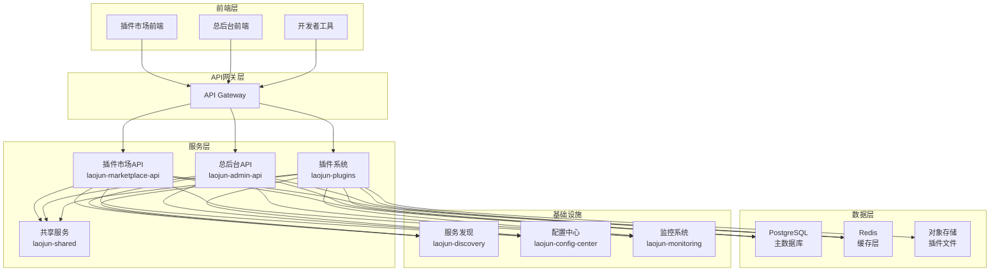
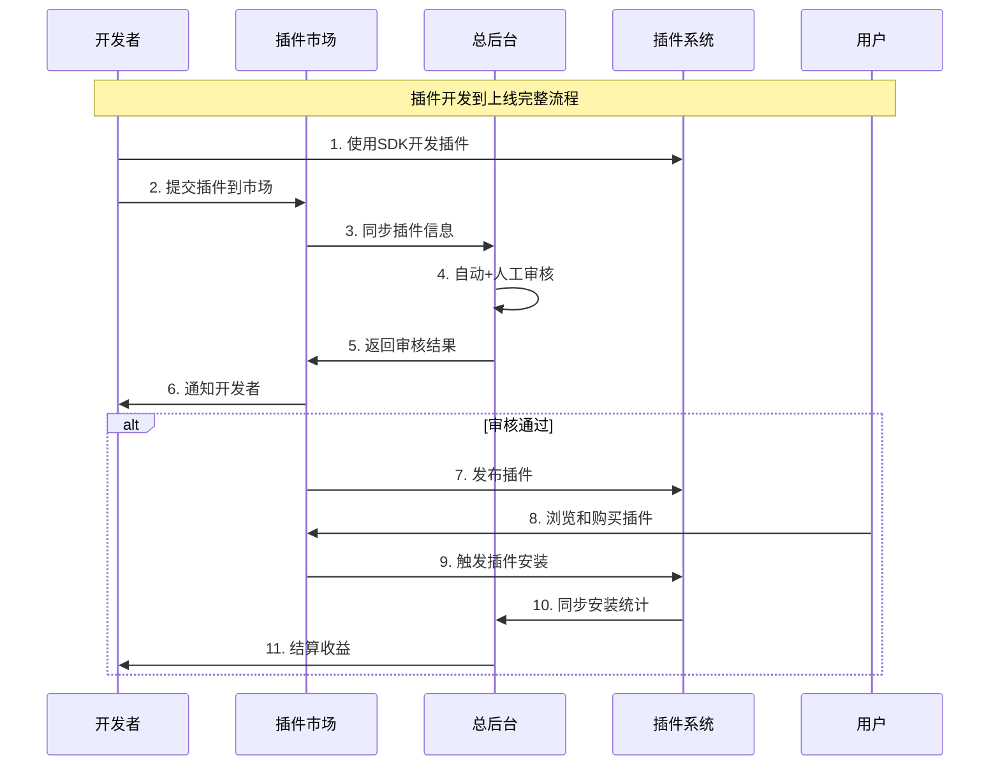

# 太上老君三大体系统一开发计划 🚀

## 📋 项目概述

基于现有文档规划和代码基础，对**插件市场体系**、**插件体系**、**总后台体系**进行整体性开发，形成完整的插件生态闭环。

## 🎯 开发目标

### 核心目标
- **统一架构**: 建立三大体系的统一技术架构和数据模型
- **业务闭环**: 实现从插件开发到上线的完整业务流程
- **数据同步**: 确保三大体系间的实时数据同步和状态一致
- **用户体验**: 提供统一的用户界面和操作体验

### 技术目标
- **高可用**: 99.9% 系统可用性
- **高性能**: 支持 10,000+ 并发用户
- **可扩展**: 支持水平扩展和功能扩展
- **安全性**: 完整的安全防护和权限控制

## 📊 当前状态分析

### 1. 插件市场体系 (laojun-marketplace-api)
**开发状态**: 🟡 基础架构完成，核心功能待实现

**已完成**:
- ✅ 基础项目结构和配置
- ✅ 数据库连接和基础模型
- ✅ HTTP 服务器和路由框架
- ✅ 基础中间件和服务发现

**待实现**:
- 🔄 插件展示和搜索功能
- 🔄 用户评价和评分系统
- 🔄 支付处理和订单管理
- 🔄 开发者管理和收益分成

### 2. 插件体系 (laojun-plugins)
**开发状态**: 🟡 框架搭建完成，SDK和运行时待完善

**已完成**:
- ✅ 基础项目结构
- ✅ 插件管理器框架
- ✅ 基础配置和路由

**待实现**:
- 🔄 插件开发 SDK
- 🔄 插件运行时环境
- 🔄 插件注册中心
- 🔄 插件生命周期管理
- 🔄 插件通信机制

### 3. 总后台体系 (laojun-admin-api)
**开发状态**: 🟢 基础功能较完整，需要集成插件管理

**已完成**:
- ✅ 完整的项目结构和配置
- ✅ 用户管理和权限控制
- ✅ 基础的系统管理功能
- ✅ 数据库和缓存集成

**待实现**:
- 🔄 插件审核工作流
- 🔄 插件管理界面
- 🔄 开发者认证系统
- 🔄 数据统计和分析

## 🏗️ 整体集成架构

### 系统架构图



### 数据流设计



## 🛠️ 核心接口规范

### 1. 插件注册接口

```http
POST /api/v1/plugins/register
Content-Type: application/json
Authorization: Bearer {developer_token}

{
  "name": "示例插件",
  "version": "1.0.0",
  "description": "插件描述",
  "category": "工具类",
  "tags": ["效率", "工具"],
  "manifest": {
    "entry": "main.js",
    "permissions": ["read", "write"],
    "dependencies": ["core@1.0.0"]
  },
  "package_url": "https://storage.example.com/plugin.zip",
  "checksum": "sha256:..."
}
```

### 2. 插件审核接口

```http
POST /api/v1/admin/plugins/{id}/review
Content-Type: application/json
Authorization: Bearer {admin_token}

{
  "status": "approved|rejected|pending",
  "reviewer_id": "uuid",
  "notes": "审核意见",
  "checklist": {
    "security_check": true,
    "code_quality": true,
    "functionality": true
  }
}
```

### 3. 插件安装接口

```http
POST /api/v1/plugins/{id}/install
Content-Type: application/json
Authorization: Bearer {user_token}

{
  "version": "1.0.0",
  "config": {
    "auto_update": true,
    "permissions": ["read"]
  }
}
```

## 📅 开发路线图

### 第一阶段：基础设施完善 (2-3周)

#### Week 1-2: 核心服务完善
- **插件系统 SDK 开发**
  - 插件开发框架和API
  - 插件生命周期管理
  - 插件通信机制
  
- **数据模型统一**
  - 统一插件元数据格式
  - 跨服务数据同步机制
  - 数据库迁移脚本

#### Week 3: 服务集成
- **API 网关配置**
  - 路由规则和负载均衡
  - 认证和权限中间件
  - 限流和熔断机制

- **服务发现集成**
  - 服务注册和健康检查
  - 配置中心集成
  - 监控指标采集

### 第二阶段：核心功能实现 (3-4周)

#### Week 4-5: 插件市场核心功能
- **插件展示系统**
  - 插件列表和详情页面
  - 搜索和筛选功能
  - 分类和标签管理

- **用户系统**
  - 用户注册和登录
  - 个人中心和购买历史
  - 评价和评分系统

#### Week 6-7: 总后台管理功能
- **插件审核系统**
  - 审核工作流引擎
  - 审核员分配和管理
  - 审核历史和统计

- **开发者管理**
  - 开发者认证和管理
  - 收益分成和结算
  - 数据统计和分析

### 第三阶段：高级功能和优化 (2-3周)

#### Week 8-9: 高级功能
- **支付系统集成**
  - 多种支付方式支持
  - 订单管理和退款
  - 财务报表和对账

- **推荐系统**
  - 个性化推荐算法
  - 热门插件排行
  - 相关插件推荐

#### Week 10: 性能优化和测试
- **性能优化**
  - 数据库查询优化
  - 缓存策略优化
  - CDN 和静态资源优化

- **测试和部署**
  - 单元测试和集成测试
  - 压力测试和性能测试
  - 生产环境部署

## 🔧 技术实现要点

### 1. 数据同步机制

```go
// 事件驱动的数据同步
type PluginEvent struct {
    Type      string    `json:"type"`      // create, update, delete, review
    PluginID  string    `json:"plugin_id"`
    Data      any       `json:"data"`
    Timestamp time.Time `json:"timestamp"`
    Source    string    `json:"source"`    // marketplace, admin, plugins
}

// 同步服务接口
type SyncService interface {
    PublishEvent(event PluginEvent) error
    SubscribeEvents(eventType string, handler EventHandler) error
    SyncPluginData(pluginID string, direction SyncDirection) error
}
```

### 2. 插件生命周期管理

```go
// 插件状态枚举
type PluginStatus string

const (
    StatusDraft     PluginStatus = "draft"      // 草稿
    StatusSubmitted PluginStatus = "submitted"  // 已提交
    StatusReviewing PluginStatus = "reviewing"  // 审核中
    StatusApproved  PluginStatus = "approved"   // 已通过
    StatusRejected  PluginStatus = "rejected"   // 已拒绝
    StatusPublished PluginStatus = "published"  // 已发布
    StatusSuspended PluginStatus = "suspended"  // 已暂停
)

// 状态转换规则
var StatusTransitions = map[PluginStatus][]PluginStatus{
    StatusDraft:     {StatusSubmitted},
    StatusSubmitted: {StatusReviewing, StatusDraft},
    StatusReviewing: {StatusApproved, StatusRejected},
    StatusApproved:  {StatusPublished, StatusRejected},
    StatusPublished: {StatusSuspended},
    StatusSuspended: {StatusPublished},
}
```

### 3. 权限控制模型

```yaml
# RBAC 权限模型
roles:
  super_admin:
    permissions: ["*"]
  
  marketplace_admin:
    permissions:
      - "marketplace.*"
      - "plugin.manage"
      - "user.view"
  
  plugin_reviewer:
    permissions:
      - "plugin.review"
      - "plugin.view_queue"
      - "review.create"
  
  developer:
    permissions:
      - "plugin.create"
      - "plugin.update_own"
      - "plugin.view_own"
  
  user:
    permissions:
      - "plugin.view_public"
      - "plugin.install"
      - "review.create_own"
```

## 📈 成功指标

### 技术指标
- **系统可用性**: ≥ 99.9%
- **响应时间**: API 响应时间 < 200ms
- **并发处理**: 支持 10,000+ 并发用户
- **数据一致性**: 跨服务数据同步延迟 < 1s

### 业务指标
- **插件数量**: 目标 1000+ 个插件
- **开发者数量**: 目标 500+ 个开发者
- **用户活跃度**: 日活用户 > 5000
- **审核效率**: 插件审核周期 < 3天

## 📋 相关文档

### 核心设计文档
- 📋 **[插件业务闭环全流程设计](PLUGIN_BUSINESS_FLOW.md)** - 完整的插件业务流程设计，包含开发者提交、市场展示、审核发布、使用场景和数据统计的详细规范
- 🗺️ **[开发路线图](../project/DEVELOPMENT_ROADMAP.md)** - 详细的10周开发计划和里程碑
- 📊 **[插件数据统计分析](../analytics/plugin-analytics.md)** - 完整的数据统计分析系统设计

### 技术文档
- 🔗 **[插件市场与总后台集成](MARKETPLACE_INTEGRATION.md)** - 系统间集成方案
- 🏗️ **[系统架构详细分析](../architecture/DETAILED_ANALYSIS_REPORT.md)** - 技术架构深度分析

### 业务文档
- 🏪 **[插件市场业务流程](../../laojun-docs/marketplace/business-flow.md)** - 市场业务流程概述
- ✅ **[插件审核系统](../../laojun-docs/marketplace/plugin-review-system.md)** - 审核系统设计
- 💻 **[开发指南](../../laojun-workspace/docs/development-guide.md)** - 项目开发指南

## 🚀 下一步行动

### 立即开始的任务

1. **完善插件 SDK** (优先级：高)
   - 设计插件开发 API
   - 实现插件运行时环境
   - 创建示例插件和文档

2. **实现数据同步机制** (优先级：高)
   - 设计事件驱动架构
   - 实现跨服务数据同步
   - 建立数据一致性保证

3. **开发插件审核系统** (优先级：中)
   - 实现审核工作流引擎
   - 开发审核员管理界面
   - 集成自动化审核工具

### 技术准备

1. **环境搭建**
   - 统一开发环境配置
   - CI/CD 流水线搭建
   - 测试环境部署

2. **团队协作**
   - 代码规范和 Review 流程
   - 项目管理和进度跟踪
   - 技术文档和知识分享

---

**项目负责人**: 开发团队  
**文档版本**: v1.0  
**最后更新**: 2024年12月  
**下次评审**: 每周五项目例会