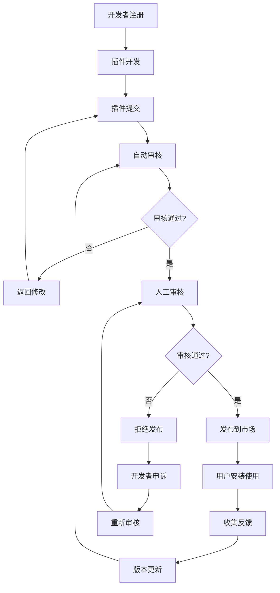
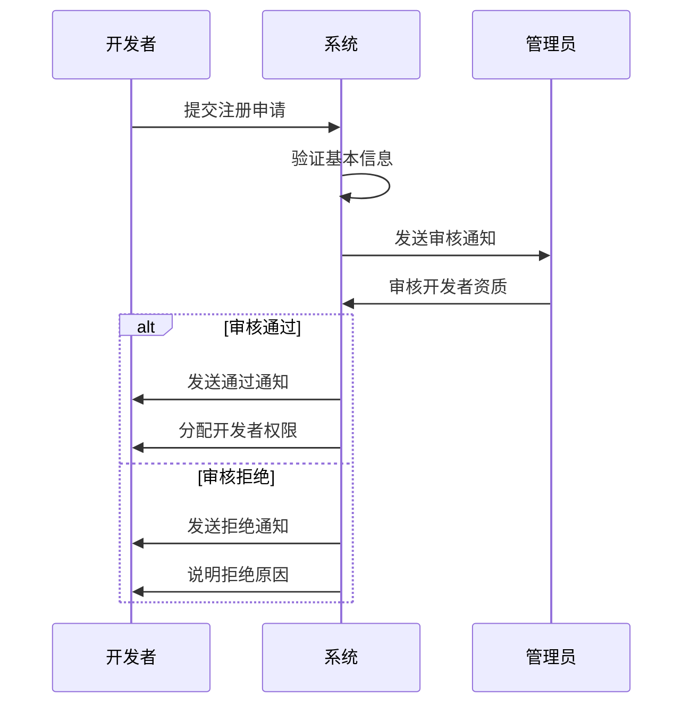
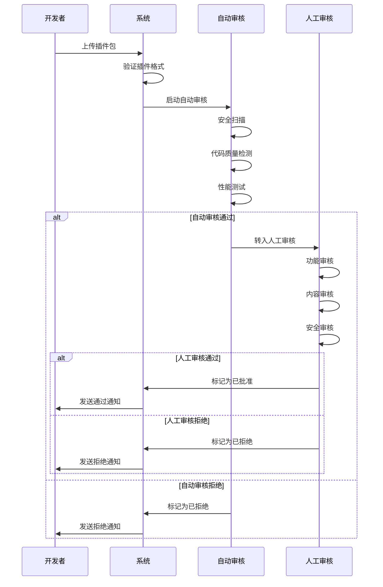
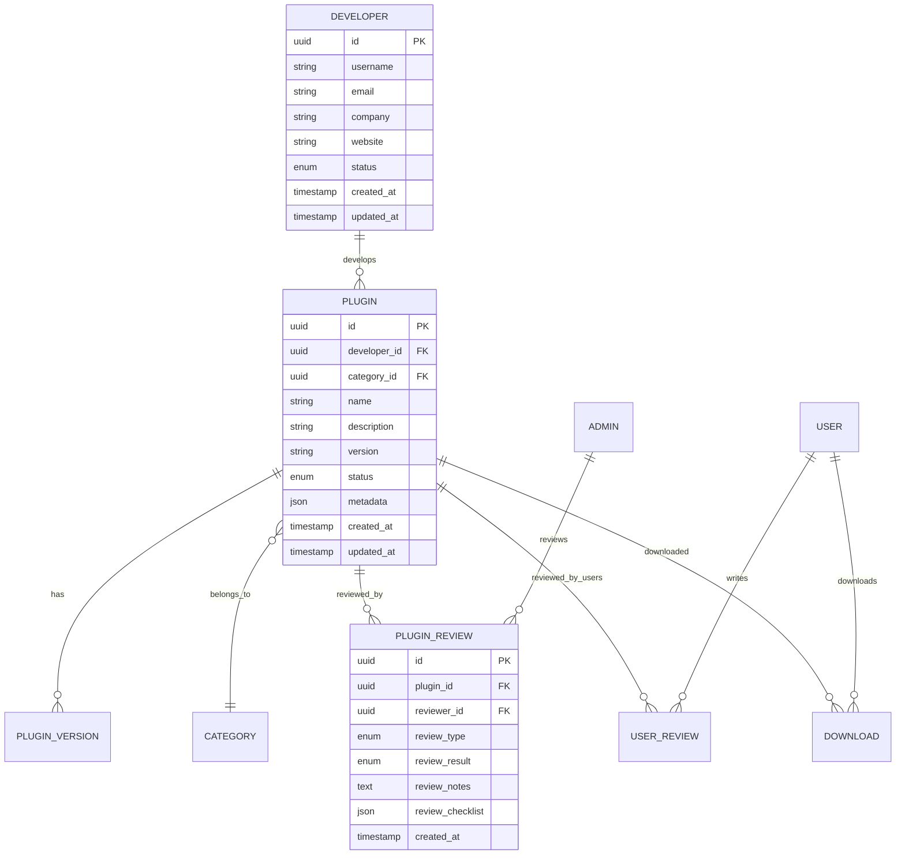

# 插件市场业务流程设计

## 重要更新通知 🔄

> **最新版本**: 插件业务闭环全流程设计已完成重大更新，包含详细的技术规范、API设计、异常处理和性能保障措施。
> 
> 📋 **完整文档**: [插件业务闭环全流程设计](../../docs/integration/PLUGIN_BUSINESS_FLOW.md)
> 
> 新文档包含以下完整内容：
> - 🔄 **开发者提交环节**: 详细的提交规范、版本控制机制、身份验证体系
> - 🏪 **插件市场环节**: 完整的分类展示方案、搜索筛选功能、评价系统设计
> - ✅ **审核发布环节**: 安全审核标准、技术审查流程、灰度发布策略
> - 🎯 **使用场景分类**: 后台直接集成、跨平台业务对接的详细方案
> - 📊 **数据统计环节**: 使用量统计、性能监控、用户行为分析的完整体系
> - 🛡️ **异常处理和版本兼容性**: 完整的错误处理流程和兼容性策略
> - ⚡ **性能和安全保障**: 详细的性能指标和安全保障措施

## 1. 系统架构概述

### 1.1 整体架构

插件市场系统采用微服务架构，主要包括以下组件：

```
┌─────────────────┐    ┌─────────────────┐    ┌─────────────────┐
│   插件市场前端   │    │   后台管理前端   │    │   开发者工具     │
│   (React)      │    │   (React)      │    │   (CLI)        │
└─────────────────┘    └─────────────────┘    └─────────────────┘
         │                       │                       │
         └───────────────────────┼───────────────────────┘
                                 │
┌─────────────────────────────────┼─────────────────────────────────┐
│                    API Gateway                                    │
└─────────────────────────────────┼─────────────────────────────────┘
                                 │
         ┌───────────────────────┼───────────────────────┐
         │                       │                       │
┌─────────────────┐    ┌─────────────────┐    ┌─────────────────┐
│  插件市场API     │    │   管理后台API    │    │   认证服务       │
│  (Port: 8081)   │    │  (Port: 8080)   │    │                │
└─────────────────┘    └─────────────────┘    └─────────────────┘
         │                       │                       │
         └───────────────────────┼───────────────────────┘
                                 │
┌─────────────────────────────────┼─────────────────────────────────┐
│                    数据层                                         │
│  ┌─────────────┐  ┌─────────────┐  ┌─────────────┐  ┌───────────┐ │
│  │ PostgreSQL  │  │    Redis    │  │  文件存储    │  │  消息队列  │ │
│  │   (主库)    │  │   (缓存)    │  │   (插件包)   │  │ (通知)    │ │
│  └─────────────┘  └─────────────┘  └─────────────┘  └───────────┘ │
└─────────────────────────────────────────────────────────────────┘
```

### 1.2 核心模块

#### 1.2.1 插件管理模块
- 插件发布和更新
- 版本控制
- 插件包管理
- 元数据管理

#### 1.2.2 审核管理模块
- 自动审核（安全扫描、质量检测）
- 人工审核（功能、内容、安全）
- 审核流程管理
- 审核记录追踪

#### 1.2.3 开发者管理模块
- 开发者注册和认证
- 权限管理
- 开发者等级系统
- 收益管理

#### 1.2.4 用户管理模块
- 用户注册和登录
- 插件安装和管理
- 评价和反馈
- 使用统计

## 2. 业务流程设计

### 2.1 插件生命周期



### 2.2 插件状态管理

#### 2.2.1 状态定义

| 状态 | 描述 | 可见性 | 操作权限 |
|------|------|--------|----------|
| `draft` | 草稿状态 | 仅开发者 | 开发者可编辑、提交 |
| `pending` | 待审核 | 开发者、管理员 | 管理员可审核 |
| `approved` | 审核通过 | 开发者、管理员 | 开发者可发布 |
| `rejected` | 审核拒绝 | 开发者、管理员 | 开发者可修改重提交 |
| `published` | 已发布 | 所有用户 | 用户可安装 |
| `suspended` | 已暂停 | 开发者、管理员 | 管理员可恢复 |
| `banned` | 已封禁 | 仅管理员 | 管理员可解封 |
| `updated` | 有更新版本 | 所有用户 | 用户可更新 |

#### 2.2.2 状态转换规则

```json
{
  "state_transitions": {
    "draft": ["pending"],
    "pending": ["approved", "rejected"],
    "approved": ["published", "rejected"],
    "rejected": ["pending", "draft"],
    "published": ["suspended", "updated"],
    "suspended": ["published", "banned"],
    "banned": ["suspended"],
    "updated": ["published"]
  },
  "transition_permissions": {
    "developer": ["draft->pending", "rejected->pending", "rejected->draft", "approved->published"],
    "admin": ["pending->approved", "pending->rejected", "approved->rejected", "published->suspended", "suspended->published", "suspended->banned", "banned->suspended"],
    "system": ["published->updated"]
  }
}
```

### 2.3 开发者工作流程

#### 2.3.1 开发者注册流程



#### 2.3.2 插件提交流程



### 2.4 管理员工作流程

#### 2.4.1 审核工作台

管理员通过审核工作台进行插件审核：

1. **审核队列管理**
   - 按优先级排序待审核插件
   - 分配审核任务
   - 跟踪审核进度

2. **插件详情审核**
   - 查看插件基本信息
   - 下载和测试插件
   - 填写审核意见
   - 做出审核决定

3. **批量操作**
   - 批量审核相似插件
   - 批量更新插件状态
   - 批量发送通知

#### 2.4.2 审核标准

**自动审核标准：**
- 代码安全性检查
- 恶意代码检测
- 性能基准测试
- API兼容性检查
- 依赖项安全检查

**人工审核标准：**
- 功能完整性和正确性
- 用户体验和界面设计
- 文档完整性
- 内容合规性
- 安全性深度检查

## 3. 数据模型设计

### 3.1 核心实体关系



### 3.2 状态管理表设计

```sql
-- 插件审核记录表
CREATE TABLE mp_plugin_reviews (
    id UUID PRIMARY KEY DEFAULT gen_random_uuid(),
    plugin_id UUID NOT NULL REFERENCES mp_plugins(id),
    reviewer_id UUID REFERENCES users(id),
    previous_status VARCHAR(20),
    new_status VARCHAR(20) NOT NULL,
    review_type VARCHAR(20) NOT NULL, -- 'auto', 'manual', 'appeal'
    review_result VARCHAR(20) NOT NULL, -- 'pass', 'reject', 'pending'
    review_notes TEXT,
    review_checklist JSONB,
    created_at TIMESTAMP DEFAULT CURRENT_TIMESTAMP,
    updated_at TIMESTAMP DEFAULT CURRENT_TIMESTAMP
);

-- 开发者申诉表
CREATE TABLE mp_developer_appeals (
    id UUID PRIMARY KEY DEFAULT gen_random_uuid(),
    plugin_id UUID NOT NULL REFERENCES mp_plugins(id),
    developer_id UUID NOT NULL REFERENCES mp_developers(id),
    appeal_reason TEXT NOT NULL,
    appeal_status VARCHAR(20) DEFAULT 'pending',
    admin_response TEXT,
    created_at TIMESTAMP DEFAULT CURRENT_TIMESTAMP,
    resolved_at TIMESTAMP
);
```

## 4. 安全和质量保证

### 4.1 安全措施

1. **代码安全扫描**
   - 静态代码分析
   - 依赖项漏洞检查
   - 恶意代码检测

2. **运行时安全**
   - 沙箱环境测试
   - 权限控制检查
   - 资源使用限制

3. **数据安全**
   - 敏感信息检测
   - 数据加密要求
   - 隐私合规检查

### 4.2 质量控制

1. **代码质量**
   - 代码规范检查
   - 复杂度分析
   - 测试覆盖率

2. **性能要求**
   - 启动时间限制
   - 内存使用限制
   - CPU使用限制

3. **用户体验**
   - 界面设计规范
   - 交互体验检查
   - 文档完整性

## 5. 监控和分析

### 5.1 业务指标

- 插件提交数量
- 审核通过率
- 审核平均时间
- 开发者活跃度
- 用户下载量

### 5.2 技术指标

- 系统响应时间
- 错误率
- 可用性
- 资源使用率

### 5.3 报警机制

- 审核队列积压报警
- 系统异常报警
- 安全威胁报警
- 性能异常报警

## 6. 扩展规划

### 6.1 短期目标（1-3个月）

- 完成基础审核流程
- 实现自动化安全检查
- 建立基本的管理界面

### 6.2 中期目标（3-6个月）

- 引入AI辅助审核
- 完善开发者工具
- 建立社区评价系统

### 6.3 长期目标（6-12个月）

- 建立插件生态系统
- 实现收益分成机制
- 支持多语言和国际化