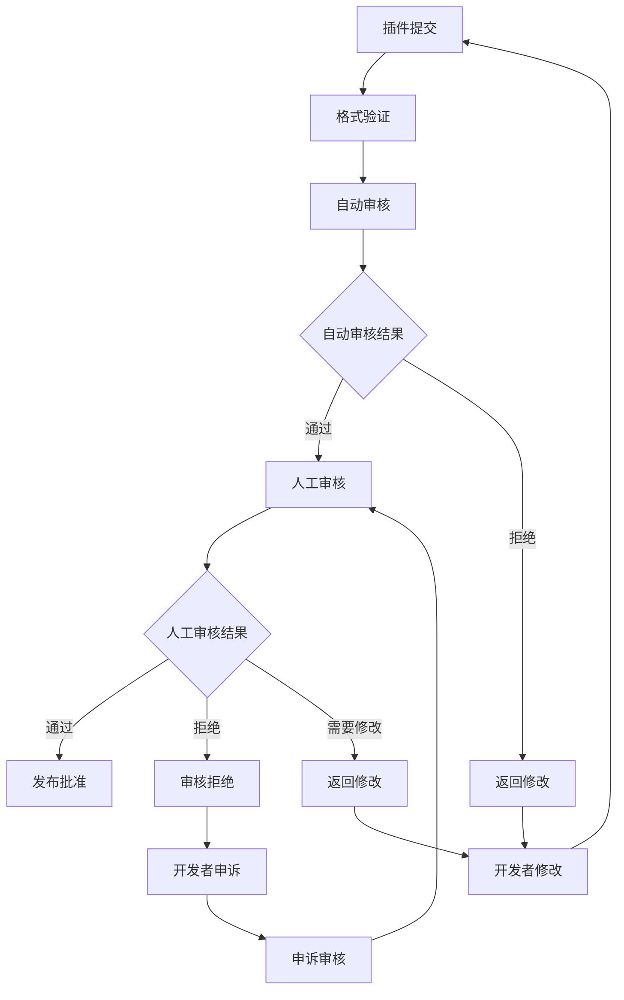
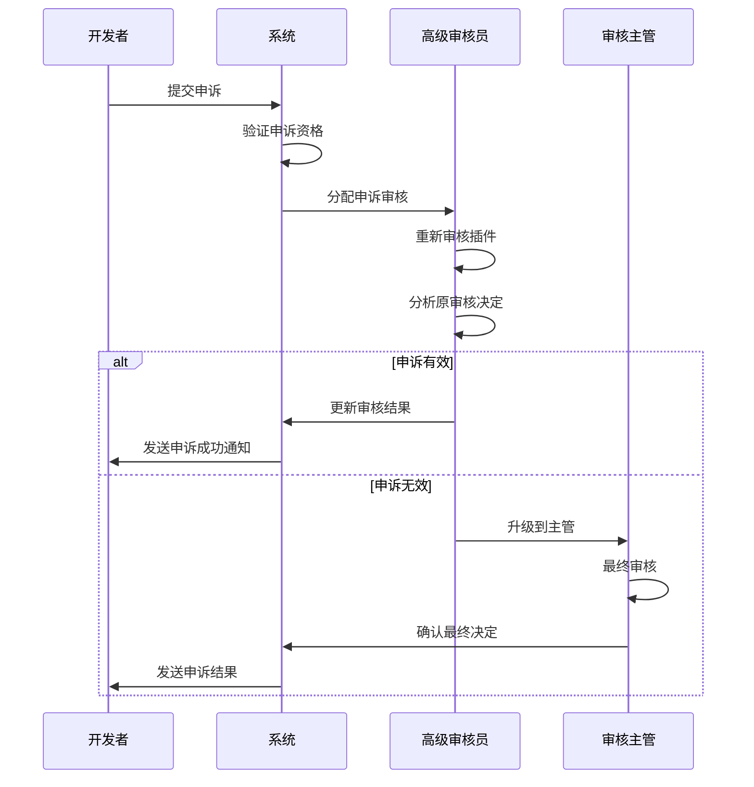

# 插件审核工作流程

## 1. 审核流程概述

插件审核是确保插件质量和安全性的关键环节，采用"自动审核 + 人工审核"的双重保障机制。

### 1.1 审核阶段



### 1.2 审核时间目标

| 审核阶段 | 目标时间 | 最大时间 |
|----------|----------|----------|
| 格式验证 | 1分钟 | 5分钟 |
| 自动审核 | 10分钟 | 30分钟 |
| 人工审核 | 2工作日 | 5工作日 |
| 申诉处理 | 3工作日 | 7工作日 |

## 2. 自动审核系统

### 2.1 安全扫描

#### 2.1.1 恶意代码检测

```yaml
security_checks:
  malware_detection:
    - virus_scan: true
    - trojan_detection: true
    - backdoor_scan: true
    - suspicious_patterns: true
  
  code_analysis:
    - static_analysis: true
    - dynamic_analysis: true
    - behavior_analysis: true
    - network_activity: true
  
  vulnerability_scan:
    - known_vulnerabilities: true
    - dependency_check: true
    - cve_database: true
    - security_advisories: true
```

#### 2.1.2 权限检查

```yaml
permission_checks:
  file_system:
    - read_permissions: ["allowed_paths"]
    - write_permissions: ["temp_paths", "plugin_data"]
    - execute_permissions: ["plugin_bin"]
  
  network:
    - outbound_connections: ["whitelist_domains"]
    - inbound_connections: false
    - port_binding: ["allowed_ports"]
  
  system:
    - registry_access: false
    - system_calls: ["whitelist"]
    - process_creation: ["limited"]
```

### 2.2 代码质量检测

#### 2.2.1 代码规范

```yaml
code_standards:
  formatting:
    - consistent_indentation: true
    - line_length: 120
    - naming_conventions: true
  
  structure:
    - cyclomatic_complexity: 10
    - function_length: 50
    - class_size: 500
  
  documentation:
    - function_comments: required
    - api_documentation: required
    - readme_file: required
```

#### 2.2.2 性能检测

```yaml
performance_checks:
  startup_time:
    - max_startup_time: "5s"
    - memory_usage: "100MB"
    - cpu_usage: "50%"
  
  runtime:
    - response_time: "1s"
    - memory_leak: false
    - resource_cleanup: true
  
  compatibility:
    - api_version: "v1.0+"
    - dependencies: "compatible"
    - platform_support: ["windows", "linux", "macos"]
```

### 2.3 自动审核配置

```json
{
  "auto_review_config": {
    "enabled": true,
    "timeout": 1800,
    "parallel_jobs": 5,
    "retry_attempts": 3,
    "checks": {
      "security": {
        "weight": 40,
        "required": true,
        "fail_threshold": 0
      },
      "quality": {
        "weight": 30,
        "required": true,
        "fail_threshold": 2
      },
      "performance": {
        "weight": 20,
        "required": false,
        "fail_threshold": 3
      },
      "compatibility": {
        "weight": 10,
        "required": false,
        "fail_threshold": 1
      }
    }
  }
}
```

## 3. 人工审核流程

### 3.1 审核分配

#### 3.1.1 审核员分级

| 级别 | 权限范围 | 审核类型 |
|------|----------|----------|
| 初级审核员 | 简单插件 | 功能审核、文档审核 |
| 中级审核员 | 复杂插件 | 安全审核、性能审核 |
| 高级审核员 | 所有插件 | 最终审核、申诉处理 |
| 审核主管 | 管理权限 | 流程管理、质量控制 |

#### 3.1.2 分配策略

```yaml
assignment_strategy:
  load_balancing:
    - max_concurrent_reviews: 10
    - priority_queue: true
    - skill_matching: true
  
  plugin_categorization:
    - simple_plugins: ["ui_themes", "simple_tools"]
    - complex_plugins: ["system_tools", "security_tools"]
    - high_risk_plugins: ["admin_tools", "network_tools"]
  
  reviewer_selection:
    - expertise_match: true
    - workload_balance: true
    - conflict_avoidance: true
```

### 3.2 审核检查清单

#### 3.2.1 功能审核

```yaml
functional_review:
  basic_functionality:
    - feature_completeness: required
    - user_interface: required
    - error_handling: required
    - edge_cases: recommended
  
  user_experience:
    - intuitive_design: required
    - responsive_interface: required
    - accessibility: recommended
    - internationalization: optional
  
  integration:
    - api_compatibility: required
    - plugin_conflicts: required
    - system_integration: required
```

#### 3.2.2 内容审核

```yaml
content_review:
  compliance:
    - legal_compliance: required
    - content_policy: required
    - copyright_check: required
    - trademark_check: required
  
  quality:
    - description_accuracy: required
    - screenshot_quality: required
    - documentation_completeness: required
    - version_notes: required
  
  appropriateness:
    - age_appropriate: required
    - professional_content: required
    - no_offensive_material: required
```

#### 3.2.3 安全审核

```yaml
security_review:
  code_security:
    - input_validation: required
    - output_encoding: required
    - authentication: required
    - authorization: required
  
  data_protection:
    - data_encryption: required
    - secure_storage: required
    - privacy_protection: required
    - gdpr_compliance: required
  
  system_security:
    - privilege_escalation: forbidden
    - system_modification: restricted
    - network_security: required
```

### 3.3 审核决策

#### 3.3.1 审核结果类型

```yaml
review_results:
  approved:
    description: "插件通过所有审核检查"
    next_action: "发布到市场"
    notification: "congratulations"
  
  rejected:
    description: "插件存在严重问题"
    next_action: "禁止发布"
    notification: "detailed_feedback"
  
  needs_changes:
    description: "插件需要修改后重新提交"
    next_action: "返回开发者"
    notification: "change_requests"
  
  pending:
    description: "需要进一步审核"
    next_action: "升级审核"
    notification: "status_update"
```

#### 3.3.2 审核意见模板

```yaml
review_templates:
  security_issues:
    - "发现潜在的安全漏洞：{vulnerability_details}"
    - "权限使用不当：{permission_issues}"
    - "数据处理不安全：{data_security_issues}"
  
  quality_issues:
    - "代码质量需要改进：{quality_metrics}"
    - "性能问题：{performance_issues}"
    - "用户体验问题：{ux_issues}"
  
  compliance_issues:
    - "不符合平台政策：{policy_violations}"
    - "文档不完整：{documentation_issues}"
    - "版权问题：{copyright_issues}"
```

## 4. 审核工作台设计

### 4.1 审核队列界面

```typescript
interface ReviewQueue {
  filters: {
    status: 'pending' | 'in_review' | 'completed';
    priority: 'high' | 'medium' | 'low';
    category: string;
    reviewer: string;
    dateRange: [Date, Date];
  };
  
  sorting: {
    field: 'submitted_at' | 'priority' | 'complexity';
    order: 'asc' | 'desc';
  };
  
  pagination: {
    page: number;
    pageSize: number;
    total: number;
  };
  
  plugins: PluginReviewItem[];
}

interface PluginReviewItem {
  id: string;
  name: string;
  version: string;
  developer: string;
  category: string;
  status: ReviewStatus;
  priority: Priority;
  submittedAt: Date;
  autoReviewResult: AutoReviewResult;
  assignedReviewer?: string;
  estimatedTime: number;
}
```

### 4.2 插件详情审核界面

```typescript
interface PluginReviewDetail {
  plugin: PluginInfo;
  autoReview: AutoReviewResult;
  reviewHistory: ReviewRecord[];
  reviewChecklist: ReviewChecklist;
  reviewNotes: string;
  attachments: File[];
  
  actions: {
    approve: () => void;
    reject: (reason: string) => void;
    requestChanges: (changes: ChangeRequest[]) => void;
    escalate: (reason: string) => void;
  };
}

interface ReviewChecklist {
  functional: ChecklistItem[];
  security: ChecklistItem[];
  quality: ChecklistItem[];
  compliance: ChecklistItem[];
}

interface ChecklistItem {
  id: string;
  description: string;
  required: boolean;
  status: 'pass' | 'fail' | 'na' | 'pending';
  notes?: string;
}
```

### 4.3 批量操作界面

```typescript
interface BatchOperations {
  selectedPlugins: string[];
  
  operations: {
    batchApprove: (plugins: string[]) => void;
    batchReject: (plugins: string[], reason: string) => void;
    batchAssign: (plugins: string[], reviewer: string) => void;
    batchPriority: (plugins: string[], priority: Priority) => void;
  };
  
  filters: {
    sameCategory: boolean;
    sameDeveloper: boolean;
    similarIssues: boolean;
  };
}
```

## 5. 审核质量控制

### 5.1 审核员绩效评估

```yaml
performance_metrics:
  efficiency:
    - reviews_per_day: target_10
    - average_review_time: target_4h
    - queue_processing_rate: target_90%
  
  quality:
    - accuracy_rate: target_95%
    - consistency_score: target_90%
    - appeal_success_rate: max_5%
  
  feedback:
    - developer_satisfaction: target_4.5
    - review_helpfulness: target_4.0
    - communication_quality: target_4.5
```

### 5.2 审核一致性检查

```yaml
consistency_checks:
  cross_validation:
    - sample_rate: 10%
    - multiple_reviewers: 2
    - consensus_threshold: 80%
  
  calibration:
    - monthly_training: true
    - standard_cases: true
    - feedback_sessions: true
  
  monitoring:
    - decision_variance: track
    - time_variance: track
    - quality_trends: track
```

### 5.3 持续改进

```yaml
improvement_process:
  feedback_collection:
    - developer_feedback: continuous
    - reviewer_feedback: weekly
    - user_feedback: monthly
  
  process_optimization:
    - bottleneck_analysis: monthly
    - automation_opportunities: quarterly
    - tool_improvements: continuous
  
  training_updates:
    - policy_updates: immediate
    - best_practices: monthly
    - new_technologies: quarterly
```

## 6. 申诉处理流程

### 6.1 申诉类型

```yaml
appeal_types:
  review_decision:
    description: "对审核决定不满"
    handler: "senior_reviewer"
    timeline: "3_days"
  
  process_violation:
    description: "认为审核流程有问题"
    handler: "review_manager"
    timeline: "5_days"
  
  bias_complaint:
    description: "认为存在偏见或不公"
    handler: "independent_panel"
    timeline: "7_days"
```

### 6.2 申诉处理流程



## 7. 监控和报告

### 7.1 实时监控指标

```yaml
monitoring_metrics:
  queue_status:
    - pending_count: alert_threshold_100
    - average_wait_time: alert_threshold_24h
    - reviewer_utilization: target_80%
  
  quality_metrics:
    - approval_rate: normal_range_70-85%
    - rejection_rate: normal_range_10-20%
    - appeal_rate: max_threshold_5%
  
  performance_metrics:
    - review_completion_time: target_2_days
    - auto_review_accuracy: target_90%
    - system_availability: target_99.9%
```

### 7.2 定期报告

```yaml
reporting_schedule:
  daily_reports:
    - queue_status
    - reviewer_workload
    - system_performance
  
  weekly_reports:
    - quality_metrics
    - trend_analysis
    - issue_summary
  
  monthly_reports:
    - comprehensive_analysis
    - improvement_recommendations
    - policy_updates
```

## 8. 工具和集成

### 8.1 审核工具集成

```yaml
tool_integrations:
  security_scanners:
    - sonarqube: code_quality
    - snyk: vulnerability_scan
    - clamav: malware_detection
  
  testing_tools:
    - selenium: ui_testing
    - jest: unit_testing
    - lighthouse: performance_testing
  
  documentation_tools:
    - swagger: api_documentation
    - jsdoc: code_documentation
    - markdown: user_documentation
```

### 8.2 通知系统

```yaml
notification_system:
  channels:
    - email: all_stakeholders
    - slack: review_team
    - dashboard: real_time_updates
  
  triggers:
    - plugin_submitted: immediate
    - review_completed: immediate
    - appeal_filed: immediate
    - sla_breach: immediate
  
  templates:
    - approval_notification
    - rejection_notification
    - change_request_notification
    - appeal_result_notification
```

这个审核工作流程确保了插件质量和安全性，同时为开发者提供了透明、公平的审核体验。