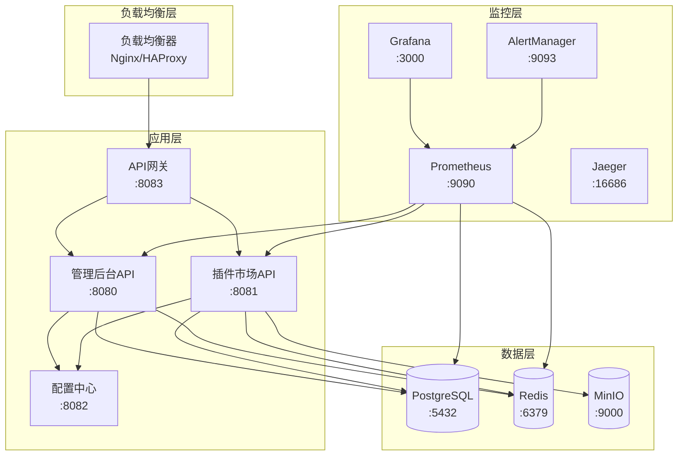
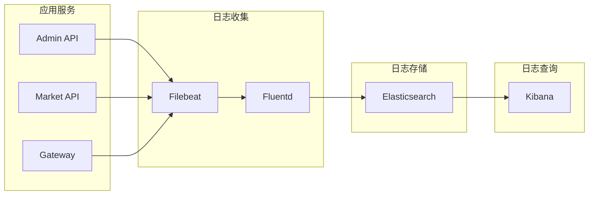
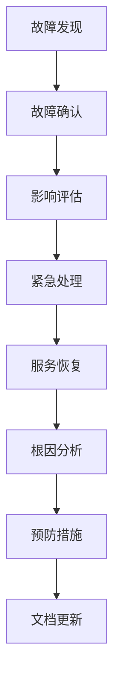

# 太上老君系统运维概览

## 概述

太上老君系统运维文档提供了系统监控、维护、故障排查和性能优化的全面指南。本文档面向运维工程师和系统管理员。

## 系统架构监控

### 服务拓扑


## 监控体系

### 核心指标监控

#### 系统指标
```yaml
# 系统资源监控
system_metrics:
  cpu:
    - cpu_usage_percent
    - cpu_load_average
    - cpu_cores_count
  
  memory:
    - memory_usage_percent
    - memory_available_bytes
    - memory_total_bytes
  
  disk:
    - disk_usage_percent
    - disk_free_bytes
    - disk_io_read_bytes
    - disk_io_write_bytes
  
  network:
    - network_receive_bytes
    - network_transmit_bytes
    - network_connections_active
```

#### 应用指标
```yaml
# 应用性能监控
application_metrics:
  http:
    - http_requests_total
    - http_request_duration_seconds
    - http_requests_in_flight
    - http_response_size_bytes
  
  database:
    - db_connections_active
    - db_connections_idle
    - db_query_duration_seconds
    - db_queries_total
  
  cache:
    - cache_hits_total
    - cache_misses_total
    - cache_operations_duration_seconds
  
  business:
    - users_active_total
    - plugins_installed_total
    - api_calls_total
```

### Prometheus 配置
```yaml
# prometheus.yml
global:
  scrape_interval: 15s
  evaluation_interval: 15s

rule_files:
  - "rules/*.yml"

alerting:
  alertmanagers:
    - static_configs:
        - targets:
          - alertmanager:9093

scrape_configs:
  - job_name: 'laojun-admin-api'
    static_configs:
      - targets: ['admin-api:8080']
    metrics_path: '/metrics'
    scrape_interval: 10s
  
  - job_name: 'laojun-marketplace-api'
    static_configs:
      - targets: ['marketplace-api:8081']
    metrics_path: '/metrics'
    scrape_interval: 10s
  
  - job_name: 'laojun-gateway'
    static_configs:
      - targets: ['gateway:8083']
    metrics_path: '/metrics'
    scrape_interval: 10s
  
  - job_name: 'postgres-exporter'
    static_configs:
      - targets: ['postgres-exporter:9187']
  
  - job_name: 'redis-exporter'
    static_configs:
      - targets: ['redis-exporter:9121']
  
  - job_name: 'node-exporter'
    static_configs:
      - targets: ['node-exporter:9100']
```

### Grafana 仪表板

#### 系统概览仪表板
```json
{
  "dashboard": {
    "title": "太上老君系统概览",
    "panels": [
      {
        "title": "服务状态",
        "type": "stat",
        "targets": [
          {
            "expr": "up{job=~\"laojun-.*\"}"
          }
        ]
      },
      {
        "title": "请求量趋势",
        "type": "graph",
        "targets": [
          {
            "expr": "rate(http_requests_total[5m])"
          }
        ]
      },
      {
        "title": "响应时间分布",
        "type": "heatmap",
        "targets": [
          {
            "expr": "histogram_quantile(0.95, rate(http_request_duration_seconds_bucket[5m]))"
          }
        ]
      }
    ]
  }
}
```

## 日志管理

### 日志收集架构


### 日志配置

#### 应用日志配置
```yaml
# logging.yml
logging:
  level: info
  format: json
  output: stdout
  
  fields:
    service: laojun-admin-api
    version: v1.0.0
    environment: production
  
  rotation:
    max_size: 100MB
    max_age: 30
    max_backups: 10
    compress: true
```

#### Filebeat 配置
```yaml
# filebeat.yml
filebeat.inputs:
- type: log
  enabled: true
  paths:
    - /var/log/laojun/*.log
  fields:
    service: laojun
    environment: production
  fields_under_root: true
  multiline.pattern: '^\d{4}-\d{2}-\d{2}'
  multiline.negate: true
  multiline.match: after

output.elasticsearch:
  hosts: ["elasticsearch:9200"]
  index: "laojun-logs-%{+yyyy.MM.dd}"

processors:
- add_host_metadata:
    when.not.contains.tags: forwarded
```

### 日志查询示例
```bash
# 查看错误日志
curl -X GET "elasticsearch:9200/laojun-logs-*/_search" -H 'Content-Type: application/json' -d'
{
  "query": {
    "bool": {
      "must": [
        {"match": {"level": "error"}},
        {"range": {"@timestamp": {"gte": "now-1h"}}}
      ]
    }
  },
  "sort": [{"@timestamp": {"order": "desc"}}],
  "size": 100
}'

# 查看特定服务日志
curl -X GET "elasticsearch:9200/laojun-logs-*/_search" -H 'Content-Type: application/json' -d'
{
  "query": {
    "bool": {
      "must": [
        {"match": {"service": "laojun-admin-api"}},
        {"range": {"@timestamp": {"gte": "now-30m"}}}
      ]
    }
  }
}'
```

## 告警配置

### 告警规则
```yaml
# alerts.yml
groups:
- name: laojun-system
  rules:
  - alert: ServiceDown
    expr: up{job=~"laojun-.*"} == 0
    for: 1m
    labels:
      severity: critical
    annotations:
      summary: "服务 {{ $labels.job }} 已停止"
      description: "服务 {{ $labels.job }} 在实例 {{ $labels.instance }} 上已停止超过1分钟"
  
  - alert: HighErrorRate
    expr: rate(http_requests_total{status=~"5.."}[5m]) > 0.1
    for: 5m
    labels:
      severity: warning
    annotations:
      summary: "高错误率告警"
      description: "服务 {{ $labels.job }} 错误率超过10%"
  
  - alert: HighResponseTime
    expr: histogram_quantile(0.95, rate(http_request_duration_seconds_bucket[5m])) > 1
    for: 5m
    labels:
      severity: warning
    annotations:
      summary: "响应时间过长"
      description: "服务 {{ $labels.job }} 95%响应时间超过1秒"
  
  - alert: DatabaseConnectionHigh
    expr: db_connections_active / db_connections_max > 0.8
    for: 5m
    labels:
      severity: warning
    annotations:
      summary: "数据库连接数过高"
      description: "数据库连接使用率超过80%"
  
  - alert: DiskSpaceHigh
    expr: (1 - disk_free_bytes / disk_total_bytes) > 0.85
    for: 5m
    labels:
      severity: critical
    annotations:
      summary: "磁盘空间不足"
      description: "磁盘使用率超过85%"
```

### AlertManager 配置
```yaml
# alertmanager.yml
global:
  smtp_smarthost: 'smtp.example.com:587'
  smtp_from: 'alerts@example.com'

route:
  group_by: ['alertname']
  group_wait: 10s
  group_interval: 10s
  repeat_interval: 1h
  receiver: 'web.hook'

receivers:
- name: 'web.hook'
  email_configs:
  - to: 'ops-team@example.com'
    subject: '[太上老君系统] {{ .GroupLabels.alertname }}'
    body: |
      {{ range .Alerts }}
      告警: {{ .Annotations.summary }}
      描述: {{ .Annotations.description }}
      时间: {{ .StartsAt }}
      {{ end }}
  
  webhook_configs:
  - url: 'http://webhook-server:8080/alerts'
    send_resolved: true
```

## 备份策略

### 数据库备份
```bash
#!/bin/bash
# backup-database.sh

# 配置
DB_HOST="localhost"
DB_PORT="5432"
DB_USER="laojun"
DB_NAME="laojun"
BACKUP_DIR="/backup/database"
RETENTION_DAYS=30

# 创建备份目录
mkdir -p $BACKUP_DIR

# 生成备份文件名
BACKUP_FILE="$BACKUP_DIR/laojun_$(date +%Y%m%d_%H%M%S).sql"

# 执行备份
pg_dump -h $DB_HOST -p $DB_PORT -U $DB_USER -d $DB_NAME > $BACKUP_FILE

# 压缩备份文件
gzip $BACKUP_FILE

# 清理过期备份
find $BACKUP_DIR -name "*.sql.gz" -mtime +$RETENTION_DAYS -delete

# 验证备份
if [ -f "$BACKUP_FILE.gz" ]; then
    echo "备份成功: $BACKUP_FILE.gz"
else
    echo "备份失败"
    exit 1
fi
```

### Redis 备份
```bash
#!/bin/bash
# backup-redis.sh

REDIS_HOST="localhost"
REDIS_PORT="6379"
BACKUP_DIR="/backup/redis"
RETENTION_DAYS=7

mkdir -p $BACKUP_DIR

# 触发 Redis 备份
redis-cli -h $REDIS_HOST -p $REDIS_PORT BGSAVE

# 等待备份完成
while [ $(redis-cli -h $REDIS_HOST -p $REDIS_PORT LASTSAVE) -eq $(redis-cli -h $REDIS_HOST -p $REDIS_PORT LASTSAVE) ]; do
    sleep 1
done

# 复制备份文件
cp /var/lib/redis/dump.rdb $BACKUP_DIR/dump_$(date +%Y%m%d_%H%M%S).rdb

# 清理过期备份
find $BACKUP_DIR -name "dump_*.rdb" -mtime +$RETENTION_DAYS -delete
```

### 文件存储备份
```bash
#!/bin/bash
# backup-minio.sh

MINIO_ENDPOINT="http://localhost:9000"
MINIO_ACCESS_KEY="minioadmin"
MINIO_SECRET_KEY="minioadmin"
BACKUP_DIR="/backup/minio"

# 使用 mc 工具同步数据
mc alias set local $MINIO_ENDPOINT $MINIO_ACCESS_KEY $MINIO_SECRET_KEY
mc mirror local/laojun-bucket $BACKUP_DIR/$(date +%Y%m%d)

# 清理过期备份
find $BACKUP_DIR -type d -mtime +30 -exec rm -rf {} \;
```

## 性能优化

### 数据库优化

#### 连接池配置
```yaml
# database.yml
database:
  host: postgres
  port: 5432
  user: laojun
  password: password
  dbname: laojun
  
  pool:
    max_open_conns: 25
    max_idle_conns: 5
    conn_max_lifetime: 300s
    conn_max_idle_time: 60s
  
  slow_query_log: true
  slow_query_threshold: 1s
```

#### 索引优化
```sql
-- 查询慢查询
SELECT query, mean_time, calls, total_time
FROM pg_stat_statements
ORDER BY total_time DESC
LIMIT 10;

-- 添加索引
CREATE INDEX CONCURRENTLY idx_users_email_status 
ON users(email, status) 
WHERE deleted_at IS NULL;

-- 分析表统计信息
ANALYZE users;

-- 查看索引使用情况
SELECT schemaname, tablename, indexname, idx_scan, idx_tup_read, idx_tup_fetch
FROM pg_stat_user_indexes
ORDER BY idx_scan DESC;
```

### 缓存优化

#### Redis 配置优化
```conf
# redis.conf
maxmemory 2gb
maxmemory-policy allkeys-lru

# 持久化配置
save 900 1
save 300 10
save 60 10000

# 网络配置
tcp-keepalive 300
timeout 0

# 日志配置
loglevel notice
logfile /var/log/redis/redis-server.log
```

#### 应用层缓存策略
```go
// 缓存配置
type CacheConfig struct {
    TTL           time.Duration
    MaxSize       int
    CleanupPeriod time.Duration
}

// 多级缓存
type MultiLevelCache struct {
    l1 *sync.Map          // 内存缓存
    l2 *redis.Client      // Redis 缓存
    config CacheConfig
}

func (c *MultiLevelCache) Get(key string) (interface{}, error) {
    // 先查 L1 缓存
    if value, ok := c.l1.Load(key); ok {
        return value, nil
    }
    
    // 再查 L2 缓存
    value, err := c.l2.Get(context.Background(), key).Result()
    if err == nil {
        c.l1.Store(key, value)
        return value, nil
    }
    
    return nil, errors.New("cache miss")
}
```

## 故障排查

### 常见故障场景

#### 服务无响应
```bash
# 1. 检查服务状态
systemctl status laojun-admin-api
docker ps | grep laojun

# 2. 检查端口监听
netstat -tulpn | grep :8080
ss -tulpn | grep :8080

# 3. 检查进程资源使用
top -p $(pgrep laojun-admin-api)
ps aux | grep laojun

# 4. 检查日志
journalctl -u laojun-admin-api -f
docker logs laojun-admin-api --tail=100 -f

# 5. 检查网络连通性
curl -I http://localhost:8080/health
telnet localhost 8080
```

#### 数据库连接问题
```bash
# 1. 检查数据库服务
systemctl status postgresql
docker ps | grep postgres

# 2. 检查连接数
psql -h localhost -U laojun -d laojun -c "SELECT count(*) FROM pg_stat_activity;"

# 3. 检查锁等待
psql -h localhost -U laojun -d laojun -c "
SELECT blocked_locks.pid AS blocked_pid,
       blocked_activity.usename AS blocked_user,
       blocking_locks.pid AS blocking_pid,
       blocking_activity.usename AS blocking_user,
       blocked_activity.query AS blocked_statement,
       blocking_activity.query AS current_statement_in_blocking_process
FROM pg_catalog.pg_locks blocked_locks
JOIN pg_catalog.pg_stat_activity blocked_activity ON blocked_activity.pid = blocked_locks.pid
JOIN pg_catalog.pg_locks blocking_locks ON blocking_locks.locktype = blocked_locks.locktype
JOIN pg_catalog.pg_stat_activity blocking_activity ON blocking_activity.pid = blocking_locks.pid
WHERE NOT blocked_locks.granted;
"

# 4. 检查慢查询
psql -h localhost -U laojun -d laojun -c "
SELECT query, mean_time, calls, total_time
FROM pg_stat_statements
ORDER BY total_time DESC
LIMIT 10;
"
```

#### 内存泄漏排查
```bash
# 1. 监控内存使用
watch -n 1 'ps aux | grep laojun | grep -v grep'

# 2. 生成内存 profile
curl http://localhost:8080/debug/pprof/heap > heap.prof

# 3. 分析内存 profile
go tool pprof heap.prof

# 4. 查看 GC 统计
curl http://localhost:8080/debug/pprof/heap?debug=1

# 5. 强制 GC
curl -X POST http://localhost:8080/debug/pprof/gc
```

### 故障处理流程

#### 紧急故障处理


#### 故障处理清单
```yaml
# 故障处理清单
incident_response:
  immediate_actions:
    - 确认故障范围和影响
    - 通知相关人员
    - 启动应急预案
    - 记录故障时间和现象
  
  investigation:
    - 收集日志和监控数据
    - 分析错误信息
    - 检查系统资源使用
    - 确定根本原因
  
  resolution:
    - 实施修复措施
    - 验证服务恢复
    - 监控系统稳定性
    - 更新故障状态
  
  post_incident:
    - 编写故障报告
    - 总结经验教训
    - 制定预防措施
    - 更新运维文档
```

## 容量规划

### 性能基准测试
```bash
# HTTP 压力测试
wrk -t12 -c400 -d30s --script=post.lua http://localhost:8080/api/v1/users

# 数据库压力测试
pgbench -h localhost -p 5432 -U laojun -d laojun -c 10 -j 2 -T 60

# Redis 压力测试
redis-benchmark -h localhost -p 6379 -c 50 -n 10000
```

### 容量评估
```yaml
# 容量规划参数
capacity_planning:
  current_metrics:
    daily_active_users: 10000
    peak_requests_per_second: 1000
    average_response_time: 200ms
    database_size: 50GB
    
  growth_projection:
    user_growth_rate: 20%
    request_growth_rate: 30%
    data_growth_rate: 25%
    
  resource_requirements:
    cpu_cores: 8
    memory_gb: 16
    storage_gb: 200
    network_mbps: 100
```

## 安全运维

### 安全监控
```yaml
# 安全监控规则
security_monitoring:
  failed_login_attempts:
    threshold: 5
    window: 5m
    action: block_ip
  
  suspicious_api_calls:
    threshold: 100
    window: 1m
    action: rate_limit
  
  privilege_escalation:
    events:
      - sudo_usage
      - admin_login
      - permission_change
    action: alert
```

### 安全加固
```bash
# 系统安全加固
# 1. 更新系统补丁
apt update && apt upgrade -y

# 2. 配置防火墙
ufw enable
ufw allow 22/tcp
ufw allow 80/tcp
ufw allow 443/tcp

# 3. 禁用不必要的服务
systemctl disable telnet
systemctl disable ftp

# 4. 配置日志审计
auditctl -w /etc/passwd -p wa -k passwd_changes
auditctl -w /etc/shadow -p wa -k shadow_changes

# 5. 设置文件权限
chmod 600 /etc/ssh/sshd_config
chmod 644 /etc/passwd
chmod 640 /etc/shadow
```

## 相关文档

- [部署指南](../deployment/overview.md)
- [监控配置](./monitoring.md)
- [故障排查手册](./troubleshooting.md)
- [安全运维指南](./security.md)
- [性能优化指南](./performance.md)

---

**文档版本**: v1.0  
**最后更新**: 2024年12月  
**维护团队**: 太上老君运维团队